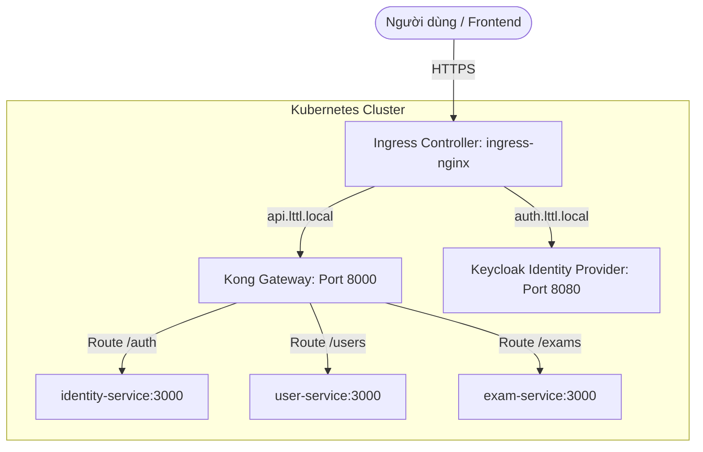

# Hướng dẫn API Gateway & Authentication - Authorization

Tài liệu này giải thích chi tiết cấu trúc triển khai **API Gateway** (sử dụng Kong & Kubernetes Ingress) và cơ chế **Xác thực & Phân quyền** (sử dụng OAuth2, JWT & Keycloak) trong dự án Luyện Thi Lái Xe Microservices.

---

## 1. API Gateway & Kubernetes Ingress

API Gateway là cổng vào duy nhất cho toàn bộ traffic bên ngoài hướng tới hệ thống microservices. Dự án tích hợp **Kong Gateway** làm Gateway chính và sử dụng **Kubernetes Ingress** để quản lý các routing quy mô cluster.



### 1.1 Tích hợp Kong API Gateway

Kong được triển khai dưới dạng **Declarative (DB-less)** sử dụng file cấu hình tĩnh [kong.yaml](file:///c:/Users/Ngo%20Minh%20Tri/workspace/uit/microservices/luyen-thi-lai-xe-microservices/kong/kong.yaml). Điều này giúp hệ thống chạy nhanh hơn, không phụ thuộc vào database riêng cho Gateway và dễ dàng quản lý bằng Git.

Các tính năng chính được cấu hình trong Kong:

1. **Routing & Path Rewrite (Định tuyến & Viết lại đường dẫn):**
   Kong map các path công cộng tới các service đích tương ứng bằng cơ chế `strip_path`.

   * **Ví dụ 1 (Đã strip path):** Request `GET /auth/login` gửi đến Kong sẽ được strip `/auth` và forward đến `identity-service:3000/login` (`strip_path: true`).
   * **Ví dụ 2 (Giữ nguyên path):** Request `GET /users/me` gửi đến Kong sẽ giữ nguyên đường dẫn và forward đến `user-service:3000/users/me` (`strip_path: false`).
2. **Cấu hình Plugins chung:**

   * **CORS (Cross-Origin Resource Sharing):** Cho phép các domain frontend (như `localhost:3000`, `localhost:5173`) truy cập an toàn, đồng thời mở các header nhạy cảm như `Authorization` và `x-correlation-id`.
   * **Correlation ID:** Tự động tạo header `x-correlation-id` dạng UUID cho mỗi request đi qua. Header này được chuyển tiếp tới tất cả microservices downstream để liên kết log file (tiện lợi cho việc tracing).
   * **Zipkin (Tracing):** Đẩy thông tin span của Gateway về cụm **Jaeger Tracing** (`http://jaeger:9411`) để đo lường độ trễ mạng của API.
   * **Rate Limiting (Giới hạn băng thông):** Giới hạn tần suất gọi API từ một IP ở mức tối đa **100 requests/giây** và **1000 requests/giờ** nhằm chống tấn công DDoS.

### 1.2 Kubernetes Ingress & Advanced Networking

Trên AKS, thay vì phơi bày tất cả microservices ra Internet (tốn chi phí cấp IP tĩnh và nguy cơ bảo mật cao), dự án chỉ sử dụng một IP công cộng duy nhất cho **Ingress Controller (ingress-nginx)**.

* File cấu hình: [ingress.yaml](file:///c:/Users/Ngo%20Minh%20Tri/workspace/uit/microservices/luyen-thi-lai-xe-microservices/charts/luyen-thi-lai-xe/templates/ingress.yaml)
* **Quy tắc định tuyến (Routing Rules):**
  * Tên miền API (`api.52.139.233.166.nip.io`) -> Đi qua Ingress -> Forward vào Service `luyen-thi-lai-xe-kong` (Port 8000).
  * Tên miền xác thực (`auth.52.139.233.166.nip.io`) -> Đi qua Ingress -> Forward thẳng vào Service `luyen-thi-lai-xe-keycloak` (Port 8080) để thực hiện login/xác thực.

---

## 2. Authentication & Authorization (Xác thực & Phân quyền)

Hệ thống bảo mật dựa trên tiêu chuẩn công nghiệp **OAuth 2.0 / OIDC (OpenID Connect)** kết hợp với **Keycloak** làm máy chủ quản lý danh tính tập trung (Identity Provider) và **JWT (JSON Web Token)** để trao đổi thông tin xác thực một cách phi trạng thái (stateless).

### 2.1 Luồng Xác thực OAuth2 (OAuth2 Flows)

Dự án áp dụng 2 luồng chính tùy thuộc vào đối tượng gọi API:

1. **Resource Owner Password Credentials Flow (Dành cho Người dùng):**

   * Học viên/Admin điền username và password trên giao diện.
   * Frontend gửi request login qua Gateway tới `identity-service`.
   * `identity-service` gọi endpoint `/protocol/openid-connect/token` của Keycloak để nhận về **Access Token** (JWT) và **Refresh Token**.
   * Frontend lưu Access Token và đính kèm vào header `Authorization: Bearer <token>` ở mỗi request tiếp theo.
2. **Client Credentials Flow (Dành cho Inter-service communication):**

   * Khi các microservice gọi trực tiếp với nhau (ví dụ: `exam-service` cần gọi `question-service` để lấy danh sách câu hỏi).
   * `exam-service` tự cấu hình client secret và thực hiện trao đổi client credentials với Keycloak để lấy một Token nội bộ (Service Token), dùng token đó để gọi `question-service` an toàn.

### 2.2 Triển khai Keycloak & Phân quyền RBAC

**Cấu hình Keycloak:**

* **Realm:** `luyen-thi-lai-xe-realm` (Không gian quản lý người dùng riêng).
* **Client:** `nestjs-backend` (Cấu hình ở chế độ bảo mật `confidential` với client secret để xác thực).
* **Roles (Vai trò trong hệ thống):**
  * `ADMIN`: Quản trị viên hệ thống.
  * `CENTER_MANAGER`: Quản lý trung tâm đào tạo lái xe.
  * `INSTRUCTOR`: Giáo viên hướng dẫn.
  * `STUDENT`: Học viên luyện thi.

**Role-Based Access Control (RBAC) trong Code:**
Dự án sử dụng thư viện `nest-keycloak-connect` để tích hợp bảo vệ các Endpoint cấp controller.

* **Khai báo Guard toàn cục** tại [app.module.ts](file:///c:/Users/Ngo%20Minh%20Tri/workspace/uit/microservices/luyen-thi-lai-xe-microservices/apps/user-service/src/app.module.ts#L98-L100):
  * `AuthGuard`: Xác thực token hợp lệ.
  * `RoleGuard`: Kiểm tra quyền hạn (Role).
* **Sử dụng decorator `@Roles`** trong Controller để bảo vệ API (ví dụ tại [admin-user.controller.ts](file:///c:/Users/Ngo%20Minh%20Tri/workspace/uit/microservices/luyen-thi-lai-xe-microservices/apps/user-service/src/presentation/http/admin-user.controller.ts#L73)):
  ```typescript
  @Post()
  @Roles({ roles: ['realm:ADMIN', 'realm:CENTER_MANAGER'] })
  async createUserProfile(@Body() dto: CreateUserRequestDto) { ... }
  ```

### 2.3 Cơ chế Xác thực Offline (Offline Token Validation)

Thông thường, để kiểm tra token có hợp lệ không, mỗi microservice phải gửi request ngược lại Keycloak (Introspection) -> Gây nghẽn cổ chai cho Keycloak.

Dự án đã triển khai **Offline Validation** bằng mã hóa bất đối xứng **RS256**:

1. Lần đầu chạy, [JwtAuthGuard](file:///c:/Users/Ngo%20Minh%20Tri/workspace/uit/microservices/luyen-thi-lai-xe-microservices/apps/identity-service/src/infrastructure/guards/jwt-auth.guard.ts#L71) sẽ gọi Keycloak lấy **Public Key** của Realm và lưu vào bộ nhớ cache.
2. Với mỗi request gửi tới kèm Access Token, guard dùng thư viện `jsonwebtoken` kết hợp Public Key để tự giải mã và kiểm tra chữ ký số (Verify Signature) trực tiếp trên máy mà không cần kết nối tới Keycloak.
3. Đồng thời xác thực các thông tin an toàn: Thời hạn (`exp`), Nhà phát hành (`iss` khớp với Keycloak URL).

### 2.4 Cơ chế Revoke Token qua Redis (Token Blacklisting)

Một điểm yếu của JWT là stateless (không thu hồi được cho đến khi hết hạn). Dự án giải quyết triệt để vấn đề này bằng cách thiết lập **Token Blacklist**:

* Khi người dùng gọi API `/logout`, Access Token hiện tại sẽ được gửi lên và lưu vào bộ nhớ đệm **Redis** với thời gian sống (TTL) bằng đúng thời hạn còn lại của token.
* [TokenBlacklistGuard](file:///c:/Users/Ngo%20Minh%20Tri/workspace/uit/microservices/luyen-thi-lai-xe-microservices/packages/common/src/auth/token-blacklist.guard.ts) được cấu hình chạy trước mọi request để kiểm tra token trong Redis. Nếu tìm thấy, request bị từ chối ngay lập tức với mã lỗi `401 Unauthorized` (Token đã bị vô hiệu hóa).

---

## 3. Thực hành Demo & Thuyết trình

Bạn có thể chứng minh các cơ chế trên hoạt động trong bài báo cáo bằng các kịch bản sau:

### 3.1 Demo Định tuyến và Bảo mật qua Gateway

1. Thử gọi API qua Gateway mà không kèm token:

   ```powershell
   Invoke-RestMethod -Uri "http://localhost:8000/users/me" -Method GET
   ```

   *Kết quả: Trả về lỗi `401 Unauthorized` do hệ thống chặn truy cập.*
2. Thực hiện đăng nhập để lấy token:

   ```powershell
   $login = Invoke-RestMethod -Uri "http://localhost:8000/auth/login" -Method POST `
     -ContentType "application/json" `
     -Body '{"username":"admin@test.com","password":"123456"}'

   # API response dùng standard envelope, nên token nằm trong data.
   $token = $login.data.accessToken
   $refreshToken = $login.data.refreshToken

   if (-not $token) {
     $login | ConvertTo-Json -Depth 5
     throw "Login response does not contain data.accessToken"
   }
   ```
3. Đính kèm token và gọi lại API:

   ```powershell
   Invoke-RestMethod -Uri "http://localhost:8000/users/me" -Method GET -Headers @{ Authorization = "Bearer $token" }
   ```

   *Kết quả: Trả về thông tin cá nhân của học viên thành công.*

### 3.2 Demo Token Blacklist (Logout vô hiệu hóa token)

1. Sử dụng token vừa lấy ở trên để gọi API thành công.
2. Gọi API logout để xóa phiên đăng nhập:

   ```powershell
   Invoke-RestMethod -Uri "http://localhost:8000/auth/logout" -Method POST `
     -ContentType "application/json" `
     -Body (@{ refreshToken = $refreshToken } | ConvertTo-Json) `
     -Headers @{ Authorization = "Bearer $token" }
   ```
3. Tiếp tục dùng token đó để gọi lại API `/users/me`:

   ```powershell
   Invoke-RestMethod -Uri "http://localhost:8000/users/me" -Method GET -Headers @{ Authorization = "Bearer $token" }
   ```

   *Kết quả: Trả về lỗi `401 Unauthorized` (mặc dù token về mặt toán học chưa hết hạn). Điều này chứng minh cơ chế Blacklist với Redis đã chặn đứng token bị thu hồi.*

### 3.3 Demo Phân quyền RBAC (Role-Based Access Control)

Mục tiêu của demo này là chứng minh hệ thống không chỉ kiểm tra người dùng đã đăng nhập hay chưa, mà còn kiểm tra **vai trò** trong JWT. Cùng một endpoint quản trị sẽ bị chặn với tài khoản học viên, nhưng được phép với tài khoản admin.

#### Bước 1: Đăng nhập bằng tài khoản học viên

```powershell
$studentLogin = Invoke-RestMethod -Uri "http://localhost:8000/auth/login" -Method POST `
  -ContentType "application/json" `
  -Body '{"username":"student.a1@test.com","password":"123456"}'

$studentToken = $studentLogin.data.accessToken

if (-not $studentToken) {
  $studentLogin | ConvertTo-Json -Depth 5
  throw "Student login response does not contain data.accessToken"
}
```

Kiểm tra tài khoản học viên vẫn gọi được API dành cho người đã đăng nhập:

```powershell
Invoke-RestMethod -Uri "http://localhost:8000/users/me" -Method GET `
  -Headers @{ Authorization = "Bearer $studentToken" }
```

Kết quả kỳ vọng: request thành công vì token hợp lệ.

#### Bước 2: Dùng token học viên gọi API quản trị

```powershell
Invoke-RestMethod -Uri "http://localhost:8000/admin/users" -Method GET `
  -Headers @{ Authorization = "Bearer $studentToken" }
```

Kết quả kỳ vọng: trả về `403 Forbidden`.

Ý nghĩa khi thuyết trình:

- `401 Unauthorized`: chưa đăng nhập hoặc token không hợp lệ.
- `403 Forbidden`: đã đăng nhập, token hợp lệ, nhưng role không đủ quyền.
- Student có thể gọi `/users/me`, nhưng không được gọi `/admin/users`.

#### Bước 3: Đăng nhập bằng tài khoản admin

```powershell
$adminLogin = Invoke-RestMethod -Uri "http://localhost:8000/auth/login" -Method POST `
  -ContentType "application/json" `
  -Body '{"username":"admin@test.com","password":"123456"}'

$adminToken = $adminLogin.data.accessToken

if (-not $adminToken) {
  $adminLogin | ConvertTo-Json -Depth 5
  throw "Admin login response does not contain data.accessToken"
}
```

Dùng token admin gọi lại cùng endpoint quản trị:

```powershell
Invoke-RestMethod -Uri "http://localhost:8000/admin/users" -Method GET `
  -Headers @{ Authorization = "Bearer $adminToken" }
```

Kết quả kỳ vọng: request thành công và trả về danh sách người dùng/hồ sơ học viên.

#### Bước 4: Giải thích bằng code

Khi demo với thầy, mở các file sau để chỉ ra RBAC được khai báo ở tầng controller/module:

- `apps/user-service/src/app.module.ts`: cấu hình `AuthGuard` và `RoleGuard`.
- `apps/user-service/src/presentation/http/admin-user.controller.ts`: các endpoint admin dùng `@Roles({ roles: ['realm:ADMIN', 'realm:CENTER_MANAGER'] })`.

Thông điệp chính:

> Kong chịu trách nhiệm routing request vào đúng service. Sau đó user-service kiểm tra JWT và role claim bằng guard của NestJS/Keycloak. Vì vậy hệ thống có hai lớp bảo vệ: gateway ở biên và RBAC ở service.
