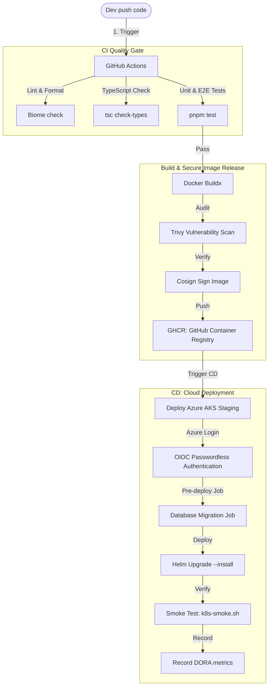

# Hướng dẫn CI/CD & Triển khai lên Cloud (Kubernetes AKS)

Tài liệu này giải thích chi tiết pipeline **CI/CD** (GitHub Actions), cơ chế đóng gói bảo mật (Docker, Trivy, Cosign), chiến lược triển khai (Rolling Update, Rollback) và cách đưa hệ thống lên đám mây **Azure AKS** trong dự án Luyện Thi Lái Xe Microservices.

---

## 1. Tổng quan Luồng CI/CD (GitHub Actions Pipeline)

Dự án sử dụng **GitHub Actions** để thiết lập luồng tích hợp và triển khai liên tục (CI/CD) tự động hóa hoàn toàn từ khi đẩy code lên nhánh `main` cho đến khi chạy smoke test trên Azure AKS Staging.



---

## 2. Quy trình Đóng gói & Phát hành Container bảo mật

Để đưa microservices chạy trên đám mây, các dịch vụ phải được container hóa thành Docker images và đẩy lên Registry bảo mật.

### 2.1 Tối ưu hóa Dockerfile (Multi-stage Build)
* File cấu hình: [Dockerfile.service](file:///c:/Users/Ngo%20Minh%20Tri/workspace/uit/microservices/luyen-thi-lai-xe-microservices/Dockerfile.service)
* **Kỹ thuật áp dụng:** Sử dụng multi-stage build với image cơ sở siêu nhẹ `node:22-alpine` ở stage chạy chính. Stage đầu build và biên dịch TypeScript, stage sau chỉ copy file `.js` đã biên dịch và node_modules cần thiết cho production. Điều này giúp giảm dung lượng image từ ~1.2GB xuống còn **< 200MB**, tăng tốc độ deploy và giảm chi phí lưu trữ.

### 2.2 Các chốt chặn bảo mật (Security Gates)
Trước khi push ảnh lên Registry, pipeline thực thi các quy trình bảo mật:
1. **Trivy Vulnerability Scan (Quét lỗ hổng):** Quét toàn bộ hệ thống file và dependencies của container. Nếu phát hiện lỗ hổng mức **HIGH** hoặc **CRITICAL**, pipeline sẽ tự động hủy (break build) để đảm bảo không mang mã độc lên cloud.
2. **Cosign Cryptographic Signing (Ký số container):** Sử dụng công cụ Cosign để ký xác thực chữ ký số lên image. Chỉ những image có chữ ký hợp lệ từ GitHub Workflow mới được phép deploy vào cụm AKS, tránh việc bị giả mạo image.
3. **GitHub Container Registry (GHCR):** Nơi lưu trữ image tập trung, phân quyền kéo ảnh bằng `imagePullSecret` được sinh động qua Helm.

---

## 3. Triển khai Thực tế lên Cloud (Azure AKS Cluster)

Dự án lựa chọn dịch vụ **Azure AKS (Azure Kubernetes Service)** làm hạ tầng cloud vì:
* **AKS Free Tier:** Cung cấp cụm Kubernetes quản lý miễn phí (chỉ tính tiền VM nodes), tối ưu chi phí cho các dự án demo của sinh viên.
* **Azure OIDC Oauth2 (Passwordless):** GitHub Actions kết nối tới Azure bằng phương thức OIDC (OpenID Connect federated credentials), không cần lưu trữ Azure Service Principal client secret cố định lâu dài trên GitHub, loại bỏ hoàn toàn nguy cơ rò rỉ khóa đám mây.
* **Cơ chế tách bạch Migration Job:** 
  Trước khi thay đổi phiên bản ứng dụng, một Kubernetes Job chạy [Dockerfile.migration-runner](file:///c:/Users/Ngo%20Minh%20Tri/workspace/uit/microservices/luyen-thi-lai-xe-microservices/Dockerfile.migration-runner) sẽ được khởi tạo độc lập để thực thi Prisma migrations. Chỉ khi DB cập nhật thành công, các Pods mới của Microservice mới được phép rollout để tránh lỗi xung đột dữ liệu.

---

## 4. Chiến lược Triển khai & Khả năng Rollback (Hồi phục)

### 4.1 Triển khai Rolling Update (Zero-Downtime)
* Được cấu hình mặc định trong spec của Helm chart:
  ```yaml
  strategy:
    type: RollingUpdate
    rollingUpdate:
      maxSurge: 25%          # Tối đa thêm 25% số lượng Pod mới vượt ngưỡng mong muốn
      maxUnavailable: 25%    # Tối đa 25% số lượng Pod cũ bị tắt đi đồng thời
  ```
* **Cơ chế:** K8s sẽ khởi động các Pod mới trước, kiểm tra qua Readiness Probe thành công mới định tuyến traffic sang và tắt dần các Pod cũ. Nhờ đó, người dùng hoàn toàn không nhận ra hệ thống đang được nâng cấp (Không downtime).

### 4.2 Triển khai Blue-Green / Canary (Mở rộng nâng cao)
* Hệ thống có thể chuyển đổi linh hoạt sang Blue-Green / Canary bằng cách cấu hình phân chia trọng số traffic (weight) của Ingress hoặc Kong Gateway, định tuyến 10% traffic vào cụm Canary (phiên bản mới) để test trước khi chuyển đổi toàn bộ 100% traffic.

### 4.3 Quản lý phiên bản bất biến (Immutable Versioning)
Dự án **tuyệt đối không** sử dụng thẻ `:latest` cho image. Mỗi bản build trên main branch được gắn nhãn bất biến bằng chính **Git SHA** của commit đó. Điều này giúp:
* Đảm bảo tính nhất quán (cụm K8s biết chính xác code nào đang chạy).
* Tránh tình trạng Kubernetes cache lại image cũ khi deploy lại.

### 4.4 Cơ chế Rollback tự động & Thủ công
Nếu hệ thống sau khi deploy gặp sự cố (Smoke test fail hoặc lỗi runtime phát sinh):
* **Hồi phục tự động:** Helm tự động kích hoạt tham số `--rollback-on-failure` để quay về phiên bản trước đó nếu cụm Pods mới không thể Ready sau thời gian timeout.
* **Hồi phục thủ công (Qua GitHub Workflow):**
  Dự án cấu hình riêng workflow [rollback-release.yml](file:///c:/Users/Ngo%20Minh%20Tri/workspace/uit/microservices/luyen-thi-lai-xe-microservices/.github/workflows/rollback-release.yml). DevOps chỉ cần chọn môi trường (`staging`/`production`), điền Revision muốn quay lại (ví dụ: quay lại Helm revision `12`) và nhấn **Run workflow**. Lệnh `helm rollback` sẽ thực thi lập tức đưa cụm ứng dụng và cấu hình về trạng thái an toàn trước đó trong vài giây.

---

## 5. Thực hành Thuyết trình & Demo CI/CD - Cloud Deployment

### 5.1 Demo 1: Xem lịch sử triển khai (Helm History)
Chứng minh hệ thống quản lý lịch sử deploy chuyên nghiệp và chặt chẽ:
* **Qua CLI:**
  ```powershell
  helm history luyen-thi-lai-xe -n staging
  ```
  *Kết quả trả về danh sách các Revision, thời gian deploy, trạng thái (deployed/superseded/failed) và mô tả chi tiết.*
* **Qua Lens:**
  Vào mục **Helm -> Releases** để xem thông tin trực quan.

### 5.2 Demo 2: Thao tác Rollback một bản nâng cấp lỗi
Giả lập tình huống phiên bản mới bị lỗi và ta cần rollback khẩn cấp:

1. Thuyết trình: "Tôi sẽ thực hiện rollback hệ thống Staging về Revision trước đó ngay lập tức bằng GitHub Action."
2. Lên GitHub, truy cập tab **Actions** -> Chọn **Rollback Release** -> Nhấp **Run workflow**.
3. Chọn target_environment là `staging`, điền `helm_revision` (ví dụ: `1`). Tích chọn `confirm_rollback` và bấm **Run**.
4. Mở k9s hoặc Lens song song, người nghe sẽ thấy:
   * Các Pods chạy image lỗi bị terminate.
   * Cụm K8s tự động tải lại image phiên bản an toàn trước đó và chạy lên.
   * Lệnh `helm history luyen-thi-lai-xe -n staging` tự động cập nhật thêm 1 dòng Revision mới với mô tả: `Rollback to 1`.
   * Pipeline tự động kích hoạt smoke test `k8s-smoke.sh` chạy kiểm tra lại sau rollback để báo cáo trạng thái DORA metrics.
