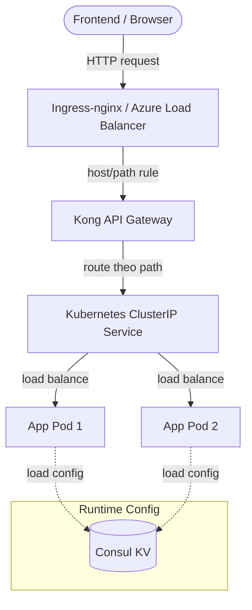

# Hướng Dẫn Service Discovery & Load Balancing

Tài liệu này dùng để demo và giải thích cơ chế **Service Discovery** và **Load Balancing** trong hệ thống DriveMate. Nội dung bám theo codebase hiện tại, không giả định các service đã đăng ký vào Consul Catalog.

## 1. Kết Luận Ngắn Gọn

Trong bản triển khai hiện tại:

- **Consul** dùng chính cho **Centralized Configuration KV**.
- **Docker Compose local** dùng Docker DNS/service name và Kong để route request.
- **AKS/Kubernetes** dùng Kubernetes DNS, ClusterIP Service, Ingress-nginx và Kong để discovery/load balancing.
- **Consul Catalog không phải cơ chế service registry mặc định**. Vì vậy lệnh `/v1/catalog/services` có thể chỉ trả về `consul`, và điều đó là bình thường.

Nếu chạy:

```powershell
Invoke-RestMethod -Uri "http://localhost:8500/v1/catalog/services"
```

và thấy:

```text
consul
------
{}
```

thì không có nghĩa là service discovery bị lỗi. Nó chỉ cho biết app services hiện **không tự register vào Consul Catalog**.

## 2. Kiến Trúc Discovery Và Load Balancing



Luồng chính:

1. Client gọi API public qua Ingress/Kong.
2. Kong route request theo path, ví dụ `/auth`, `/users`, `/courses`.
3. Kubernetes Service giữ địa chỉ nội bộ ổn định cho từng microservice.
4. Nếu một service có nhiều pod, Kubernetes Service load balance đến các pod đang ready.
5. Các service đọc cấu hình runtime từ Consul KV.

## 3. Vai Trò Của Consul Trong Project

### 3.1. Consul KV

Consul KV lưu cấu hình runtime theo environment:

```text
config/development-local/<service>/<key>
config/staging/<service>/<key>
config/production/<service>/<key>
```

Ví dụ:

```text
config/development-local/exam-service/services.question.baseUrl
config/development-local/docs-service/swagger.services
config/development-local/shared/public.gateway.url
```

Các service dùng `ConsulConfigFactory` để load config với thứ tự ưu tiên:

```text
environment variables > Consul KV > .env/defaults
```

### 3.2. Consul Catalog

Hiện tại các NestJS service trong repo **không có cơ chế tự đăng ký** vào Consul Catalog. Do đó:

```powershell
Invoke-RestMethod -Uri "http://localhost:8500/v1/catalog/services"
```

có thể chỉ trả về `consul`.

Trong project này, discovery runtime nằm ở:

- Docker DNS khi chạy full Docker Compose.
- `localhost:<port>`/Kong dev khi chạy hybrid local.
- Kubernetes DNS/ClusterIP khi chạy AKS.

## 4. Demo Local: Consul KV

### 4.1. Khởi động local infra

```powershell
pnpm infra:up
pnpm consul:seed:local
```

Kiểm tra container Consul:

```powershell
docker compose -f docker-compose.infra.yml ps consul
```

Mở UI:

```text
http://localhost:8500
```

Vào tab **Key/Value** và mở:

```text
config/development-local/
```

### 4.2. Kiểm tra key bằng API

Liệt kê toàn bộ config keys:

```powershell
Invoke-RestMethod -Uri "http://localhost:8500/v1/kv/config/development-local/?keys"
```

Kiểm tra service-to-service URL của `exam-service` tới `question-service`:

```powershell
Invoke-RestMethod -Uri "http://localhost:8500/v1/kv/config/development-local/exam-service/services.question.baseUrl?raw"
```

Kỳ vọng:

```text
http://localhost:3005
```

Kiểm tra danh sách Swagger upstream của `docs-service`:

```powershell
Invoke-RestMethod -Uri "http://localhost:8500/v1/kv/config/development-local/docs-service/swagger.services?raw"
```

Kỳ vọng dạng:

```text
identity-service:3001,user-service:3002,exam-service:3003,course-service:3004,question-service:3005,notification-service:3006,analytics-service:3007,simulation-service:3008,media-service:3010,audit-service:3011
```

### 4.3. Lời thoại demo

> Ở bản hiện tại, Consul không được dùng làm service registry chính. Consul được dùng làm KV store để tập trung hóa cấu hình runtime. Ví dụ, `exam-service` không hard-code địa chỉ `question-service` trong source code, mà đọc `services.question.baseUrl` từ Consul KV theo environment. Cơ chế discovery và load balancing khi chạy thật do Docker DNS hoặc Kubernetes Service đảm nhiệm.

## 5. Demo Local: Docker DNS Và Kong

Khi chạy full Docker Compose bằng:

```powershell
pnpm docker:up
```

các container nằm trong cùng Docker network và có thể gọi nhau bằng service name:

```text
http://question-service:3000
http://user-service:3000
http://rabbitmq:5672
http://consul:8500
```

Kong local expose tại:

```text
http://localhost:8000
```

Ví dụ:

```powershell
curl.exe -i http://localhost:8000/auth/public
```

Nếu chạy hybrid mode (`pnpm infra:up` + `pnpm dev`), các service chạy trực tiếp trên host qua port local như `3001`, `3002`, `3005`; Kong dev route qua `host.docker.internal`.

## 6. Demo AKS/Kubernetes: Service Discovery

### 6.1. Kiểm tra context và namespace

```powershell
kubectl config current-context
kubectl get deploy,pod,svc,ingress -n staging
```

### 6.2. Xem Kubernetes Service

```powershell
kubectl get svc -n staging
```

Các app service trong Helm chart dùng `ClusterIP`, ví dụ:

```text
luyen-thi-lai-xe-user-service
luyen-thi-lai-xe-question-service
luyen-thi-lai-xe-exam-service
```

ClusterIP là địa chỉ nội bộ ổn định. Pod có thể chết và tạo lại với IP khác, nhưng Service DNS vẫn giữ nguyên.

### 6.3. Test DNS nội bộ

Vào một pod app:

```powershell
kubectl exec -it deploy/luyen-thi-lai-xe-exam-service -n staging -- sh
```

Trong pod, thử gọi service khác:

```sh
wget -qO- http://luyen-thi-lai-xe-question-service:3000/health/live
```

Nếu image có `nslookup`, có thể kiểm tra DNS:

```sh
nslookup luyen-thi-lai-xe-question-service
```

Lời thoại:

> Service không cần biết IP thật của pod `question-service`. Nó chỉ gọi DNS name của Kubernetes Service. Kubernetes/CoreDNS phân giải tên này và Service load balance request đến pod đang ready.

## 7. Demo AKS/Kubernetes: Load Balancing Qua Service

### 7.1. Scale một deployment

Ví dụ scale `user-service` lên 2 replicas:

```powershell
kubectl scale deploy luyen-thi-lai-xe-user-service -n staging --replicas=2
kubectl rollout status deploy/luyen-thi-lai-xe-user-service -n staging
```

Xem pods:

```powershell
kubectl get pods -n staging -l app.kubernetes.io/service-name=user-service -o wide
```

### 7.2. Xem endpoints phía sau Service

```powershell
kubectl get endpoints luyen-thi-lai-xe-user-service -n staging
```

Hoặc nếu cluster dùng EndpointSlice:

```powershell
kubectl get endpointslice -n staging -l kubernetes.io/service-name=luyen-thi-lai-xe-user-service
```

Kỳ vọng: thấy nhiều địa chỉ pod phía sau cùng một Service.

### 7.3. Scale về 1 để tiết kiệm tài nguyên

```powershell
kubectl scale deploy luyen-thi-lai-xe-user-service -n staging --replicas=1
kubectl rollout status deploy/luyen-thi-lai-xe-user-service -n staging
```

Lời thoại:

> Khi replicas tăng lên 2, Service vẫn giữ một DNS name duy nhất, nhưng danh sách endpoints phía sau tăng lên. Kubernetes tự cập nhật endpoints và phân phối traffic tới các pod đang ready. Đây là load balancing nội bộ của Kubernetes.

## 8. Demo Ingress Và Kong

Public traffic trên AKS đi theo flow:

```text
Frontend/Browser
  -> Azure Load Balancer
  -> ingress-nginx
  -> Kubernetes Ingress
  -> Kong
  -> ClusterIP Service
  -> App Pod
```

Kiểm tra Ingress:

```powershell
kubectl get ingress -n staging -o wide
```

Kiểm tra Kong service:

```powershell
kubectl get svc luyen-thi-lai-xe-kong -n staging
```

Test API public:

```powershell
$ApiHost = "api.52.139.233.166.nip.io"
curl.exe -i "http://${ApiHost}/auth/public"
```

Lời thoại:

> Microservices không expose public từng service một. Hệ thống chỉ expose entrypoint qua Ingress và Kong. Kong quản lý routing, CORS, rate limit, auth boundary; Kubernetes Service xử lý load balancing nội bộ tới pods.

## 9. So Sánh Client-Side Và Server-Side Load Balancing

| Tiêu chí | Client-side load balancing | Server-side load balancing |
| --- | --- | --- |
| Cơ chế | Client tự lấy danh sách instance và chọn instance để gọi. | Client gọi một endpoint ổn định; proxy/service phân phối request. |
| Ví dụ | Eureka + Ribbon, custom registry client. | Kong, Nginx, Kubernetes Service, Ingress. |
| Ưu điểm | Linh hoạt ở client, giảm một hop proxy trong một số kiến trúc. | Client đơn giản, quản lý bảo mật/routing tập trung. |
| Nhược điểm | Client phức tạp, mỗi language phải có library/discovery logic. | Thêm proxy/service layer, cần HA cho gateway/ingress. |
| DriveMate | Không dùng làm cơ chế chính. | Dùng Kong + Kubernetes Service/Ingress. |

## 10. Checklist Demo Nhanh

Local Consul KV:

```powershell
pnpm infra:up
pnpm consul:seed:local
Invoke-RestMethod -Uri "http://localhost:8500/v1/kv/config/development-local/?keys"
Invoke-RestMethod -Uri "http://localhost:8500/v1/kv/config/development-local/exam-service/services.question.baseUrl?raw"
```

AKS service discovery:

```powershell
kubectl get svc -n staging
kubectl exec -it deploy/luyen-thi-lai-xe-exam-service -n staging -- sh
wget -qO- http://luyen-thi-lai-xe-question-service:3000/health/live
```

AKS load balancing:

```powershell
kubectl scale deploy luyen-thi-lai-xe-user-service -n staging --replicas=2
kubectl get endpoints luyen-thi-lai-xe-user-service -n staging
kubectl scale deploy luyen-thi-lai-xe-user-service -n staging --replicas=1
```

Ingress/Kong:

```powershell
kubectl get ingress -n staging -o wide
curl.exe -i "http://api.52.139.233.166.nip.io/auth/public"
```

## 11. Kết Luận

DriveMate triển khai service discovery và load balancing theo hướng thực dụng:

- Consul KV tập trung hóa cấu hình runtime.
- Docker DNS hỗ trợ discovery trong local full Docker.
- Kubernetes DNS và ClusterIP Service là cơ chế discovery/load balancing chính trên AKS.
- Kong và Ingress-nginx là entrypoint public cho toàn hệ thống.
- Consul Catalog không phải cơ chế mặc định, nên catalog rỗng là bình thường.

Cách trình bày này đúng với codebase hiện tại và tránh hiểu nhầm rằng app services phải xuất hiện trong Consul Catalog mới gọi là service discovery.
