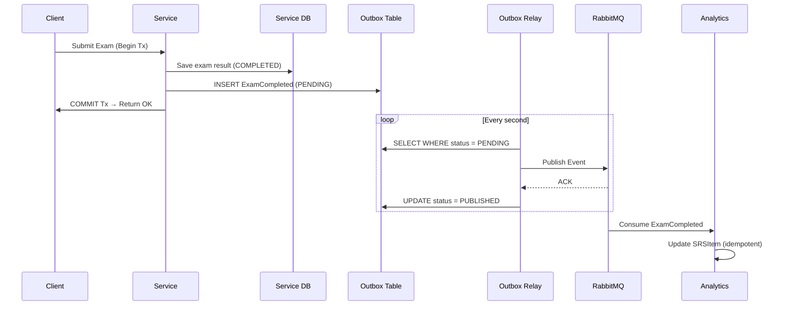
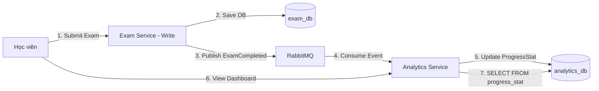

# DriveMate — Hướng Dẫn Đối Chiếu Kiến Trúc: SRS ➔ ASR ➔ ADD ➔ SAD ➔ Design Patterns

Tài liệu này là bản đồ đối chiếu (**Mapping**) chi tiết và đầy đủ giữa **Use Cases (SRS)**, **ASR**, **ADD**, **SAD**, **Design Patterns** và **vị trí source code cụ thể** trong dự án **DriveMate**. Mỗi mục đều link thẳng đến file và đoạn code tương ứng, kèm giải thích cách pattern thỏa mãn yêu cầu kiến trúc. Phần cuối bao gồm **ASR Constraint Compliance Audit** kiểm tra từng constraint trong ASR.xlsx đối chiếu với codebase thực tế.

---

## 📐 0. Kiến Trúc Tổng Thể (Từ ADD Section 3)

### 4+1 View Model

| View | Mô tả ADD | Triển khai |
|------|-----------|------------|
| **Logical** | 12 services + Kong + Keycloak + Consul + ELK | `apps/*/` mỗi thư mục = một service |
| **Implementation** | Turborepo monorepo, NestJS 11, Prisma v7 per-service, `@repo/common` | `packages/common/`, `packages/prisma-*/` |
| **Deployment** | Dev: Docker Compose; Prod target: Kubernetes + HPA | `docker-compose.yaml`, `k8s/` |
| **Data** | Database-per-service PostgreSQL 15, RabbitMQ, Redis (identity-only) | Mỗi `apps/*/prisma/schema.prisma` |
| **Process** | Login via Keycloak, Async Notification, Offline Sync, Server FSM | `identity-service/`, `notification-service/`, `exam-service/`, `simulation-service/` |

---

## 🧩 1. Danh Mục Đầy Đủ Design Patterns (GoF + Architectural)

### 📋 Bảng Tổng Hợp Tất Cả Patterns

| # | Pattern | Loại | Vị Trí Code | ASR / ADD |
|---|---------|------|-------------|-----------|
| 1 | **Decorator** | GoF Structural | `@IsEmail()`, `@ApiProperty()`, `@Injectable()` trên DTOs và Controllers | ASR-SEC-04 validation |
| 2 | **Template Method** | GoF Behavioral | `AggregateRoot`, `Entity`, `ValueObject`, `ExamSessionRepository` (abstract class) | ADD Section 3.2 |
| 3 | **Factory Method** | GoF Creational | `ExamSession.create()`, `Email.create()`, `Practice2dSession.create()` | ASR-DI-09, ASR-DI-08 |
| 4 | **Factory (Static Factory)** | GoF Creational | `ConsulConfigFactory.create()` | ASR-MOD-01, ADD 3.2 |
| 5 | **Strategy** | GoF Behavioral | `CourseCachePort` abstract class + `RedisCourseCacheService` implementation | ASR-PERF-05, ASR-AV-06 |
| 6 | **Adapter** | GoF Structural | `HttpQuestionPoolClient extends QuestionPoolClient`, `HttpUserProfileClient extends UserProfileClient` | ASR-AV-04, ADD 3.2 |
| 7 | **Interceptor (Decorator variant)** | GoF Structural / NestJS | `ApiResponseInterceptor`, `AccessLogInterceptor`, `CorrelationIdInterceptor`, `MetricsInterceptor`, `RabbitMqRetryInterceptor` | ASR-AV-03, ADD 3.2 |
| 8 | **Chain of Responsibility** | GoF Behavioral | NestJS Guards pipeline: `AuthGuard` → `TokenBlacklistGuard` → `RolesGuard` | ASR-SEC-01, ASR-SEC-03, ASR-SEC-04 |
| 9 | **Observer (Event-Driven)** | GoF Behavioral | `AggregateRoot.addDomainEvent()` → domain events → `ExamSessionCompletedEvent` | ASR-DI-07, ASR-REL-04 |
| 10 | **Repository** | DDD Pattern | `ExamSessionRepository` (abstract) + `PrismaExamSessionRepository` (impl) | ADD 3.2, ASR-REL-04 |
| 11 | **Mapper** | DDD/Structural | `ExamSessionMapper.toDomain()` (DB row → Domain aggregate) | ADD Section 3.2 |
| 12 | **Value Object** | DDD Pattern | `Email` (immutable, self-validating) | ASR-SEC-04 |
| 13 | **Aggregate Root** | DDD Pattern | `ExamSession`, `Practice2dSession` (encapsulate invariants, emit events) | ASR-REL-04, ASR-DI-01 |
| 14 | **Finite State Machine (FSM)** | Behavioral | `Practice2dSession.ingestTelemetry()` + `detectFeedback()` state transitions | ASR-UX-02, ADD 3.5 Flow 4 |
| 15 | **Transactional Outbox** | Messaging Pattern | Outbox tables in `exam-service`, `user-service`, `course-service` | ASR-DI-07, ASR-AV-05 |
| 16 | **CQRS** | Architectural | Write: `exam-service` → Read: `analytics-service` pre-aggregated table | ASR-PERF-04, ASR-PERF-07 |
| 17 | **Circuit Breaker** | Resilience Pattern | `resilientFetch()` + `configureAxiosResilience()` in `@repo/common` | ASR-AV-04 |
| 18 | **Token Blacklist** | Security Pattern | Redis `blacklist:{jti}` + `TokenBlacklistGuard` | ASR-SEC-03 |
| 19 | **Exam Config Snapshot** | Immutability Pattern | `ExamSession.topicDistributionSnapshot`, `optionsSnapshot` JSONB | ASR-DI-08 |
| 20 | **Idempotent Write** | Data Consistency | SQL Upsert trên `(examSessionId, questionId)` + `RabbitMqRetryInterceptor` dedup | ASR-REL-03 |
| 21 | **Soft Delete** | Data Integrity | `isDeleted=true` trong `course-service`, `question-service` | ASR-DI-03, ASR-DI-10 |
| 22 | **Pub-Sub (Message Broker)** | Messaging | RabbitMQ exchanges + queues + `RabbitMqRetryInterceptor` | ADD 3.4, ASR-PERF-08 |
| 23 | **Retry with Exponential Backoff** | Resilience | `backoffMs()` trong `resilient-http-client.ts` và `rabbitmq-resilience.ts` | ASR-AV-04, ASR-AV-05 |
| 24 | **Cache-Aside** | Performance | `RedisCourseCacheService` + `CourseCachePort` | ASR-PERF-05 |
| 25 | **Config Priority Chain** | Configuration | `ConsulConfigFactory`: env vars > Consul KV > .env > defaults | ASR-MOD-01, ADD 3.1 |
| 26 | **Correlation ID Propagation** | Observability | `CorrelationIdInterceptor` + `x-correlation-id` header qua HTTP và RabbitMQ | ADD 3.1 ELK |

---

## 🔬 2. Chi Tiết Từng Pattern — Code + Giải Thích + ASR Liên Quan

### 🎨 Pattern 1: Decorator Pattern

**Loại:** GoF Structural — thêm behavior vào object mà không sửa class gốc.

**Trong DriveMate:** TypeScript/NestJS dùng Decorator (`@`) đặt trên properties của DTO và Methods của Controller để tự động thêm validation, documentation, và DI metadata.

**Code cụ thể — [create-user.request.dto.ts](../../apps/identity-service/src/presentation/dtos/create-user.request.dto.ts#L11-L33):**
```typescript
export class CreateUserRequestDto {
  @ApiProperty({ example: 'nguyenvana@gm.uit.edu.vn' })  // Decorator: thêm Swagger doc
  @IsEmail()                                               // Decorator: thêm validation rule
  email!: string;

  @ApiProperty({ enum: UserRole, example: UserRole.STUDENT })
  @IsEnum(UserRole)                                        // Decorator: enforce enum constraint
  role!: UserRole;

  @ApiProperty({ minLength: 8 })
  @IsString()
  @MinLength(8)                                            // Decorator: min length guard
  temporaryPassword!: string;
}
```

**Cách pattern thỏa mãn ASR/ADD:**
- `@IsEmail()`, `@IsEnum()`, `@MinLength()` → **ASR-SEC-04** (Input validation trước khi tạo user, email uniqueness enforcement tại API layer)
- `@ApiProperty()` → **ADD Section 3.2** (OpenAPI/Swagger auto-generation cho docs-service)
- `@Injectable()` trên Services → **ADD Section 3.2** (NestJS DI Container quản lý lifecycle)

---

### 🎨 Pattern 2: Template Method Pattern

**Loại:** GoF Behavioral — abstract class định nghĩa skeleton của algorithm; subclass override các bước cụ thể.

**Trong DriveMate:** Các abstract class DDD base và Repository interface định nghĩa "hợp đồng" mà concrete implementations phải thực hiện.

**Code cụ thể — [entity.base.ts](../../packages/common/src/ddd/entity.base.ts#L1-L17):**
```typescript
// TEMPLATE: định nghĩa skeleton behavior cho mọi Entity
export abstract class Entity<TId> {
  protected readonly _id: TId;

  constructor(id: TId) { this._id = id; }

  get id(): TId { return this._id; }

  // Template Method: equality so sánh bằng identity (ID), không phải reference
  equals(other: Entity<TId>): boolean {
    if (other === null || other === undefined) return false;
    if (other.constructor !== this.constructor) return false;
    return this._id === other._id;  // Concrete step: compare by ID
  }
}
```

**Code cụ thể — [aggregate-root.base.ts](../../packages/common/src/ddd/aggregate-root.base.ts#L1-L18):**
```typescript
// TEMPLATE: AggregateRoot extends Entity, thêm domain event management
export abstract class AggregateRoot<TId> extends Entity<TId> {
  private _domainEvents: DomainEvent[] = [];

  protected addDomainEvent(event: DomainEvent): void {
    this._domainEvents.push(event);
  }
  // Subclass ExamSession, Practice2dSession sẽ gọi addDomainEvent()
  // trong các business methods của mình
}
```

**Code cụ thể — [exam-session.repository.ts](../../apps/exam-service/src/domain/repositories/exam-session.repository.ts#L36-L45):**
```typescript
// TEMPLATE: Abstract Repository — domain layer chỉ biết interface
export abstract class ExamSessionRepository {
  abstract findById(id: string): Promise<ExamSession | null>;
  abstract findAll(filter: ListExamSessionsFilter): Promise<ListExamSessionsPage>;
  abstract findMissedQuestions(filter: MissedQuestionReviewFilter): Promise<MissedQuestionItem[]>;
  abstract save(session: ExamSession): Promise<void>;
  // Concrete impl (PrismaExamSessionRepository) ở infrastructure layer
}
```

**Cách pattern thỏa mãn ASR/ADD:**
- **ADD Section 3.2 `@repo/common`:** DDD base classes là shared library; mọi service extend cùng một AggregateRoot → nhất quán pattern toàn hệ thống.
- **ASR-REL-04 Atomic Submit:** `ExamSession` extends `AggregateRoot` → business invariants (assertInProgress, assertNotExpired) được enforce trong domain, không rò rỉ ra ngoài.

---

### 🎨 Pattern 3: Factory Method Pattern

**Loại:** GoF Creational — static factory method kiểm soát quá trình khởi tạo object, thực thi business invariants.

**Code cụ thể — [email.vo.ts](../../apps/identity-service/src/domain/value-objects/email.vo.ts#L11-L17):**
```typescript
export class Email extends ValueObject<{ value: string }> {
  private constructor(props: { value: string }) {  // private: không thể new Email()
    super(props);
  }

  // FACTORY METHOD: validate rồi mới tạo object
  static create(value: string): Email {
    const normalized = value.trim().toLowerCase();
    if (!Email.EMAIL_REGEX.test(normalized)) {
      throw new InvalidEmailException(value);  // Guard: invalid input = exception
    }
    return new Email({ value: normalized });   // Normalize tại điểm tạo
  }
}
```

**Code cụ thể — [exam-session.aggregate.ts](../../apps/exam-service/src/domain/aggregates/exam-session/exam-session.aggregate.ts#L77-L113):**
```typescript
export class ExamSession extends AggregateRoot<string> {
  // FACTORY METHOD: create() cho NEW session
  static create(props: CreateExamSessionProps): ExamSession {
    if (!props.studentId?.trim()) throw new InvalidExamSessionException('studentId is required');
    if (!props.templateId?.trim()) throw new InvalidExamSessionException('templateId is required');
    if (props.questions.length < 1) throw new InvalidExamSessionException('questions are required');
    const now = new Date();
    const expiresAt = new Date(now.getTime() + props.durationMinutes * 60_000); // Server-authoritative timer
    return new ExamSession(crypto.randomUUID(), props.studentId, ...);
  }

  // FACTORY METHOD: reconstitute() cho session đã có trong DB
  static reconstitute(props: ReconstituteExamSessionProps): ExamSession {
    return new ExamSession(props.id, props.studentId, ...);  // No validation: trusted from DB
  }
}
```

**Cách pattern thỏa mãn ASR/ADD:**
- **ASR-DI-09:** `ExamSession.create()` validate `questions.length >= 1` trước khi tạo session → structural correctness enforced tại domain.
- **ASR-REL-02:** `expiresAt = now + durationMinutes * 60_000` được tính server-side ngay khi `create()`, không phụ thuộc client clock.
- **ASR-SEC-04:** `Email.create()` normalize + validate → invalid email không thể tồn tại trong domain.

---

### 🎨 Pattern 4: Factory (Static Factory — ConsulConfigFactory)

**Loại:** GoF Creational — tạo complex object (config) với fallback chain.

**Code cụ thể — [consul.factory.ts](../../packages/common/src/consul/consul.factory.ts#L9-L73):**
```typescript
// biome-ignore lint/complexity/noStaticOnlyClass: factory pattern kept as class for NestJS compatibility
export class ConsulConfigFactory {
  /**
   * Priority: Environment Variables > Consul KV > .env File > Defaults
   */
  static create(joiSchema?: Joi.ObjectSchema, serviceName?: string): ConfigFactory {
    return async () => {
      try {
        const consulConfig = await ConsulConfigFactory.loadFromConsul(consulUrl, nodeEnv, serviceName);
        const envConfig = ConsulConfigFactory.loadFromEnv(env, serviceName);
        // mergeConfig: env vars OVERRIDE Consul values (priority chain)
        config = ConsulConfigFactory.mergeConfig(consulConfig, envConfig);
      } catch (error) {
        // FALLBACK: Nếu Consul không available, dùng .env file
        config = ConsulConfigFactory.loadFromEnv(env, serviceName);
      }
      if (joiSchema) {
        const { error, value } = joiSchema.validate(config, { abortEarly: false });
        if (error) throw new Error(`Configuration validation error: ${error.message}`);
        return value;
      }
      return config;
    };
  }
}
```

**Cách pattern thỏa mãn ASR/ADD:**
- **ASR-MOD-01 (No Redeployment):** Exam rules lấy từ Consul KV; thay đổi tại Consul → có hiệu lực ngay không cần restart service.
- **ADD Section 3.1:** "Consul KV — per-service configuration with priority: env vars > Consul > defaults" — Config priority chain được implement chính xác tại [L44](../../packages/common/src/consul/consul.factory.ts#L44).

---

### 🎨 Pattern 5: Strategy Pattern

**Loại:** GoF Behavioral — định nghĩa family of algorithms, encapsulate từng cái, cho phép hoán đổi.

**Code cụ thể — [course-cache.port.ts](../../apps/course-service/src/application/ports/course-cache.port.ts#L18-L30):**
```typescript
// STRATEGY INTERFACE: định nghĩa cache contract
export abstract class CourseCachePort {
  abstract getCourse(courseId: string): Promise<CourseResult | null>;
  abstract setCourse(course: CourseResult): Promise<void>;
  abstract getCourseList(key: CourseListCacheKey): Promise<ListCoursesResult | null>;
  abstract setCourseList(key: CourseListCacheKey, result: ListCoursesResult): Promise<void>;
  abstract invalidateCourse(courseId: string): Promise<void>;
  abstract invalidateLists(): Promise<void>;
}
```

**Code cụ thể — [redis-course-cache.service.ts](../../apps/course-service/src/infrastructure/cache/redis-course-cache.service.ts#L14-L21):**
```typescript
// CONCRETE STRATEGY: Redis implementation
@Injectable()
export class RedisCourseCacheService extends CourseCachePort {
  private readonly ttlSeconds = 600;  // 10 minutes TTL

  constructor(@Inject(REDIS_CLIENT) private readonly redis: Redis) {
    super();
  }

  // invalidateCourse → delete + invalidateLists (xóa tất cả list cache liên quan)
  async invalidateCourse(courseId: string): Promise<void> {
    await this.safeExec(() => this.redis.del(this.courseKey(courseId)));
    await this.invalidateLists();
  }

  // safeExec: nếu Redis down → fallback = null (partial degradation)
  private async safeExec<T>(operation: () => Promise<T>, fallback?: T): Promise<T> {
    try {
      return await operation();
    } catch (error) {
      this.logger.warn(`Course cache skipped: ${error}`);
      return fallback as T;  // Graceful degradation: cache miss, query DB instead
    }
  }
}
```

**Cách pattern thỏa mãn ASR/ADD:**
- **ASR-PERF-05:** Cache hit < 50ms; cache miss DB fallback < 300ms — `safeExec` đảm bảo nếu Redis fail thì vẫn serve từ DB.
- **ASR-AV-06 (Partial Degradation):** `safeExec` với fallback = null → khi Redis fail, system tiếp tục hoạt động với DB fallback thay vì crash.
- **ADD Table 47:** "Selected flows can use cache-backed or projected read models to reduce direct dependency pressure."
- Strategy pattern cho phép swap `RedisCourseCacheService` với `InMemoryCacheService` hoặc `NoCacheService` mà không sửa business logic.

---

### 🎨 Pattern 6: Adapter Pattern

**Loại:** GoF Structural — chuyển đổi interface của class thành interface khác mà client mong đợi.

**Code cụ thể — [http-question-pool.client.ts](../../apps/exam-service/src/infrastructure/http/http-question-pool.client.ts#L16-L57):**
```typescript
// ADAPTEE: `resilientFetch` (raw HTTP API)
// ADAPTER: HttpQuestionPoolClient adapts HTTP → domain QuestionPoolClient interface

@Injectable()
export class HttpQuestionPoolClient extends QuestionPoolClient {
  // QuestionPoolClient là abstract class trong application/ports layer
  // HttpQuestionPoolClient "adapts" HTTP response sang QuestionPoolItem[]

  async getPool(request: QuestionPoolRequest): Promise<QuestionPoolItem[]> {
    const token = await this.tokenService.getServiceToken();
    const response = await resilientFetch(            // Gọi HTTP (raw)
      `${baseUrl}/admin/questions/pool`,
      { method: 'POST', headers: { authorization: `Bearer ${token}` }, body: JSON.stringify(request) },
      { serviceName: 'exam-service', dependencyName: 'question-service', timeoutMs }
    );
    const envelope = await response.json() as ApiEnvelope<{ items: QuestionPoolItem[] }>;
    return envelope.data?.items ?? [];  // Adapt API envelope → domain type
  }
}
```

**Cách pattern thỏa mãn ASR/ADD:**
- **ASR-AV-04:** Adapter bọc `resilientFetch` (có Circuit Breaker, Retry, Timeout) → `exam-service` được bảo vệ khỏi `question-service` failure.
- **ADD Section 3.2 Implementation View:** "Authentication and authorization are handled by Keycloak guards injected at the module level — no individual service implements its own auth logic" — Adapter pattern giúp exam-service giao tiếp với question-service qua clean interface mà không phụ thuộc HTTP details.
- **Dependency Inversion Principle:** `StartSessionUseCase` phụ thuộc vào abstract `QuestionPoolClient`, không phụ thuộc vào HTTP — có thể test dễ dàng bằng mock.

---

### 🎨 Pattern 7: Interceptor Pattern (Decorator variant — Cross-Cutting Concerns)

**Loại:** GoF Structural + NestJS AOP — thêm behavior trước/sau khi request được xử lý mà không sửa handler logic.

**7a. ApiResponseInterceptor — [http-api.ts](../../packages/common/src/http-api.ts#L51-L143):**
```typescript
@Injectable()
export class ApiResponseInterceptor<T> implements NestInterceptor {
  intercept(context: ExecutionContext, next: CallHandler<T>): Observable<...> {
    return next.handle().pipe(
      map((data) => ({         // Wrap mọi response thành uniform envelope
        success: true,
        code: 'SUCCESS',
        message: statusCode === HttpStatus.CREATED ? 'Created' : 'OK',
        timestamp: new Date().toISOString(),
        path: request.originalUrl,
        data,                  // Original data từ controller/use-case
      })),
    );
  }
}
```

**7b. AccessLogInterceptor — [access-log.interceptor.ts](../../packages/common/src/http/access-log.interceptor.ts#L28-L80):**
```typescript
@Injectable()
export class AccessLogInterceptor implements NestInterceptor {
  intercept(context: ExecutionContext, next: CallHandler): Observable<unknown> {
    const startedAt = Date.now();
    return next.handle().pipe(
      tap({
        next: () => this.logAccess(request, response, startedAt),  // Log on success
        error: () => this.logAccess(request, response, startedAt), // Log on error
      }),
    );
    // logAccess ghi: method, path, statusCode, latencyMs, actorId, actorRole, ipAddress, userAgent
  }
}
```

**7c. CorrelationIdInterceptor — [correlation-id.interceptor.ts](../../packages/common/src/http/correlation-id.interceptor.ts#L28-L61):**
```typescript
@Injectable()
export class CorrelationIdInterceptor implements NestInterceptor {
  intercept(context: ExecutionContext, next: CallHandler): Observable<unknown> {
    const correlationId = this.resolveCorrelationId(context)  // Lấy từ HTTP header hoặc RabbitMQ headers
      ?? getCurrentCorrelationId()
      ?? createCorrelationId();  // Tạo mới nếu chưa có

    return new Observable((subscriber) =>
      runWithCorrelationId(correlationId, () => {  // Propagate qua AsyncLocalStorage
        const subscription = next.handle().subscribe(subscriber);
        return () => subscription.unsubscribe();
      }),
    );
  }
  // resolveCorrelationId: hỗ trợ cả HTTP (x-correlation-id header) và RabbitMQ (message properties.headers)
}
```

**7d. MetricsInterceptor — [metrics.interceptor.ts](../../packages/common/src/metrics/metrics.interceptor.ts#L13-L53):**
```typescript
@Injectable()
export class MetricsInterceptor implements NestInterceptor {
  intercept(context: ExecutionContext, next: CallHandler): Observable<unknown> {
    const startedAt = process.hrtime.bigint();
    return next.handle().pipe(
      finalize(() => {
        const durationSeconds = Number(process.hrtime.bigint() - startedAt) / 1_000_000_000;
        this.metricsService.recordHttpRequest({ method, route, statusCode, durationSeconds });
        // Prometheus RED signals: Rate (count), Errors (status >= 400), Duration (durationSeconds)
      }),
    );
  }
}
```

**7e. RabbitMqRetryInterceptor — [rabbitmq-resilience.ts](../../packages/common/src/messaging/rabbitmq-resilience.ts#L234-L339):**
```typescript
@Injectable()
export class RabbitMqRetryInterceptor implements NestInterceptor {
  intercept(context: ExecutionContext, next: CallHandler): Observable<unknown> {
    // 1. Idempotency check: skip duplicate messages
    const messageKey = resolveMessageKey(context, this.options.queue);
    if (messageKey && isProcessedMessage(messageKey)) {
      this.logger.warn(`RabbitMQ duplicate message skipped: ${messageKey}`);
      this.ack(context);
      return EMPTY;  // Idempotent: không xử lý lại
    }

    return next.handle().pipe(
      tap(() => { markProcessedMessage(messageKey); this.ack(context); }),
      catchError((error) => from(this.retryOrDeadLetter(context, error)).pipe(mergeMap(() => EMPTY))),
    );
  }

  private async retryOrDeadLetter(context, error): Promise<void> {
    const currentRetryCount = readRetryCount(headers);
    const targetQueue = nextRetryCount <= this.retryDelaysMs.length
      ? getRabbitMqRetryQueueName(this.options.queue, nextRetryCount)  // Retry queue
      : getRabbitMqDlqName(this.options.queue);                        // Dead Letter Queue
    channel.sendToQueue(targetQueue, message.content, { ...headers, 'x-retry-count': nextRetryCount });
  }
}
```

**Cách patterns thỏa mãn ASR/ADD:**
- `ApiResponseInterceptor` → **ADD Section 3.2** (ApiResponseInterceptor, DomainExceptionFilter listed as shared library components)
- `AccessLogInterceptor` → **ADD Section 3.1** (ELK stack logging; Winston HTTP transport; logs include actorId, correlationId)
- `CorrelationIdInterceptor` → **ADD Table 44** ("Requests propagate x-correlation-id to help correlate logs and troubleshoot cross-service failures")
- `MetricsInterceptor` → **ASR-AV-03** (Prometheus RED signals: Rate, Errors, Duration)
- `RabbitMqRetryInterceptor` → **ASR-AV-05** (Retry + DLQ), **ASR-REL-03** (Idempotency check via `processedMessageKeys` map)

---

### 🎨 Pattern 8: Chain of Responsibility — NestJS Guards Pipeline

**Loại:** GoF Behavioral — chuỗi handler xử lý request tuần tự; mỗi handler quyết định có tiếp tục hay không.

**Code cụ thể — [jwt-auth.guard.ts](../../apps/identity-service/src/infrastructure/guards/jwt-auth.guard.ts#L19-L69):**
```typescript
@Injectable()
export class JwtAuthGuard implements CanActivate {
  private cachedPublicKey: string | null = null;  // Public key cache (lazy load)

  async canActivate(context: ExecutionContext): Promise<boolean> {
    // CHAIN STEP 1: Check nếu route là Public → bypass chain
    const isPublic = this.reflector.getAllAndOverride<boolean>(META_UNPROTECTED, [...]);
    if (isPublic) return true;

    // CHAIN STEP 2: Validate JWT signature với Keycloak public key
    const token = authHeader.slice(7);
    const publicKey = await this.getPublicKey();  // Fetch from Keycloak (with retry via resilientFetch)
    const decoded = jwt.verify(token, publicKey, { algorithms: ['RS256'], issuer });
    request.user = decoded;
    return true;
    // NestJS tự động tiếp tục sang TokenBlacklistGuard → RolesGuard
  }

  private async getPublicKey(): Promise<string> {
    if (this.cachedPublicKey) return this.cachedPublicKey;  // Cache Keycloak public key
    const response = await resilientFetch(url, {}, { serviceName: 'identity-service', dependencyName: 'keycloak' });
    // ...format and cache
  }
}
```

**Cách pattern thỏa mãn ASR/ADD:**
- **ASR-SEC-01:** Guard pipeline enforce stateless JWT validation trên mỗi request.
- **ASR-SEC-03:** `TokenBlacklistGuard` là link kế tiếp trong chain — check Redis blacklist AFTER JWT validation.
- **ASR-SEC-04:** `RolesGuard` là link cuối — enforce RBAC dựa trên `realm_access.roles` trong JWT payload.
- **ADD Section 3.1:** "Kong validates JWT tokens via Keycloak on every request" — Guards là tầng validation trong NestJS sau Kong.

---

### 🎨 Pattern 9: Observer / Domain Event Pattern

**Loại:** GoF Behavioral — subject (Aggregate) notify observers (event handlers) khi state thay đổi.

**Code cụ thể — [exam-session.aggregate.ts](../../apps/exam-service/src/domain/aggregates/exam-session/exam-session.aggregate.ts#L192-L238):**
```typescript
private grade(status: ExamSessionStatus, finishedAt: Date): void {
  // Business logic: tính điểm, check kill-questions
  let score = 0;
  let criticalMistakes = 0;
  for (const question of this._questions) {
    const correct = question.grade();
    if (correct) score += 1;
    if (question.isCritical && !correct) criticalMistakes += 1;  // Rule Engine
  }
  const failedByCritical = criticalMistakes > this.maxCriticalMistakes;
  this._isPassed = !failedByCritical && score >= this.passingScore;
  // ...

  // OBSERVER: emit domain events → handlers sẽ xử lý async
  this.addDomainEvent(new ExamSessionCompletedEvent(         // → Outbox publisher
    this.id, this.studentId, score, this._isPassed,
    this.licenseCategory,
    this._questions.map(q => ({ questionId: q.questionId, isCorrect: q.isCorrect }))
  ));

  if (this._isPassed) {
    this.addDomainEvent(new ExamSessionPassedEvent(...));    // → Notification trigger
  } else {
    this.addDomainEvent(new ExamSessionFailedEvent(...));   // → Notification trigger
  }
}
```

**Code cụ thể — [practice2d-session.aggregate.ts](../../apps/simulation-service/src/domain/aggregates/practice2d/practice2d-session.aggregate.ts#L154-L181):**
```typescript
end(abandoned = false): void {
  this.assertActive();  // Guard clause: chỉ kết thúc nếu IN_PROGRESS
  this._status = abandoned ? Practice2dSessionStatus.ABANDONED : Practice2dSessionStatus.COMPLETED;
  this._score = Math.max(0, 100 - this._totalPenalty);

  if (!abandoned) {
    this.addDomainEvent(new Practice2dSessionCompletedEvent(  // Observer notification
      this.id, this.studentId, this.licenseCategory,
      this._score, this._errorCount, this._totalPenalty
    ));
  }
}
```

**Cách pattern thỏa mãn ASR/ADD:**
- **ASR-DI-07:** `ExamSessionCompletedEvent` được ghi vào outbox TRONG CÙNG transaction với exam result → Transactional Outbox Pattern triggered bởi Observer.
- **ASR-REL-04:** Grading logic hoàn toàn trong `grade()` method của domain — không ở controller hay service layer.
- **ADD Section 3.6.1 (Scenario 1):** "exam-service opens a single exam_db transaction that records all answers, grades the submission, writes the immutable COMPLETED result, and writes an ExamCompleted event to the outbox table."

---

### 🎨 Pattern 10: Repository Pattern

**Loại:** DDD Pattern — tách biệt domain logic khỏi data access; domain thao tác với abstract repository.

**Code cụ thể — [exam-session.repository.ts](../../apps/exam-service/src/domain/repositories/exam-session.repository.ts#L36-L45):**
```typescript
// Domain layer: chỉ biết abstract contract
export abstract class ExamSessionRepository {
  abstract findById(id: string): Promise<ExamSession | null>;
  abstract findAll(filter: ListExamSessionsFilter): Promise<ListExamSessionsPage>;
  abstract findMissedQuestions(filter: MissedQuestionReviewFilter): Promise<MissedQuestionItem[]>;
  abstract save(session: ExamSession): Promise<void>;
}
// PrismaExamSessionRepository ở infrastructure layer implement abstract này
// → Domain không biết Prisma, PostgreSQL, hay SQL syntax
```

**Cách pattern thỏa mãn ASR/ADD:**
- **ADD Section 3.2:** "Prisma v7 generates an isolated client package per service (e.g. @prisma/exam-client) to enforce the database-per-service boundary."
- **ASR-DI-01:** `save(session)` ghi toàn bộ ExamSession aggregate (bao gồm grading result) trong 1 Prisma transaction.
- **ASR-PERF-10, ASR-PERF-03:** `findAll()` có `ListExamSessionsFilter` với `page/size` → pagination enforced tại repository interface level — không thể gọi findAll() mà không có pagination params.

---

### 🎨 Pattern 11: Mapper Pattern

**Loại:** DDD/Structural — chuyển đổi data giữa các layers (DB row ↔ Domain object, Domain ↔ DTO).

**Code cụ thể — [exam-session.mapper.ts](../../apps/exam-service/src/infrastructure/persistence/mappers/exam-session.mapper.ts#L63-L114):**
```typescript
export class ExamSessionMapper {
  static toDomain(raw: RawExamSession): ExamSession {
    return ExamSession.reconstitute({
      // Map DB fields → Domain aggregate props
      // Ưu tiên snapshot values (immutable) over live template values
      passingScore: raw.passingScoreSnapshot ?? raw.template.passingScore,   // Snapshot first!
      durationMinutes: raw.durationMinutesSnapshot ?? raw.template.durationMinutes,
      // ...
      questions: raw.questions.map((q) => ({
        optionsSnapshot: q.optionsSnapshot as ExamQuestionOptionSnapshot[],  // JSONB → typed
        correctOptionId: q.correctOptionId,   // correctOptionId ONLY exists in domain aggregate
        isCritical: q.isCritical,            // isCritical ONLY exists in domain — stripped from API response
        // ...
      })),
    });
  }
}
```

**Cách pattern thỏa mãn ASR/ADD:**
- **ASR-SEC-05 (Answer Confidentiality):** `correctOptionId` và `isCritical` tồn tại trong domain aggregate (sau Mapper), nhưng Controller/DTO KHÔNG bao giờ serialize chúng ra response.
- **ASR-DI-08 (Config Snapshot):** Mapper ưu tiên `*Snapshot` fields (read from DB) over live template values → đảm bảo immutability của historical exam config.

---

### 🎨 Pattern 12 & 13: Value Object + Aggregate Root (DDD Patterns)

**Loại:** DDD Tactical Patterns — fundamental building blocks của Domain-Driven Design.

**Value Object — [value-object.base.ts](../../packages/common/src/ddd/value-object.base.ts#L1-L13):**
```typescript
export abstract class ValueObject<T extends object> {
  protected readonly props: T;

  constructor(props: T) {
    this.props = Object.freeze(props);  // IMMUTABLE: không ai có thể mutate props sau constructor
  }

  equals(other: ValueObject<T>): boolean {
    // VALUE EQUALITY: so sánh bằng nội dung (không phải reference)
    return JSON.stringify(this.props) === JSON.stringify(other.props);
  }
}
// Email extends ValueObject → Email("a@b.com") === Email("a@b.com") là true
```

**Cách pattern thỏa mãn ASR/ADD:**
- **ASR-SEC-04:** `Email` ValueObject tự validate và normalize → business rule về email format được enforce tại domain level, không rò rỉ ra controller.
- **ADD Section 3.2:** `@repo/common` — DDD base classes (AggregateRoot, Entity, ValueObject).

---

### 🎨 Pattern 14: Finite State Machine (FSM) — Server-Side

**Loại:** Behavioral Pattern — quản lý state transitions theo rules được định nghĩa sẵn.

**Code cụ thể — [practice2d-session.aggregate.ts](../../apps/simulation-service/src/domain/aggregates/practice2d/practice2d-session.aggregate.ts#L183-L235):**
```typescript
// FSM: ingestTelemetry là state transition trigger
ingestTelemetry(input: PracticeTelemetryInput): Practice2dFeedback {
  this.assertActive();  // GUARD: chỉ xử lý khi state = IN_PROGRESS

  this._totalEvents += 1;
  const feedback = this.detectFeedback(input);  // State evaluation
  this._feedbackEvents.push(feedback);
  if (feedback.penalty > 0 || feedback.severity === FeedbackSeverity.FATAL) {
    this._errorCount += 1;
    this._totalPenalty += feedback.penalty;
  }
  return feedback;
}

private detectFeedback(input: PracticeTelemetryInput): Practice2dFeedback {
  // FSM TRANSITION RULES (server-side, không expose to client):
  if (input.collision) {
    return this.feedback(input, 'COLLISION', FeedbackSeverity.FATAL, 100); // Fatal → session ends
  }
  if (typeof input.speedKmh === 'number' && input.speedKmh > 60) {
    return this.feedback(input, 'OVERSPEED', FeedbackSeverity.WARNING, 10); // Warning → deduct points
  }
  if (typeof input.laneOffset === 'number' && Math.abs(input.laneOffset) > 1) {
    return this.feedback(input, 'LANE_DEPARTURE', FeedbackSeverity.WARNING, 5);
  }
  return this.feedback(input, null, FeedbackSeverity.INFO, 0);  // Normal
}
```

**Cách pattern thỏa mãn ASR/ADD:**
- **ASR-UX-02 (Alert ≤ 300ms):** Feedback được tính ngay server-side từ telemetry; client nhận `{ errorCode, severity, penalty }` → render alert ngay không cần thêm xử lý.
- **ADD Section 3.5 (Flow 4):** "simulation-service processes each incoming event server-side, validates it against the current FSM state, and either advances the FSM state or rejects the action."
- **ASR-DI-02:** FSM rules (COLLISION = FATAL, OVERSPEED = WARNING) là data-driven behavior — không expose sang client → không thể cheat.

---

### 🎨 Pattern 15: Retry with Exponential Backoff

**Loại:** Resilience Pattern — retry failed operations với increasing delays.

**Code cụ thể — [resilient-http-client.ts](../../packages/common/src/http/resilient-http-client.ts#L57-L94):**
```typescript
// Retry loop với backoff
for (let attempt = 0; attempt <= normalized.retries; attempt += 1) {
  const controller = new AbortController();
  const timeout = setTimeout(() => controller.abort(), normalized.timeoutMs);

  try {
    const response = await fetch(input, { ...init, signal: controller.signal });
    if (!shouldRetryStatus(response.status) || attempt === normalized.retries) {
      recordCircuitResult(normalized, response.ok || response.status < 500);
      return response;
    }
  } catch (error) {
    if (attempt === normalized.retries) { recordCircuitResult(normalized, false); throw error; }
  } finally {
    clearTimeout(timeout);
  }

  await sleep(backoffMs(normalized, attempt));  // Exponential backoff
  assertCircuitClosed(normalized);  // Check circuit breaker state trước retry
}

function backoffMs(options, attempt: number): number {
  return Math.round(options.retryDelayMs * options.retryBackoffFactor ** attempt);
  // Default: 200ms * 2^0 = 200ms, 200ms * 2^1 = 400ms, 200ms * 2^2 = 800ms
}
```

**Cách pattern thỏa mãn ASR/ADD:**
- **ASR-AV-04:** "Calls using the helper fail within the configured timeout, retry transient failures according to configuration." Tactics: Retry, Exception Handling.
- `shouldRetryStatus()` chỉ retry 408 (Timeout), 429 (Rate Limit), 5xx — không retry 4xx (client errors).

---

### 🎨 Pattern 16: Config Priority Chain (Composite Configuration)

**Loại:** Chain of Responsibility variant — mỗi config source có priority; override theo thứ tự.

**Code cụ thể — [consul.factory.ts](../../packages/common/src/consul/consul.factory.ts#L35-L53):**
```typescript
// PRIORITY: env vars > Consul KV > .env defaults
let config: ConfigRecord = {};
try {
  const consulConfig = await ConsulConfigFactory.loadFromConsul(consulUrl, nodeEnv, serviceName);
  const envConfig = ConsulConfigFactory.loadFromEnv(env, serviceName);
  // mergeConfig: envConfig (env vars) OVERRIDE consulConfig (Consul KV)
  config = ConsulConfigFactory.mergeConfig(consulConfig, envConfig);
} catch (error) {
  // FALLBACK: Consul unreachable → use env vars / .env only
  config = ConsulConfigFactory.loadFromEnv(env, serviceName);
}
// Key design: ConsulConfigService caches fetched keys (L13: configCache Map)
// to avoid repeated Consul calls during service lifetime
```

**Cách pattern thỏa mãn ASR/ADD:**
- **ADD Section 3.1:** "Consul KV — per-service configuration with priority: env vars > Consul > defaults"
- **ASR-MOD-01:** Exam rules stored in Consul KV → Admin thay đổi → Consul KV update → next request của service lấy config mới từ Consul → no restart needed.

---

### 🎨 Pattern 17: Correlation ID Propagation (Observability Pattern)

**Loại:** Observability Pattern — gắn unique ID cho mỗi request, propagate qua tất cả services.

**Code cụ thể — [correlation-id.interceptor.ts](../../packages/common/src/http/correlation-id.interceptor.ts#L29-L60):**
```typescript
intercept(context: ExecutionContext, next: CallHandler): Observable<unknown> {
  const correlationId =
    this.resolveCorrelationId(context) ??  // 1. Lấy từ incoming request
    getCurrentCorrelationId() ??           // 2. Dùng current context (async propagation)
    createCorrelationId();                 // 3. Tạo mới nếu chưa có (UUID)

  return new Observable((subscriber) =>
    runWithCorrelationId(correlationId, () => {  // AsyncLocalStorage: propagate qua async chain
      const subscription = next.handle().subscribe(subscriber);
      return () => subscription.unsubscribe();
    }),
  );
  // Supports both HTTP (x-correlation-id header) and RabbitMQ (message properties.headers)
}
```

**Cách pattern thỏa mãn ASR/ADD:**
- **ADD Table 44 (ASR-AV-03):** "Requests propagate x-correlation-id to help correlate logs and troubleshoot cross-service failures." — Interceptor tự động extract/create/propagate correlation ID.
- **ADD Section 3.1 (ELK Stack):** `AccessLogInterceptor` ghi `correlationId` vào mọi log entry → có thể trace một request qua nhiều services trong Kibana bằng cùng correlation ID.

---

## 🗺️ 3. Bản Đồ Đối Chiếu Chi Tiết (Use Case ➔ ASR ➔ ADD ➔ Pattern ➔ Code)

### 🔐 Nhóm 1: Quản Lý Người Dùng & Bảo Mật

| Use Case | ASR | ADD Table/Section | Pattern | File & Dòng Code Cốt Lõi |
|----------|-----|------------------|---------|--------------------------|
| UC01: Login | ASR-SEC-01, ASR-PERF-01 | Table 1, 7; Flow 1 | Chain of Responsibility (Guards), Caching (Public Key) | [jwt-auth.guard.ts#L28-L69](../../apps/identity-service/src/infrastructure/guards/jwt-auth.guard.ts#L28-L69) |
| UC02: Forgot Password | ASR-SEC-02 | Table 2 | Token Lifecycle (Delegation to Keycloak) | [forgot-password.use-case.ts#L15-L32](../../apps/identity-service/src/application/use-cases/forgot-password/forgot-password.use-case.ts#L15-L32) |
| UC03: Create User | ASR-SEC-04 | Table 4; ADD 3.4 | Decorator (DTO validation), Pub-Sub (RabbitMQ sync) | [create-user.request.dto.ts#L11-L33](../../apps/identity-service/src/presentation/dtos/create-user.request.dto.ts#L11-L33) |
| UC05: Lock User | ASR-SEC-01 | Table 1 | Delegation Pattern (Keycloak BFD) | [lock-user.use-case.ts#L21-L32](../../apps/identity-service/src/application/use-cases/lock-user/lock-user.use-case.ts#L21-L32) |
| UC06: Assign License | ASR-DI-05, ASR-MOD-02 | Table 28, 36 | Transactional Outbox, Audit Log | [assign-license-tier.use-case.ts#L18-L47](../../apps/user-service/src/application/use-cases/assign-license-tier/assign-license-tier.use-case.ts#L18-L47) |
| UC33: Logout | ASR-SEC-03 | Table 3; ADD 3.4 | Token Blacklist (Redis), Chain of Responsibility | [token-blacklist.guard.ts#L13-L29](../../apps/identity-service/src/infrastructure/guards/token-blacklist.guard.ts#L13-L29) |

#### 🔍 Chi Tiết Logic & Đoạn Code Nhóm 1

*   **UC01: Login (jwt-auth.guard.ts)**
    *   *Mô tả*: Trích xuất token JWT stateless từ HTTP Authorization header, kiểm tra chữ ký token sử dụng khóa công khai Keycloak và gán thông tin người dùng vào request context.
    *   *Code*:
        ```typescript
        // apps/identity-service/src/infrastructure/guards/jwt-auth.guard.ts (Lines 28-69)
        const isPublic = this.reflector.getAllAndOverride<boolean>(META_UNPROTECTED, [
          context.getHandler(),
          context.getClass(),
        ]);
        if (isPublic) return true;

        const request = context.switchToHttp().getRequest();
        const authHeader = request.headers.authorization;
        if (!authHeader || !authHeader.startsWith('Bearer ')) {
          throw new UnauthorizedException('Missing or invalid credentials. (MSG01)');
        }

        const token = authHeader.slice(7);
        try {
          const publicKey = await this.getPublicKey();
          const decoded = jwt.verify(token, publicKey, {
            algorithms: ['RS256'],
            issuer: this.configService.get<string>('keycloak.issuer'),
          }) as jwt.JwtPayload;

          request.user = decoded;
          return true;
        }
        ```
*   **UC02: Forgot Password (forgot-password.use-case.ts)**
    *   *Mô tả*: Chuẩn hóa email đầu vào, kiểm tra tài khoản có tồn tại và đang hoạt động hay không. Nếu có, thực hiện ủy quyền việc gửi email reset mật khẩu tới Keycloak Identity Provider nhằm bảo vệ an toàn vòng đời token.
    *   *Code*:
        ```typescript
        // apps/identity-service/src/application/use-cases/forgot-password/forgot-password.use-case.ts (Lines 15-32)
        async execute(command: ForgotPasswordCommand): Promise<ForgotPasswordResult> {
          const normalizedEmail = command.email.trim().toLowerCase();
          const response = new ForgotPasswordResult(
            true,
            'Neu email nay ton tai, huong dan dat lai mat khau da duoc gui.',
          );

          const user = await this.identityProvider.findUserByEmail(normalizedEmail);
          if (!user?.id || user.enabled === false) {
            this.logger.log(
              `Forgot password requested for non-existing or disabled email: ${normalizedEmail}`,
            );
            return response;
          }

          await this.identityProvider.sendPasswordResetEmail(user.id);
          return response;
        }
        ```
*   **UC03: Create User (create-user.request.dto.ts)**
    *   *Mô tả*: Sử dụng Decorator Pattern (qua thư viện `class-validator`) để tự động kiểm tra định dạng và độ phức tạp dữ liệu đầu vào tại tầng Controller trước khi truyền đi tiếp.
    *   *Code*:
        ```typescript
        // apps/identity-service/src/presentation/dtos/create-user.request.dto.ts (Lines 11-33)
        export class CreateUserRequestDto {
          @ApiProperty({ example: 'nguyenvana@gm.uit.edu.vn' })
          @IsEmail({}, { message: 'Please enter a valid email address. (MSG04)' })
          email!: string;

          @ApiProperty({ enum: UserRole, example: UserRole.STUDENT })
          @IsEnum(UserRole, { message: 'Invalid user account data. (MSG13)' })
          role!: UserRole;

          @ApiProperty({ minLength: 8 })
          @IsString()
          @MinLength(8, {
            message: 'Password does not meet complexity requirements. (MSG07)',
          })
          temporaryPassword!: string;
        }
        ```
*   **UC05: Lock User (lock-user.use-case.ts)**
    *   *Mô tả*: Tìm thông tin user aggregate, thực thi lệnh khóa/mở khóa trên Keycloak provider, đồng thời cập nhật cờ khóa trạng thái dưới DB local và phát sinh sự kiện thay đổi qua outbox.
    *   *Code*:
        ```typescript
        // apps/identity-service/src/application/use-cases/lock-user/lock-user.use-case.ts (Lines 21-32)
        async execute(command: LockUserCommand): Promise<LockUserResult> {
          const user = await this.identityUserRepository.findById(command.userId);
          if (!user) {
            throw new IdentityUserNotFoundException(command.userId);
          }

          await this.identityProvider.setUserEnabled(command.userId, !command.locked);
          user.lock(command.locked);
          await this.identityUserRepository.save(user);
          await this.publishEvents(user);
          return new LockUserResult(user.id, command.locked);
        }
        ```
*   **UC06: Assign License (assign-license-tier.use-case.ts)**
    *   *Mô tả*: Gán phân hạng bằng lái (như B1, B2) cho học viên. Quá trình này được ghi nhận cùng một bản ghi Audit Event trong cùng transaction DB và emit event đồng bộ bất đồng bộ qua outbox.
    *   *Code*:
        ```typescript
        // apps/user-service/src/application/use-cases/assign-license-tier/assign-license-tier.use-case.ts (Lines 18-47)
        async execute(
          command: AssignLicenseTierCommand,
        ): Promise<GetUserProfileResult> {
          const profile = await this.userProfileRepository.findById(
            command.studentId,
          );
          if (!profile) {
            throw new UserProfileNotFoundException(command.studentId);
          }

          profile.assignLicenseTier(command.newLicenseTier, command.changedById);

          const auditEvent = createAuditEvent({
            serviceName: 'user-service',
            actorId: command.changedById,
            action: 'USER_LICENSE_ASSIGNED',
            resourceType: 'USER_PROFILE',
            resourceId: profile.id,
            requestContext: command.auditContext,
            metadata: {
              newLicenseTier: command.newLicenseTier,
            },
          });

          await this.userProfileRepository.save(profile, auditEvent);
        ```
*   **UC33: Logout (token-blacklist.guard.ts)**
    *   *Mô tả*: Trích xuất token từ request và tra cứu trong Redis Distributed Blacklist để từ chối các phiên truy cập đã thực hiện logout/đăng xuất trước đó.
    *   *Code*:
        ```typescript
        // apps/identity-service/src/infrastructure/guards/token-blacklist.guard.ts (Lines 13-29)
        async canActivate(context: ExecutionContext): Promise<boolean> {
          const request = context
            .switchToHttp()
            .getRequest<{ headers: { authorization?: string } }>();

          const authHeader = request.headers.authorization;
          if (!authHeader) return true;

          const token = authHeader.replace(/^Bearer\s+/i, '');
          if (token && (await this.tokenBlacklistService.isBlacklisted(token))) {
            throw new UnauthorizedException(
              'Authentication token is missing or invalid. (MSG121)',
            );
          }

          return true;
        }
        ```

---

### 📚 Nhóm 2: Quản Lý Khóa Học

| Use Case | ASR | ADD Table | Pattern | File & Dòng Code Cốt Lõi |
|----------|-----|-----------|---------|--------------------------|
| UC07: View Course | ASR-PERF-05 | Table 12 | Strategy (CourseCachePort), Cache-Aside | [course-cache.port.ts#L18-L30](../../apps/course-service/src/application/ports/course-cache.port.ts#L18-L30), [redis-course-cache.service.ts#L23-L25](../../apps/course-service/src/infrastructure/cache/redis-course-cache.service.ts#L23-L25) |
| UC08/09: Create/Update Course | ASR-DI-06, ASR-PERF-05 | Table 29, 12 | Partial Update, Cache Invalidation | [redis-course-cache.service.ts#L44-L51](../../apps/course-service/src/infrastructure/cache/redis-course-cache.service.ts#L44-L51) |
| UC10: Delete Course | ASR-DI-10 | Table 32 | Soft-Delete, Guard Clause | [delete-course.use-case.ts#L19-L50](../../apps/course-service/src/application/use-cases/delete-course/delete-course.use-case.ts#L19-L50) |

#### 🔍 Chi Tiết Logic & Đoạn Code Nhóm 2

*   **UC07: View Course (redis-course-cache.service.ts)**
    *   *Mô tả*: Cung cấp caching cho các tác vụ đọc chi tiết khóa học thông qua Redis cache. Nếu xảy ra lỗi cache, hệ thống tự động suy giảm chức năng (graceful degradation) bằng cách query trực tiếp DB.
    *   *Code*:
        ```typescript
        // apps/course-service/src/infrastructure/cache/redis-course-cache.service.ts (Lines 23-25)
        async getCourse(courseId: string): Promise<CourseResult | null> {
          return this.getJson<CourseResult>(this.courseKey(courseId));
        }
        ```
*   **UC08/09: Create/Update Course (redis-course-cache.service.ts)**
    *   *Mô tả*: Khi khóa học được cập nhật hoặc tạo mới, hệ thống tự động xóa cache khóa học chi tiết và tất cả các cache danh sách khóa học liên quan để đảm bảo tính nhất quán dữ liệu.
    *   *Code*:
        ```typescript
        // apps/course-service/src/infrastructure/cache/redis-course-cache.service.ts (Lines 44-51)
        async invalidateCourse(courseId: string): Promise<void> {
          await this.safeExec(() => this.redis.del(this.courseKey(courseId)));
          await this.invalidateLists();
        }

        async invalidateLists(): Promise<void> {
          await this.deleteByPattern('course:list:*');
        }
        ```
*   **UC10: Delete Course (delete-course.use-case.ts)**
    *   *Mô tả*: Hỗ trợ cơ chế xóa mềm (Soft-Delete) bằng cách thay đổi trạng thái `isDeleted=true` và lưu lại thông tin người xóa. Đồng thời ném biệt lệ ngăn chặn nếu khóa học đang có học viên đăng ký hoạt động.
    *   *Code*:
        ```typescript
        // apps/course-service/src/application/use-cases/delete-course/delete-course.use-case.ts (Lines 19-50)
        async execute(command: DeleteCourseCommand): Promise<CourseResult> {
          const course = await this.courseRepository.findById(command.courseId);
          if (!course) throw new CourseNotFoundException(command.courseId);
          const activeEnrollments = await this.courseRepository.countEnrollments(
            course.id,
          );
          if (activeEnrollments > 0) {
            throw new CourseHasActiveEnrollmentsException(course.id);
          }

          course.archive(command.actorId);
          await this.courseRepository.save(
            course,
            createAuditEvent({
              serviceName: 'course-service',
              actorId: command.actorId ?? course.createdById,
              action: 'COURSE_ARCHIVED',
              resourceType: 'COURSE',
              resourceId: course.id,
              requestContext: command.auditContext,
              metadata: {
                status: course.status,
                isDeleted: course.isDeleted,
                deletedAt: course.deletedAt?.toISOString(),
              },
            }),
          );
          await this.courseCache.invalidateCourse(course.id);
          await this.courseCache.invalidateLists();

          return CourseResult.fromAggregate(course);
        }
        ```

---

### 📝 Nhóm 3: Thi Lý Thuyết

| Use Case | ASR | ADD Table | Pattern | File & Dòng Code Cốt Lõi |
|----------|-----|-----------|---------|--------------------------|
| UC11: Start Exam | ASR-PERF-12, ASR-DI-08, ASR-DI-09, ASR-REL-02 | Table 10, 31, 34, Scenario 4 | Factory Method, Exam Config Snapshot, Adapter | [exam-session.aggregate.ts#L77-L113](../../apps/exam-service/src/domain/aggregates/exam-session/exam-session.aggregate.ts#L77-L113), [http-question-pool.client.ts#L16-L57](../../apps/exam-service/src/infrastructure/http/http-question-pool.client.ts#L16-L57) |
| UC12: Auto-Save | ASR-REL-03, ASR-UX-05 | Table 21, 40, Flow 3 | Idempotent Write, Interceptor (RabbitMqRetry dedup) | [save-answer.use-case.ts#L19-L37](../../apps/exam-service/src/application/use-cases/save-answer/save-answer.use-case.ts#L19-L37) |
| UC13/14: Submit & Grade | ASR-REL-04, ASR-DI-01, ASR-DI-02, ASR-DI-07 | Table 23, 25, 30, 33, Scenario 1 | Observer (Domain Events), Aggregate Root, Rule Engine, Transactional Outbox | [exam-session.aggregate.ts#L192-L238](../../apps/exam-service/src/domain/aggregates/exam-session/exam-session.aggregate.ts#L192-L238) |
| UC15: View Result | ASR-REL-07, ASR-SEC-05 | Table 24, 5, Scenario 4 | Mapper (strip correctOptionId), Repository (indexed lookup) | [exam-session.mapper.ts#L63-L114](../../apps/exam-service/src/infrastructure/persistence/mappers/exam-session.mapper.ts#L63-L114) |

#### 🔍 Chi Tiết Logic & Đoạn Code Nhóm 3

*   **UC11: Start Exam (exam-session.aggregate.ts)**
    *   *Mô tả*: Khởi tạo một phiên thi mới, tự động tính toán thời gian hết hạn ở phía máy chủ (Server-authoritative timer) và lưu bản chụp cấu hình phân bổ câu hỏi lúc tạo (Config Snapshot) để đảm bảo lịch sử thi không bị ảnh hưởng khi cấu hình mẫu thi chung thay đổi.
    *   *Code*:
        ```typescript
        // apps/exam-service/src/domain/aggregates/exam-session/exam-session.aggregate.ts (Lines 77-113)
        static create(props: CreateExamSessionProps): ExamSession {
          if (!props.studentId?.trim()) {
            throw new InvalidExamSessionException('studentId is required');
          }
          if (!props.templateId?.trim()) {
            throw new InvalidExamSessionException('templateId is required');
          }
          if (props.questions.length < 1) {
            throw new InvalidExamSessionException('questions are required');
          }

          const now = new Date();
          const expiresAt = new Date(
            now.getTime() + props.durationMinutes * 60_000,
          );

          const questions = props.questions.map((q, index) =>
            ExamQuestion.create({
              questionId: q.questionId,
              sequence: index + 1,
              optionsSnapshot: q.optionsSnapshot,
              correctOptionId: q.correctOptionId,
              isCritical: q.isCritical,
            }),
          );
        ```
*   **UC12: Auto-Save (save-answer.use-case.ts)**
    *   *Mô tả*: Tự động lưu trữ câu trả lời của học viên trong suốt phiên thi. Hệ thống tự động kiểm tra tính sở hữu và thực hiện kết thúc (finalize) bài thi nếu đã quá thời gian quy định.
    *   *Code*:
        ```typescript
        // apps/exam-service/src/application/use-cases/save-answer/save-answer.use-case.ts (Lines 19-37)
        async execute(command: SaveAnswerCommand): Promise<ExamSessionResult> {
          const session = await this.sessionRepository.findById(command.sessionId);
          if (!session) throw new ExamSessionNotFoundException();
          session.assertOwner(command.studentId);
          const finalized = await finalizeExpiredSessionIfNeeded(
            session,
            this.sessionRepository,
            this.eventPublisher,
          );
          if (finalized) return ExamSessionResult.fromAggregate(session, true);

          session.saveAnswer(
            command.questionId,
            command.selectedOptionId,
            command.isBookmarked,
          );
          await this.sessionRepository.save(session);
          return ExamSessionResult.fromAggregate(session);
        }
        ```
*   **UC13/14: Submit & Grade (exam-session.aggregate.ts)**
    *   *Mô tả*: Chấm điểm bài thi tự động tại Domain layer theo quy định số câu đúng tối thiểu và số lỗi câu điểm liệt tối đa. Khi hoàn tất, phát sinh sự kiện domain event `ExamSessionCompletedEvent` để tiến hành lưu trữ bất đồng bộ.
    *   *Code*:
        ```typescript
        // apps/exam-service/src/domain/aggregates/exam-session/exam-session.aggregate.ts (Lines 192-238)
        private grade(status: ExamSessionStatus, finishedAt: Date): void {
          let score = 0;
          let criticalMistakes = 0;

          for (const question of this._questions) {
            const correct = question.grade();
            if (correct) {
              score += 1;
            }
            if (question.isCritical && !correct) {
              criticalMistakes += 1;
            }
          }

          const failedByCritical = criticalMistakes > this.maxCriticalMistakes;
          this._isPassed = !failedByCritical && score >= this.passingScore;
          this._score = score;
          this._status = status;
          this._finishedAt = finishedAt;

          this.addDomainEvent(
            new ExamSessionCompletedEvent(
              this.id,
              this.studentId,
              score,
              this._isPassed,
              this.licenseCategory,
              this._questions.map((q) => ({
                questionId: q.questionId,
                isCorrect: q.isCorrect ?? false,
              })),
            ),
          );
        ```
*   **UC15: View Result (exam-session.mapper.ts)**
    *   *Mô tả*: Trích xuất và chuyển đổi dữ liệu từ database sang Domain Aggregate. Quy trình ánh xạ này giúp giấu trường đáp án đúng `correctOptionId` hoặc cờ `isCritical` khỏi các API phản hồi để tránh học viên cheat dữ liệu đáp án.
    *   *Code*:
        ```typescript
        // apps/exam-service/src/infrastructure/persistence/mappers/exam-session.mapper.ts (Lines 63-114)
        static toDomain(raw: RawExamSession): ExamSession {
          return ExamSession.reconstitute({
            id: raw.id,
            studentId: raw.studentId,
            templateId: raw.templateId,
            status: raw.status as ExamSessionStatus,
            score: raw.score,
            isPassed: raw.isPassed,
            startedAt: raw.startedAt,
            finishedAt: raw.finishedAt,
            expiresAt: raw.expiresAt,
            durationMinutes: raw.durationMinutesSnapshot ?? raw.template.durationMinutes,
            passingScore: raw.passingScoreSnapshot ?? raw.template.passingScore,
            maxCriticalMistakes: raw.maxCriticalMistakesSnapshot ?? raw.template.maxCriticalMistakes,
            licenseCategory: raw.licenseCategorySnapshot as LicenseCategory,
            questions: raw.questions.map((q) =>
              ExamQuestion.reconstitute({
                id: q.id,
                questionId: q.questionId,
                sequence: q.sequence,
                selectedOptionId: q.selectedOptionId ?? undefined,
                isBookmarked: q.isBookmarked,
                isCorrect: q.isCorrect ?? undefined,
                isCritical: q.isCritical,
                correctOptionId: q.correctOptionId,
                optionsSnapshot: q.optionsSnapshot as ExamQuestionOptionSnapshot[],
              }),
            ),
          });
        }
        ```

---

### 📊 Nhóm 4: Analytics

| Use Case | ASR | ADD Table | Pattern | File & Dòng Code Cốt Lõi |
|----------|-----|-----------|---------|--------------------------|
| UC26/34: Progress Dashboard | ASR-PERF-04, ASR-PERF-07 | Table 11, 13 | CQRS, Pub-Sub (ExamCompleted event) | [messaging.controller.ts#L33-L43](../../apps/analytics-service/src/presentation/messaging/messaging.controller.ts#L33-L43), [get-progress.use-case.ts#L19-L25](../../apps/analytics-service/src/application/use-cases/get-progress/get-progress.use-case.ts#L19-L25) |
| UC19: Reset Progress | ASR-REL-05 | Table 22 | Soft Reset, Pub-Sub (student.progress.reset) | [reset-enrollment-progress.use-case.ts#L19-L49](../../apps/course-service/src/application/use-cases/reset-enrollment-progress/reset-enrollment-progress.use-case.ts#L19-L49), [messaging.controller.ts#L84-L96](../../apps/analytics-service/src/presentation/messaging/messaging.controller.ts#L84-L96) |
| UC32: Missed Questions | ASR-PERF-09, ASR-DI-07 | Table 15, 30 | Spaced Repetition, Transactional Outbox | [list-missed-questions.use-case.ts#L15-L22](../../apps/exam-service/src/application/use-cases/list-missed-questions/list-missed-questions.use-case.ts#L15-L22) |

#### 🔍 Chi Tiết Logic & Đoạn Code Nhóm 4

*   **UC26/34: Progress Dashboard (messaging.controller.ts / get-progress.use-case.ts)**
    *   *Mô tả*: Phân tách ghi và đọc (CQRS). Analytics-service lắng nghe event `exam.session.completed` qua RabbitMQ để tự cập nhật bảng tổng hợp thống kê học tập (Read-side projection). Khi người dùng query dashboard, API sẽ lấy trực tiếp từ Redis Cache hoặc từ DB Projection của analytics để đảm bảo tốc độ phản hồi nhanh nhất.
    *   *Code*:
        ```typescript
        // apps/analytics-service/src/presentation/messaging/messaging.controller.ts (Lines 33-43)
        @EventPattern('exam.session.completed')
        async handleExamCompleted(
          @Payload() payload: ExamCompletedPayload,
        ): Promise<void> {
          await this.handleSafely('exam.session.completed', async () => {
            await this.recordLearningEventUseCase.execute({
              type: 'exam-completed',
              payload,
            });
          });
        }

        // apps/analytics-service/src/application/use-cases/get-progress/get-progress.use-case.ts (Lines 19-25)
        async execute(query: GetProgressQuery): Promise<ProgressDashboard> {
          const cached = await this.cache.get(query.studentId, query.licenseTier);
          if (cached) return cached;
          const dashboard = await this.repository.getDashboard(query.studentId);
          await this.cache.set(query.studentId, dashboard, query.licenseTier);
          return dashboard;
        }
        ```
*   **UC19: Reset Progress (reset-enrollment-progress.use-case.ts / messaging.controller.ts)**
    *   *Mô tả*: Cho phép reset lại tiến trình học tập của học viên. `course-service` thực hiện reset trạng thái của enrollment aggregate và publish event `course.enrollment.progress-reset`. `analytics-service` lắng nghe event để xóa toàn bộ dữ liệu thống kê cũ của học viên đó.
    *   *Code*:
        ```typescript
        // apps/course-service/src/application/use-cases/reset-enrollment-progress/reset-enrollment-progress.use-case.ts (Lines 19-49)
        async execute(
          command: ResetEnrollmentProgressCommand,
        ): Promise<EnrollmentResult> {
          const enrollment = await this.enrollmentRepository.findById(
            command.enrollmentId,
          );
          if (!enrollment)
            throw new EnrollmentNotFoundException(command.enrollmentId);
          if (enrollment.studentId !== command.studentId) {
            throw new EnrollmentUnauthorizedException(command.enrollmentId);
          }

          enrollment.resetProgress();
          await this.enrollmentRepository.save(
            enrollment,
            createAuditEvent({
              serviceName: 'course-service',
              actorId: command.studentId,
              action: 'ENROLLMENT_PROGRESS_RESET',
              resourceType: 'COURSE_ENROLLMENT',
              resourceId: enrollment.id,
              requestContext: command.auditContext,
              metadata: { courseId: enrollment.courseId },
            }),
          );

          const events = enrollment.getDomainEvents();
          await this.eventPublisher.publishAll(events);
          enrollment.clearDomainEvents();

          return EnrollmentResult.fromAggregate(enrollment);
        }

        // apps/analytics-service/src/presentation/messaging/messaging.controller.ts (Lines 84-96)
        @EventPattern('course.enrollment.progress-reset')
        async handleProgressReset(@Payload() payload: StudentPayload): Promise<void> {
          await this.handleSafely('course.enrollment.progress-reset', async () => {
            if (!payload.studentId) return;
            this.logger.log(
              `Resetting analytics projection for student ${payload.studentId}`,
            );
            await this.recordLearningEventUseCase.execute({
              type: 'progress-reset',
              studentId: payload.studentId,
            });
          });
        }
        ```
*   **UC32: Missed Questions (list-missed-questions.use-case.ts)**
    *   *Mô tả*: Trích xuất danh sách các câu hỏi mà học viên đã trả lời sai trong khoảng thời gian nhất định từ DB để phục vụ việc ôn tập tập trung các phần kiến thức yếu.
    *   *Code*:
        ```typescript
        // apps/exam-service/src/application/use-cases/list-missed-questions/list-missed-questions.use-case.ts (Lines 15-22)
        execute(query: ListMissedQuestionsQuery): Promise<MissedQuestionItem[]> {
          return this.sessionRepository.findMissedQuestions({
            studentId: query.studentId,
            limit: Math.min(Math.max(query.limit, 1), 50),
            periodDays: query.periodDays,
            mode: query.mode,
          });
        }
        ```

---

### 🚗 Nhóm 5: Thực Hành Lái Xe

| Use Case | ASR | ADD Table | Pattern | File & Dòng Code Cốt Lõi |
|----------|-----|-----------|---------|--------------------------|
| Practice 2D Simulation | ASR-UX-02, ASR-MOD-03 | Table 39, 37, Scenario 2, Flow 4 | FSM (Server-Side), Observer (Domain Events), Factory Method | [practice2d-session.aggregate.ts#L183-L235](../../apps/simulation-service/src/domain/aggregates/practice2d/practice2d-session.aggregate.ts#L183-L235) |

#### 🔍 Chi Tiết Logic & Đoạn Code Nhóm 5

*   **Practice 2D Simulation (practice2d-session.aggregate.ts)**
    *   *Mô tả*: Triển khai máy trạng thái hữu hạn (FSM) ở server để kiểm tra gói tin telemetry gửi lên từ client. Server tự động đánh giá các vi phạm như đâm đụng (collision - phạt 100 điểm, kết thúc lập tức), chạy quá tốc độ (overspeed - phạt 10 điểm), hay đè vạch (lane offset - phạt 5 điểm), trả kết quả phản hồi về cho client nhanh chóng (<300ms).
    *   *Code*:
        ```typescript
        // apps/simulation-service/src/domain/aggregates/practice2d/practice2d-session.aggregate.ts (Lines 183-235)
        ingestTelemetry(input: PracticeTelemetryInput): Practice2dFeedback {
          this.assertActive();

          this._totalEvents += 1;
          const feedback = this.detectFeedback(input);
          this._feedbackEvents.push(feedback);
          if (feedback.penalty > 0 || feedback.severity === FeedbackSeverity.FATAL) {
            this._errorCount += 1;
            this._totalPenalty += feedback.penalty;
          }
          return feedback;
        }

        private detectFeedback(input: PracticeTelemetryInput): Practice2dFeedback {
          if (input.collision) {
            return this.feedback(input, 'COLLISION', FeedbackSeverity.FATAL, 100);
          }
          if (typeof input.speedKmh === 'number' && input.speedKmh > 60) {
            return this.feedback(input, 'OVERSPEED', FeedbackSeverity.WARNING, 10);
          }
          if (typeof input.laneOffset === 'number' && Math.abs(input.laneOffset) > 1) {
            return this.feedback(input, 'LANE_DEPARTURE', FeedbackSeverity.WARNING, 5);
          }
          return this.feedback(input, null, FeedbackSeverity.INFO, 0);
        }
        ```

---

### 🏥 Nhóm 6: System-Level Patterns

| Concern | ASR | ADD Table | Pattern | File & Dòng Code Cốt Lõi |
|---------|-----|-----------|---------|--------------------------|
| HTTP Resilience | ASR-AV-04 | Table 45 | Circuit Breaker, Retry + Exponential Backoff, Timeout | [resilient-http-client.ts#L49-L221](../../packages/common/src/http/resilient-http-client.ts#L49-L221) |
| MQ Resilience | ASR-AV-05, ASR-REL-03 | Table 46 | Interceptor, Idempotent Consumer, DLQ, Retry | [rabbitmq-resilience.ts#L234-L339](../../packages/common/src/messaging/rabbitmq-resilience.ts#L234-L339) |
| Observability | ASR-AV-03 | Table 44 | Interceptor (Metrics + AccessLog + CorrelationId), Observer | [metrics.interceptor.ts#L13-L53](../../packages/common/src/metrics/metrics.interceptor.ts#L13-L53), [access-log.interceptor.ts#L28-L80](../../packages/common/src/http/access-log.interceptor.ts#L28-L80) |
| Config Management | ASR-MOD-01 | ADD 3.1 | Factory Method, Config Priority Chain | [consul.factory.ts#L20-L73](../../packages/common/src/consul/consul.factory.ts#L20-L73) |
| Data Mapping | ASR-SEC-05, ASR-DI-08 | Table 5, 34 | Mapper Pattern | [exam-session.mapper.ts#L64-L113](../../apps/exam-service/src/infrastructure/persistence/mappers/exam-session.mapper.ts#L64-L113) |
| Audit Logging | ASR-DI-05, ASR-SEC-03 | ADD 3.4 | Factory (createAuditEvent), Sanitizer | [audit-event.factory.ts#L8-L38](../../packages/common/src/audit/audit-event.factory.ts#L8-L38) |

---

## 🏗️ 4. Mô Tả Chi Tiết Các Architectural Patterns Cốt Lõi

### 1. Transactional Outbox Pattern

**Vị trí:** `exam-service`, `user-service`, `course-service` — `infrastructure/outbox/`

**Vấn đề giải quyết:** Trong microservices, ghi DB và publish message broker không thể bọc trong 1 distributed transaction. Nếu broker down sau khi DB commit → event bị mất.

**Giải pháp (từ ADD Table 46):**


**ASR:** ASR-DI-07, ASR-AV-05, ASR-REL-04

---

### 2. CQRS (Command Query Responsibility Segregation)

**Vị trí:** Write side — `exam-service`; Read side — `analytics-service`

**Vấn đề giải quyết:** Nếu dashboard query trực tiếp từ `exam_db` (có hàng triệu records) → DB overload, response chậm.

**Giải pháp:**


**ADD Table 11:** "No real-time aggregation queries on large log tables are permitted... Response time < 200ms via indexed lookup on aggregation table."

**ASR:** ASR-PERF-04, ASR-PERF-07

---

### 3. Circuit Breaker Pattern

**Vị trí:** [resilient-http-client.ts](../../packages/common/src/http/resilient-http-client.ts)

**3 states:** `Closed` (normal) → `Open` (fail-fast sau `failureThreshold` lỗi liên tiếp) → `Half-Open` (test sau `openMs` ms).

**Code:**
```typescript
const circuits = new Map<string, CircuitState>();  // Global state map
// Key: "service-name:dependency-name" (e.g. "exam-service:question-service")

function assertCircuitClosed(options): void {
  const state = circuits.get(circuitKey(options));
  if (!state || state.openedUntil <= Date.now()) return;  // Closed or Half-Open: allow
  throw new CircuitBreakerOpenError(options.dependencyName);  // Open: fail-fast
}

function recordCircuitResult(options, success: boolean): void {
  if (success) { circuits.delete(key); return; }  // Reset on success
  const failures = current.failures + 1;
  circuits.set(key, {
    failures,
    openedUntil: failures >= failureThreshold ? Date.now() + openMs : 0,  // Open circuit
  });
}
```

**ADD Table 45 (ASR-AV-04):** Tactics: Retry, Exception Handling, Degradation, Ignore Faulty Behavior.

---

### 4. Strategy Pattern (CourseCachePort)

**Vấn đề giải quyết:** Use case (`GetCourseUseCase`) phụ thuộc vào caching, nhưng nếu hardcode Redis → khó test, khó swap implementation.

**Giải pháp:**
```
CourseCachePort (abstract Strategy interface)
  ├── RedisCourseCacheService (Concrete Strategy: Redis TTL 10min)
  └── (Future: InMemoryCacheService for local dev)
```

**ADD Table 12:** Cache key = `course:detail:{courseId}` với TTL 600s. `safeExec` đảm bảo Redis failure → fallback to null → DB query (không crash).

---

> **Nguồn tham chiếu:**
> - `context/SRS.docx` — Use Case descriptions
> - `context/ASR.xlsx` — 48 Architecturally Significant Requirements
> - `context/ADD.docx` — Architecture Design Document (Design Constraints, 5 Architectural Views, 47 ASR Scenario Tables)
> - `context/SAD.docx` — Software Architecture Document (Component View, Data Flows, Quality Attribute Tactics, Security Controls)
> - Source Code: `apps/*/`, `packages/common/src/`

---


---

## 📋 7. Use Case Detail Matrix — Flow + BR + ASR + ADD + SAD (Bổ Sung Chi Tiết)

Phần này cung cấp ma trận đối chiếu chi tiết cho toàn bộ các Use Cases (UC01–UC36), đặc tả rõ ràng luồng hoạt động (flow), các quy tắc nghiệp vụ (BR) tương ứng, mối liên kết tới các yêu cầu phi chức năng (ASR), tài liệu thiết kế (ADD), tài liệu kiến trúc (SAD), và vị trí mã nguồn cụ thể trong codebase để phục vụ việc kiểm tra và đối chiếu nhanh.

---

### 🔐 Nhóm 1: Quản Lý Người Dùng & Bảo Mật

#### UC01: Login (Đăng nhập)
*   **Dịch vụ:** `identity-service`
*   **Tác nhân (Actor):** All Users
*   **Kích hoạt (Trigger):** Người dùng nhập thông tin đăng nhập và nhấn nút "Login".
*   **Luồng Hoạt Động (Flow):**
    1. Người dùng nhập thông tin `email` và `password`.
    2. Hệ thống kiểm tra tính hợp lệ của `email` và `password` (không rỗng, đúng định dạng email). Nếu vi phạm, hiển thị lỗi `MSG01` (BR001).
    3. Hệ thống truy vấn tài khoản theo `email` và kiểm tra cờ `isLocked`. Nếu tài khoản đã bị khóa, hiển thị lỗi `MSG02` (BR002).
    4. Hệ thống mã hóa mật khẩu nhập vào và đối chiếu với hash mật khẩu trong cơ sở dữ liệu. Nếu không khớp, cập nhật bộ đếm số lần đăng nhập sai (BR003). Nếu số lần sai vượt quá 5 lần liên tiếp trong 5 phút, thực hiện khóa tài khoản (`isLocked=true`) và hiển thị lỗi `MSG02` (BR004).
    5. Nếu đăng nhập thành công, Keycloak cấp mã JWT Access Token và Refresh Token chứa các phân quyền (role claims) của người dùng. Hệ thống chuyển hướng người dùng về trang chủ (BR005).
*   **Quy tắc Nghiệp vụ (Key Business Rules):**
    *   `BR001`: Kiểm tra email và password rỗng hoặc sai định dạng (MSG01).
    *   `BR002`: Kiểm tra trạng thái tài khoản bị khóa (isLocked=true) (MSG02).
    *   `BR003`: Xác thực hash mật khẩu và cập nhật bộ đếm lần sai (MSG03).
    *   `BR004`: Khóa tài khoản sau 5 lần đăng nhập sai liên tiếp trong 5 phút (MSG02).
    *   `BR005`: Cấp JWT token và refresh token chứa role claims để phục vụ RBAC ở gateway.
*   **Liên kết ASR:** ASR-SEC-01 (Stateless Auth), ASR-PERF-01 (P95 Latency <= 300ms)
*   **Liên kết ADD:** Section 3.2 (Identity & Access Control), Table 1, Table 7, Flow 1
*   **Liên kết SAD:** §5.2.1 (Login Flow), §6.3.1 (Authentication), Logical View
*   **Tham chiếu Codebase:**
    *   Controller: [auth.controller.ts](../../apps/identity-service/src/presentation/http/auth.controller.ts)
    *   UseCase: [login.use-case.ts](../../apps/identity-service/src/application/use-cases/login/login.use-case.ts)
    *   Keycloak Service: [keycloak.service.ts](../../apps/identity-service/src/infrastructure/services/keycloak.service.ts)

#### UC02: Forgot Password (Quên mật khẩu)
*   **Dịch vụ:** `identity-service`
*   **Tác nhân (Actor):** All Users
*   **Kích hoạt (Trigger):** Người dùng submit yêu cầu quên mật khẩu từ màn hình đăng nhập.
*   **Luồng Hoạt Động (Flow):**
    1. Người dùng nhập `email` đã đăng ký.
    2. Hệ thống kiểm tra định dạng `email`. Nếu email rỗng hoặc sai định dạng, trả về lỗi `MSG04` (BR006).
    3. Hệ thống tìm kiếm tài khoản theo `email`. Nếu tài khoản không tồn tại hoặc bị khóa/disable, hệ thống ghi log cảnh báo nhưng vẫn trả về thông điệp thành công chung chung để bảo mật (MSG05 / BR007).
    4. Keycloak sinh một link reset mật khẩu chứa một token UUID dùng một lần với thời gian sống (TTL) là 15 phút, sau đó gửi qua email cho người dùng (BR008).
    5. Khi người dùng click link, Keycloak xác thực trạng thái token (tồn tại, chưa dùng, chưa hết hạn) và kiểm tra chính sách mật khẩu phức tạp đối với mật khẩu mới. Nếu thất bại, trả về lỗi `MSG06` hoặc `MSG07` (BR009).
    6. Nếu hợp lệ, hệ thống cập nhật mật khẩu đã hash một chiều, đánh dấu token đã sử dụng, và trả về thông báo thành công (BR010).
*   **Quy tắc Nghiệp vụ (Key Business Rules):**
    *   `BR006`: Validate email format (MSG04).
    *   `BR007`: Kiểm tra email tồn tại trong DB, tránh leak thông tin tài khoản (MSG05).
    *   `BR008`: Sinh reset link UUID dùng một lần, giới hạn TTL = 15 phút qua Keycloak.
    *   `BR009`: Xác thực token reset và độ phức tạp mật khẩu mới (MSG06/MSG07).
    *   `BR010`: Cập nhật hash mật khẩu mới thành công và vô hiệu hóa token.
*   **Liên kết ASR:** ASR-SEC-02 (Reset link TTL limit to 15m)
*   **Liên kết ADD:** Table 2 (Password Reset Flow)
*   **Liên kết SAD:** §6.3.1 (Password Reset via Keycloak)
*   **Tham chiếu Codebase:**
    *   Controller: [auth.controller.ts](../../apps/identity-service/src/presentation/http/auth.controller.ts)
    *   UseCase: [forgot-password.use-case.ts](../../apps/identity-service/src/application/use-cases/forgot-password/forgot-password.use-case.ts)
    *   Keycloak Admin Service (Thiết lập TTL 15 phút): [keycloak-admin.service.ts](../../apps/identity-service/src/infrastructure/keycloak-admin/keycloak-admin.service.ts#L311-L335)

#### UC03: Create Student Account (Tạo tài khoản học viên)
*   **Dịch vụ:** `identity-service` + `user-service`
*   **Tác nhân (Actor):** Admin, Center Manager
*   **Kích hoạt (Trigger):** Actor submit form tạo tài khoản học viên mới trên trang quản trị.
*   **Luồng Hoạt Động (Flow):**
    1. Hệ thống kiểm tra quyền tạo tài khoản của Actor. Nếu không được phép, trả về lỗi `MSG09` (BR011).
    2. Xác thực các thông tin bắt buộc gồm: `fullName`, `email`, `role`, `temporaryPassword`. Nếu không hợp lệ, trả về lỗi `MSG08` (BR012).
    3. Hệ thống kiểm tra xem email đã tồn tại trong DB chưa. Nếu bị trùng lặp, trả về lỗi `MSG10` (BR013).
    4. Hệ thống tiến hành mã hóa mật khẩu tạm thời, tạo tài khoản trong Keycloak và ghi nhận bản ghi người dùng với trạng thái hoạt động (Active) vào database local (BR014).
    5. Ghi nhận sự kiện tạo tài khoản qua Transactional Outbox. `user-service` lắng nghe event và tự động khởi tạo bản ghi `UserProfile` tương ứng để đồng bộ dữ liệu.
    6. Hệ thống gửi email chứa thông tin tài khoản và mật khẩu tạm thời cho học viên (BR015).
*   **Quy tắc Nghiệp vụ (Key Business Rules):**
    *   `BR011`: Phân quyền RBAC cho phép Admin/CM tạo học viên (MSG09).
    *   `BR012`: Validate các trường dữ liệu bắt buộc (MSG08).
    *   `BR013`: Email duy nhất trên toàn hệ thống (MSG10).
    *   `BR014`: Tạo tài khoản Keycloak và ghi DB local đồng thời.
    *   `BR015`: Event Outbox sync sang user-service, gửi thông tin mật khẩu tạm thời cho học viên (MSG11).
*   **Liên kết ASR:** ASR-SEC-04 (Centralized RBAC), ASR-PERF-02 (GIN trgm index)
*   **Liên kết ADD:** Table 4 (Create User Account), Section 3.4 (Outbox Sync)
*   **Liên kết SAD:** §6.3.2 (Authorization / RBAC)
*   **Tham chiếu Codebase:**
    *   Controller: [admin.controller.ts](../../apps/identity-service/src/presentation/http/admin.controller.ts)
    *   UseCase: [create-identity-user.use-case.ts](../../apps/identity-service/src/application/use-cases/create-identity-user/create-identity-user.use-case.ts)
    *   Consumer: [messaging.controller.ts](../../apps/user-service/src/presentation/messaging/messaging.controller.ts)
    *   Sync UseCase: [create-user-profile.use-case.ts](../../apps/user-service/src/application/use-cases/create-user-profile/create-user-profile.use-case.ts)

#### UC04: Update Student Account (Cập nhật tài khoản học viên)
*   **Dịch vụ:** `identity-service` + `user-service`
*   **Tác nhân (Actor):** Admin, Center Manager
*   **Kích hoạt (Trigger):** Actor submit form cập nhật thông tin tài khoản học viên.
*   **Luồng Hoạt Động (Flow):**
    1. Hệ thống kiểm tra quyền cập nhật của Actor. Nếu không được phép, trả về lỗi `MSG14` (BR016).
    2. Xác minh người dùng cần cập nhật tồn tại trong DB. Nếu không thấy, trả về lỗi `MSG12` (BR017).
    3. Validate các trường dữ liệu cập nhật (`fullName`, `email`, `role`, metadata...). Nếu không hợp lệ, trả về lỗi `MSG13` (BR018).
    4. Hệ thống cập nhật thông tin trong DB local, tăng số version của bản ghi (BR019).
    5. Hệ thống cập nhật thông tin trên Keycloak nếu có thay đổi vai trò (role) hoặc email.
    6. Ghi nhận sự kiện cập nhật qua outbox để đồng bộ thông tin sang `user-service`. Trả về kết quả cập nhật và ghi audit log (BR020).
*   **Quy tắc Nghiệp vụ (Key Business Rules):**
    *   `BR016`: Kiểm tra quyền sửa đổi tài khoản của Actor (MSG14).
    *   `BR017`: Kiểm tra sự tồn tại của người dùng (MSG12).
    *   `BR018`: Validate thông tin cập nhật (MSG13).
    *   `BR019`: Cập nhật DB local & đồng bộ Keycloak.
    *   `BR020`: Version increment, outbox sync event, trả về payload (MSG15).
*   **Liên kết ASR:** ASR-SEC-04 (RBAC)
*   **Liên kết ADD:** Table 4 (Update User Account)
*   **Liên kết SAD:** §6.3.2 (Authorization / RBAC)
*   **Tham chiếu Codebase:**
    *   Controller: [admin-user.controller.ts](../../apps/user-service/src/presentation/http/admin-user.controller.ts)
    *   UseCase: [update-user-profile.use-case.ts](../../apps/user-service/src/application/use-cases/update-user-profile/update-user-profile.use-case.ts)
    *   Aggregate: [user-profile.aggregate.ts](../../apps/user-service/src/domain/aggregates/user-profile/user-profile.aggregate.ts)

#### UC05: Lock Student Account (Khóa/Mở khóa tài khoản học viên)
*   **Dịch vụ:** `identity-service` + `user-service`
*   **Tác nhân (Actor):** Admin, Center Manager
*   **Kích hoạt (Trigger):** Actor chọn học viên và bấm nút khóa [btnLockAccount].
*   **Luồng Hoạt Động (Flow):**
    1. Kiểm tra quyền khóa tài khoản của Actor. Nếu không được phép, trả về lỗi `MSG16` (BR021).
    2. Xác minh người dùng tồn tại. Nếu không tìm thấy, trả về lỗi `MSG12` (BR022).
    3. Kiểm tra trạng thái hiện tại của tài khoản. Nếu yêu cầu khóa tài khoản đã bị khóa, hoặc yêu cầu mở khóa tài khoản đang hoạt động, hệ thống ném ra lỗi `IdentityUserAlreadyInStateException` và trả về lỗi `MSG24` (BR023 - Gap 1 đã sửa).
    4. Cập nhật cờ `enabled = false` (hoặc true khi mở khóa) trên Keycloak để chặn phiên đăng nhập ngay lập tức. Đồng thời ghi nhận cờ `isLocked` và lý do khóa vào DB local của `identity-service` (BR024).
    5. Phát đi sự kiện qua outbox. `user-service` tiêu thụ sự kiện và đồng bộ cờ `isActive = false` trong DB local để cập nhật danh sách hiển thị (BR025).
*   **Quy tắc Nghiệp vụ (Key Business Rules):**
    *   `BR021`: Quyền RBAC khóa/mở khóa (MSG16).
    *   `BR022`: Check tồn tại học viên (MSG12).
    *   `BR023`: Trạng thái đích không được trùng trạng thái hiện tại (ném ngoại lệ Bad Request MSG24 nếu đã khóa/mở khóa rồi).
    *   `BR024`: Tắt/Mở trạng thái kích hoạt trên Keycloak & ghi nhận lý do khóa ở DB.
    *   `BR025`: Outbox sync sang user-service, trả về kết quả thành công (MSG18).
*   **Liên kết ASR:** ASR-SEC-01 (Scalable Keycloak Auth), ASR-SEC-04 (Centralized RBAC)
*   **Liên kết ADD:** Table 1, Table 4, Section 3.2.1
*   **Liên kết SAD:** §6.3.1 (Authentication), §3.2.1 (identity-service)
*   **Tham chiếu Codebase:**
    *   Controller: [admin.controller.ts](../../apps/identity-service/src/presentation/http/admin.controller.ts)
    *   UseCase: [lock-user.use-case.ts](../../apps/identity-service/src/application/use-cases/lock-user/lock-user.use-case.ts)
    *   Aggregate: [identity-user.aggregate.ts](../../apps/identity-service/src/domain/aggregates/identity-user/identity-user.aggregate.ts)
    *   Consumer: [messaging.controller.ts](../../apps/user-service/src/presentation/messaging/messaging.controller.ts)

#### UC06: Assign License Categories (Gán hạng bằng lái cho học viên)
*   **Dịch vụ:** `user-service`
*   **Tác nhân (Actor):** Admin, Center Manager
*   **Kích hoạt (Trigger):** Actor submit hạng bằng lái mới cho học viên.
*   **Luồng Hoạt Động (Flow):**
    1. Kiểm tra quyền gán hạng của Actor. Nếu không được phép, trả về lỗi `MSG19` (BR026).
    2. Xác minh học viên tồn tại trong hệ thống. Nếu không, trả về lỗi `MSG12` (BR027).
    3. Xác thực hạng bằng lái gán mới (`licenseTier`) có thuộc danh mục được phép không. Nếu không hợp lệ, trả về lỗi `MSG20` (BR028).
    4. Cập nhật hạng bằng lái của học viên, đồng thời ghi nhận một bản ghi Audit Event mô tả thay đổi hạng bằng. Tất cả thao tác được lưu trong một database transaction duy nhất (BR029).
    5. Gửi event `user.license-tier.assigned` qua outbox để thông báo cho các dịch vụ khác (`course-service`, `exam-service`) cập nhật nội dung học tập và thi của học sinh đó (BR030).
*   **Quy tắc Nghiệp vụ (Key Business Rules):**
    *   `BR026`: Kiểm tra quyền RBAC của Admin/CM (MSG19).
    *   `BR027`: Check tồn tại của Student (MSG12).
    *   `BR028`: Validate giá trị hạng bằng lái (B1, B2, C...) (MSG20).
    *   `BR029`: Cập nhật Student Profile + Ghi Audit event trong cùng transaction DB.
    *   `BR030`: Outbox event trigger sang các service khác (MSG21).
*   **Liên kết ASR:** ASR-DI-05 (Atomic license tier update & audit event), ASR-MOD-02 (License tiers as config data)
*   **Liên kết ADD:** Table 28, Table 36
*   **Liên kết SAD:** §6.3.2 (Authorization / RBAC)
*   **Tham chiếu Codebase:**
    *   Controller: [admin-user.controller.ts](../../apps/user-service/src/presentation/http/admin-user.controller.ts)
    *   UseCase: [assign-license-tier.use-case.ts](../../apps/user-service/src/application/use-cases/assign-license-tier/assign-license-tier.use-case.ts)
    *   Aggregate: [user-profile.aggregate.ts](../../apps/user-service/src/domain/aggregates/user-profile/user-profile.aggregate.ts) (phương thức `assignLicenseTier`)

---

### 📚 Nhóm 2: Quản Lý Khóa Học

#### UC07: View Detailed Course List (Xem danh sách/chi tiết khóa học)
*   **Dịch vụ:** `course-service`
*   **Tác nhân (Actor):** All Users
*   **Kích hoạt (Trigger):** Người dùng điều hướng tới trang danh sách khóa học hoặc click xem chi tiết khóa học.
*   **Luồng Hoạt Động (Flow):**
    1. Kiểm tra JWT token của người dùng. Nếu không hợp lệ hoặc hết hạn, hiển thị lỗi `MSG22` (BR031).
    2. Trích xuất hạng bằng lái (`licenseCategory`) của người dùng từ token để lọc nội dung tương ứng (BR032).
    3. **Xem Chi Tiết Khóa Học:** Hệ thống tra cứu Redis Cache theo key `course:detail:{courseId}`.
        *   *Cache Hit:* Trả về thông tin khóa học ngay lập tức (<50ms).
        *   *Cache Miss:* Truy vấn dữ liệu từ DB local (`course_db`), lưu thông tin vào Redis Cache với TTL = 600 giây (10 phút), sau đó trả dữ liệu cho client. Nếu Redis bị lỗi (down), hệ thống tự động suy giảm chức năng, chuyển hướng query trực tiếp DB mà không làm lỗi request (BR033 - ASR-AV-06).
    4. **Xem Danh Sách Khóa Học:** Hệ thống thực hiện câu lệnh tìm kiếm phân trang có bộ lọc hạng bằng trên DB. Nếu không khớp khóa học nào, trả về lỗi `MSG24` (BR034).
    5. Nếu tìm thấy chi tiết khóa học, trả về kết quả (BR035). Nếu không tồn tại, trả về `MSG23`.
*   **Quy tắc Nghiệp vụ (Key Business Rules):**
    *   `BR031`: Xác thực JWT token (MSG22).
    *   `BR032`: Lọc khóa học theo hạng bằng lái trích xuất từ JWT claims.
    *   `BR033`: Cơ chế Cache-Aside dùng Redis (TTL = 10 phút) có graceful degradation khi Redis down.
    *   `BR034`: Phân trang danh sách khóa học (MSG24).
    *   `BR035`: Trả về dữ liệu chi tiết khóa học (MSG23).
*   **Liên kết ASR:** ASR-PERF-05 (Redis shared cache), ASR-AV-06 (Partial degradation via safeExec cache fallback)
*   **Liên kết ADD:** Table 12, Section 3.2.6 (course-service)
*   **Liên kết SAD:** §5.2.5 (Course Detail Cache Flow), §3.2.6 (course-service)
*   **Tham chiếu Codebase:**
    *   Controller: [course.controller.ts](../../apps/course-service/src/presentation/http/course.controller.ts)
    *   UseCases: [list-courses.use-case.ts](../../apps/course-service/src/application/use-cases/list-courses/list-courses.use-case.ts), [get-course-detail.use-case.ts](../../apps/course-service/src/application/use-cases/get-course-detail/get-course-detail.use-case.ts)
    *   Cache Service: [redis-course-cache.service.ts](../../apps/course-service/src/infrastructure/cache/redis-course-cache.service.ts)

#### UC08: Create Course (Tạo khóa học mới)
*   **Dịch vụ:** `course-service`
*   **Tác nhân (Actor):** Admin, Center Manager
*   **Kích hoạt (Trigger):** Actor submit form tạo khóa học mới.
*   **Luồng Hoạt Động (Flow):**
    1. Kiểm tra tính hợp lệ của các trường bắt buộc: `courseCode`, `courseName`, `licenseCategory`, `status`. Nếu thiếu hoặc sai định dạng, trả về lỗi `MSG25` (BR036).
    2. Kiểm tra quyền của Actor. Nếu không có quyền tạo, trả về lỗi `MSG26` (BR037).
    3. Kiểm tra tính duy nhất của mã khóa học (`courseCode`). Nếu bị trùng lặp, trả về lỗi `MSG27` (BR038).
    4. Xác thực hạng bằng lái và trạng thái khóa học so với danh mục tham chiếu. Nếu lỗi, trả về `MSG28` (BR039).
    5. Khởi tạo thực thể khóa học, ghi nhận bản ghi cùng với Audit Event vào database local trong một transaction (BR040).
    6. Vô hiệu hóa cache danh sách khóa học trên Redis (`course:list:*`) để danh sách cập nhật ngay lập tức (BR041).
*   **Quy tắc Nghiệp vụ (Key Business Rules):**
    *   `BR036`: Validate các trường thông tin đầu vào (MSG25).
    *   `BR037`: RBAC kiểm tra quyền tạo (MSG26).
    *   `BR038`: Course code duy nhất (MSG27).
    *   `BR039`: Validate hạng bằng lái và status (MSG28).
    *   `BR040`: Transaction DB ghi bản ghi khóa học + Audit Event.
    *   `BR041`: Invalidate Redis list cache, trả về payload (MSG29).
*   **Liên kết ASR:** ASR-DI-06 (Field validation), ASR-DI-05 (Audit event logging), ASR-PERF-05 (Cache invalidation)
*   **Liên kết ADD:** Table 29, Table 12
*   **Liên kết SAD:** §3.2.6 (course-service), §5.2.5 (Course Detail Cache Flow)
*   **Tham chiếu Codebase:**
    *   Controller: [admin-course.controller.ts](../../apps/course-service/src/presentation/http/admin-course.controller.ts)
    *   UseCase: [create-course.use-case.ts](../../apps/course-service/src/application/use-cases/create-course/create-course.use-case.ts)
    *   Aggregate: [course.aggregate.ts](../../apps/course-service/src/domain/aggregates/course/course.aggregate.ts)

#### UC09: Update Course (Cập nhật khóa học)
*   **Dịch vụ:** `course-service`
*   **Tác nhân (Actor):** Admin, Center Manager
*   **Kích hoạt (Trigger):** Actor submit form cập nhật thông tin khóa học.
*   **Luồng Hoạt Động (Flow):**
    1. Kiểm tra quyền sửa của Actor. Nếu không được phép, trả về lỗi `MSG30` (BR042).
    2. Tra cứu khóa học theo ID với điều kiện `isDeleted = false`. Nếu không tìm thấy, trả về lỗi `MSG23` (BR043).
    3. Validate độc lập từng trường thông tin cập nhật (tên, trạng thái, roadmap...). Nếu lỗi, trả về `MSG28` (BR044).
    4. Kiểm tra phiên bản đồng thời (Optimistic Concurrency Control) dựa trên cờ `version` của aggregate. Nếu phiên bản trên client khác trong DB (bị người khác sửa trước), từ chối và trả về lỗi `MSG31` (BR045).
    5. Ghi nhận các cập nhật vào DB local, tăng số version của khóa học và tạo sự kiện audit log trong một transaction DB (BR046).
    6. Vô hiệu hóa cache chi tiết khóa học (`course:detail:{courseId}`) và cache danh sách (`course:list:*`) trên Redis (BR047).
*   **Quy tắc Nghiệp vụ (Key Business Rules):**
    *   `BR042`: Phân quyền RBAC cập nhật (MSG30).
    *   `BR043`: Kiểm tra khóa học tồn tại và chưa bị xóa (MSG23).
    *   `BR044`: Validate độc lập các trường thông tin thay đổi (MSG28).
    *   `BR045`: Khóa lạc quan (Optimistic Concurrency) dựa trên version để chống xung đột (MSG31).
    *   `BR046`: Commit transaction cập nhật DB, tăng version, tạo audit log.
    *   `BR047`: Invalidate Redis cache (detail + lists), trả về kết quả (MSG32).
*   **Liên kết ASR:** ASR-DI-06 (Independent field updates validation), ASR-PERF-05 (Cache invalidation)
*   **Liên kết ADD:** Table 29, Table 12
*   **Liên kết SAD:** §3.2.6 (course-service), §5.2.5
*   **Tham chiếu Codebase:**
    *   Controller: [admin-course.controller.ts](../../apps/course-service/src/presentation/http/admin-course.controller.ts)
    *   UseCase: [update-course.use-case.ts](../../apps/course-service/src/application/use-cases/update-course/update-course.use-case.ts)
    *   Aggregate: [course.aggregate.ts](../../apps/course-service/src/domain/aggregates/course/course.aggregate.ts)

#### UC10: Delete Course (Xóa khóa học)
*   **Dịch vụ:** `course-service`
*   **Tác nhân (Actor):** Admin, Center Manager
*   **Kích hoạt (Trigger):** Actor xác nhận xóa khóa học.
*   **Luồng Hoạt Động (Flow):**
    1. Kiểm tra quyền xóa của Actor. Nếu không được phép, trả về lỗi `MSG33` (BR048).
    2. Tra cứu khóa học theo ID với điều kiện `isDeleted = false`. Nếu không tìm thấy, trả về lỗi `MSG23` (BR049).
    3. Kiểm tra xem khóa học có đang được học viên nào đăng ký học hay không (`countEnrollments > 0`). Nếu có ràng buộc phụ thuộc, cấm xóa và trả về lỗi `MSG34` (BR050).
    4. Thực hiện xóa mềm bằng cách đặt cờ `isDeleted = true`, lưu thông tin người xóa và thời gian xóa (deletedAt, deletedBy) trong transaction DB (BR051).
    5. Vô hiệu hóa Redis cache của khóa học đó và cache danh sách. Ghi audit event và phản hồi thành công (BR052).
*   **Quy tắc Nghiệp vụ (Key Business Rules):**
    *   `BR048`: Quyền RBAC xóa khóa học (MSG33).
    *   `BR049`: Check tồn tại khóa học chưa bị xóa (MSG23).
    *   `BR050`: Dependency check: Ngăn xóa nếu khóa học đang có enrollment (MSG34).
    *   `BR051`: Cơ chế xóa mềm (isDeleted=true, deletedAt, deletedBy).
    *   `BR052`: Invalidate cache Redis, ghi audit event (MSG35).
*   **Liên kết ASR:** ASR-DI-10 (No cross-service cascade, check enrollment before delete), ASR-DI-03 (Soft delete)
*   **Liên kết ADD:** Table 32
*   **Liên kết SAD:** §4.3 (Soft-Delete Principle), §3.2.6 (course-service)
*   **Tham chiếu Codebase:**
    *   Controller: [admin-course.controller.ts](../../apps/course-service/src/presentation/http/admin-course.controller.ts)
    *   UseCase: [delete-course.use-case.ts](../../apps/course-service/src/application/use-cases/delete-course/delete-course.use-case.ts)
    *   Aggregate: [course.aggregate.ts](../../apps/course-service/src/domain/aggregates/course/course.aggregate.ts) (phương thức `archive`)

---

### 📝 Nhóm 3: Thi Lý Thuyết

#### UC11: Take Theory Exam (Bắt đầu làm bài thi lý thuyết)
*   **Dịch vụ:** `exam-service`
*   **Tác nhân (Actor):** Học viên (Student)
*   **Kích hoạt (Trigger):** Học viên nhấn nút bắt đầu làm bài [btnStartExam].
*   **Luồng Hoạt Động (Flow):**
    1. Xác thực JWT token và kiểm tra quyền làm bài thi của học viên. Nếu không hợp lệ, trả về lỗi `MSG37` (BR053).
    2. Xác thực tính hợp lệ của `templateId` và `licenseTierId` trong payload. Nếu không đúng, trả về lỗi `MSG36` (BR054).
    3. Tải thông tin hồ sơ học sinh từ `user-service`, cấu hình thi và template thi tương ứng. Nếu thiếu tài nguyên, trả về lỗi `MSG38` (BR055).
    4. Gọi API của `question-service` để tự động bốc ngẫu nhiên bộ câu hỏi (UC24) tuân thủ phân bổ chuyên đề của template.
    5. Khởi tạo phiên thi trên máy chủ (server-authoritative timer). Thiết lập `expiresAt = now + durationMinutes`. Ghi bản chụp cấu hình thi tại thời điểm tạo (Config Snapshot: passingScore, duration, topicDistribution) dưới dạng JSONB trong database (BR056).
    6. Sử dụng Mapper ánh xạ bộ câu hỏi sang DTO trả về, đảm bảo loại bỏ hoàn toàn các trường đáp án đúng `correctOptionId` và nhãn câu hỏi điểm liệt `isCritical` để chống gian lận (BR057 - ASR-SEC-05).
    7. Lưu phiên thi với trạng thái `IN_PROGRESS` và trả thông tin bộ câu hỏi cấu trúc bảo mật về cho học viên (BR058).
*   **Quy tắc Nghiệp vụ (Key Business Rules):**
    *   `BR053`: JWT validation & exam capability check (MSG37).
    *   `BR054`: Validate parameters templateId & licenseTier (MSG36).
    *   `BR055`: Tải cấu hình thi, thông tin hồ sơ của học viên (MSG38).
    *   `BR056`: Sinh câu hỏi ngẫu nhiên, ghi nhận thời gian hết hạn server-side, lưu JSONB Config Snapshot (MSG39).
    *   `BR057`: Restricted DTO: Loại bỏ correctOptionId và isCritical khỏi response trả về client.
    *   `BR058`: Phản hồi bootstrap payload.
*   **Liên kết ASR:** ASR-PERF-12 (Indexed question select), ASR-DI-08 (Config snapshot), ASR-DI-09 (Topic count check), ASR-REL-02 (Server-side timer), ASR-SEC-05 (Answer confidentiality)
*   **Liên kết ADD:** Table 10, Table 31, Table 34
*   **Liên kết SAD:** §5.2.2 (Exam Submission Flow), §3.2.5 (exam-service)
*   **Tham chiếu Codebase:**
    *   Controller: [exam.controller.ts](../../apps/exam-service/src/presentation/http/exam.controller.ts)
    *   UseCase: [start-session.use-case.ts](../../apps/exam-service/src/application/use-cases/start-session/start-session.use-case.ts)
    *   Aggregate: [exam-session.aggregate.ts](../../apps/exam-service/src/domain/aggregates/exam-session/exam-session.aggregate.ts) (phương thức `create`)

#### UC12: Manage Exam Session (Tự động lưu & quản lý phiên thi)
*   **Dịch vụ:** `exam-service`
*   **Tác nhân (Actor):** Học viên (Student)
*   **Kích hoạt (Trigger):** Học viên đánh dấu câu hỏi hoặc chọn đáp án trong quá trình thi.
*   **Luồng Hoạt Động (Flow):**
    1. Xác thực quyền tham gia và sở hữu phiên thi của học viên từ token. Nếu không được phép, trả về lỗi `MSG41` (BR059).
    2. Xác thực tính đúng đắn của tham số (`attemptId`, `questionId`, `selectedOptionId`...). Nếu lỗi, trả về lỗi `MSG40` (BR060).
    3. Kiểm tra xem phiên thi có còn hạn làm bài không (`expiresAt > now`). Nếu đã hết giờ, tự động kích hoạt luồng nộp và chấm điểm bài thi (UC13/14) ngay lập tức và trả trạng thái nộp bài cho học viên (BR061).
    4. Lưu đáp án/bookmark vào DB thông qua câu lệnh upsert (Idempotent Write) để tránh lưu trùng dữ liệu khi có retry từ network (BR062).
    5. Trả về trạng thái làm bài cập nhật mới nhất cho học viên (BR063).
*   **Quy tắc Nghiệp vụ (Key Business Rules):**
    *   `BR059`: Quyền RBAC truy cập phiên thi (MSG41).
    *   `BR060`: Validate input parameters (MSG40).
    *   `BR061`: Tự động nộp bài (auto-submit) khi quá giờ làm bài server-side (MSG42).
    *   `BR062`: Ghi dữ liệu idempotent upsert của câu trả lời/bookmark, lưu thời gian còn lại.
    *   `BR063`: Trả về trạng thái phiên hiện tại (MSG43).
*   **Liên kết ASR:** ASR-REL-03 (Idempotent auto-save), ASR-UX-05 (Offline resilience)
*   **Liên kết ADD:** Table 21, Table 40, Flow 3
*   **Liên kết SAD:** §5.2.2 (Exam Submission Flow), §4.3 (Idempotency)
*   **Tham chiếu Codebase:**
    *   Controller: [exam.controller.ts](../../apps/exam-service/src/presentation/http/exam.controller.ts)
    *   UseCase: [save-answer.use-case.ts](../../apps/exam-service/src/application/use-cases/save-answer/save-answer.use-case.ts)
    *   Helper logic: `finalizeExpiredSessionIfNeeded` trong `save-answer.use-case.ts`

#### UC13: Submit Exam (Nộp bài thi)
*   **Dịch vụ:** `exam-service`
*   **Tác nhân (Actor):** Học viên (Student)
*   **Kích hoạt (Trigger):** Học viên nhấn nút nộp bài [btnSubmitExam] hoặc hệ thống tự động nộp khi hết giờ.
*   **Luồng Hoạt Động (Flow):**
    1. Xác thực quyền nộp bài của học viên. Nếu không, trả về lỗi `MSG44` (BR064).
    2. Kiểm tra trạng thái phiên thi và áp dụng chính sách chống nộp bài lặp lại (anti-double-submit). Nếu phiên đã nộp hoặc đang xử lý, trả về lỗi `MSG45` (BR065).
    3. Xác minh tính tồn tại của phiên thi. Nếu không thấy, trả về lỗi `MSG46` (BR066).
    4. Khóa toàn bộ các câu trả lời (không cho chỉnh sửa thêm), cập nhật trạng thái phiên thi thành `COMPLETED` và chạy đồng bộ luồng chấm điểm (UC14) bên trong cùng một database transaction (BR067).
    5. Sau khi commit transaction thành công, phát đi sự kiện `exam.session.completed` qua outbox để đồng bộ sang `analytics-service` và trả kết quả nộp bài thành công về cho học sinh (BR068).
*   **Quy tắc Nghiệp vụ (Key Business Rules):**
    *   `BR064`: JWT & privilege check (MSG44).
    *   `BR065`: Chống nộp trùng lặp bằng cách kiểm tra trạng thái phiên thi (MSG45).
    *   `BR066`: Check tồn tại phiên thi (MSG46).
    *   `BR067`: Transaction DB đóng gói nguyên tử (atomic): Khóa câu trả lời, update status thành COMPLETED, và chấm điểm đồng bộ.
    *   `BR068`: Transaction commit, outbox event publish, trả về kết quả (MSG47).
*   **Liên kết ASR:** ASR-REL-04 (Atomic submission + grading + result write), ASR-DI-01 (Immutable completed exam result), ASR-DI-07 (Outbox event written in same transaction)
*   **Liên kết ADD:** Table 23, Table 25, Table 30, Scenario 1
*   **Liên kết SAD:** §5.2.2 (Exam Submission Flow), §6.3.3 (Answer Confidentiality)
*   **Tham chiếu Codebase:**
    *   Controller: [exam.controller.ts](../../apps/exam-service/src/presentation/http/exam.controller.ts)
    *   UseCase: [submit-session.use-case.ts](../../apps/exam-service/src/application/use-cases/submit-session/submit-session.use-case.ts)
    *   Aggregate: [exam-session.aggregate.ts](../../apps/exam-service/src/domain/aggregates/exam-session/exam-session.aggregate.ts) (phương thức `submit`)

#### UC14: Grade Exam (Hệ thống chấm điểm)
*   **Dịch vụ:** `exam-service` (Internal process)
*   **Tác nhân (Actor):** Hệ thống (System)
*   **Kích hoạt (Trigger):** Được gọi đồng bộ từ bên trong transaction nộp bài của UC13.
*   **Luồng Hoạt Động (Flow):**
    1. Xác minh bối cảnh gọi hàm (phải được gọi nội bộ bên trong transaction của UC13). Nếu bị gọi độc lập từ API ngoài, hủy bỏ và ghi log lỗi `MSG48` (BR069).
    2. Xác thực tính đúng đắn của tham số chấm điểm. Nếu lỗi, trả về lỗi `MSG49` (BR070).
    3. Tải danh sách đáp án học viên chọn, đáp án đúng và định nghĩa các câu hỏi điểm liệt (`isCritical`). Nếu thiếu, trả về lỗi `MSG50` (BR071).
    4. Thực hiện thuật toán chấm điểm:
        *   So sánh đáp án đã làm với đáp án đúng để tính điểm số (`score`).
        *   Kiểm tra xem học viên có trả lời sai câu hỏi điểm liệt nào không (`criticalMistakes`).
        *   Áp dụng quy tắc xét đỗ/trượt: Bài thi bị coi là TRƯỢT nếu số câu đúng nhỏ hơn điểm tối thiểu quy định, HOẶC số câu điểm liệt bị sai lớn hơn 0 (hoặc lớn hơn `maxCriticalMistakes` cấu hình). Ngược lại là ĐỖ. Ghi nhận kết quả `isPassed` (BR072).
    5. Ghi kết quả chấm điểm vào database local và trả gói dữ liệu kết quả chấm về cho luồng nộp bài (BR073).
*   **Quy tắc Nghiệp vụ (Key Business Rules):**
    *   `BR069`: Kiểm tra ngữ cảnh gọi hàm nội bộ (MSG48).
    *   `BR070`: Validate trạng thái phiên thi đủ điều kiện chấm (MSG49).
    *   `BR071`: Tải câu trả lời và thông tin câu hỏi điểm liệt (MSG50).
    *   `BR072`: Thuật toán chấm điểm: Tính điểm đúng, đếm lỗi câu hỏi điểm liệt, áp dụng ngưỡng đỗ/trượt.
    *   `BR073`: Lưu kết quả và phản hồi (MSG51).
*   **Liên kết ASR:** ASR-REL-04 (Atomic submission + grading), ASR-DI-02 (Fatal question definitions loaded only at grading time, never exposed)
*   **Liên kết ADD:** Table 23, Table 25, Table 30, Scenario 1
*   **Liên kết SAD:** §5.2.2 (Exam Submission Flow), §6.3.3 (Answer Confidentiality)
*   **Tham chiếu Codebase:**
    *   Aggregate: [exam-session.aggregate.ts](../../apps/exam-service/src/domain/aggregates/exam-session/exam-session.aggregate.ts) (phương thức `grade` và `grade` trên từng question)
    *   Repository: [prisma-exam-session.repository.ts](../../apps/exam-service/src/infrastructure/persistence/prisma/prisma-exam-session.repository.ts)

#### UC15: View Exam Results (Xem kết quả bài thi)
*   **Dịch vụ:** `exam-service`
*   **Tác nhân (Actor):** Học viên (Student)
*   **Kích hoạt (Trigger):** Học viên click mở xem chi tiết kết quả bài thi đã nộp.
*   **Luồng Hoạt Động (Flow):**
    1. Xác thực JWT token của học viên. Nếu không hợp lệ, trả về lỗi `MSG53` (BR074).
    2. Xác minh quyền sở hữu: Học viên chỉ được xem bài thi của chính mình (`studentId` trong token khớp với `studentId` của bài thi). Nếu sai phạm, trả về lỗi `MSG52` (BR075).
    3. Tra cứu thông tin bài thi đã chấm trong database. Nếu không tìm thấy, trả về lỗi `MSG54` (BR076).
    4. Chiếu dữ liệu (projection) xây dựng DTO phản hồi chứa điểm số, trạng thái đỗ/trượt, thông tin số câu điểm liệt bị sai và chi tiết từng câu trả lời đúng/sai để học sinh đối chiếu (BR077 - chỉ trả về thông tin đáp án đúng khi bài thi đã ở trạng thái COMPLETED).
    5. Gửi chi tiết kết quả thi về cho client hiển thị (BR078).
*   **Quy tắc Nghiệp vụ (Key Business Rules):**
    *   `BR074`: JWT authentication (MSG53).
    *   `BR075`: Kiểm tra quyền sở hữu bài thi (MSG52).
    *   `BR076`: Check tồn tại bài thi (MSG54).
    *   `BR077`: Mapping dữ liệu kết quả thi (điểm, kết quả đỗ/trượt, chi tiết câu sai).
    *   `BR078`: Trả kết quả kết quả chi tiết về cho client (MSG55).
*   **Liên kết ASR:** ASR-REL-07 (Indexed lookup on query results), ASR-SEC-05 (Answer confidentiality - correct answer only sent after submit)
*   **Liên kết ADD:** Table 24, Table 5, Scenario 4
*   **Liên kết SAD:** §6.3.3 (Answer Confidentiality), §3.2.5 (exam-service)
*   **Tham chiếu Codebase:**
    *   Controller: [exam.controller.ts](../../apps/exam-service/src/presentation/http/exam.controller.ts) (GET `/exams/sessions/:id`)
    *   UseCase: [get-session-detail.use-case.ts](../../apps/exam-service/src/application/use-cases/get-session-detail/get-session-detail.use-case.ts)
    *   Mapper: [exam-session.mapper.ts](../../apps/exam-service/src/infrastructure/persistence/mappers/exam-session.mapper.ts)

#### UC16: Review Exams (Xem lịch sử thi lý thuyết)
*   **Dịch vụ:** `exam-service`
*   **Tác nhân (Actor):** Học viên (Student)
*   **Kích hoạt (Trigger):** Học viên mở phân hệ xem danh sách lịch sử thi.
*   **Luồng Hoạt Động (Flow):**
    1. Xác thực JWT token của học viên. Nếu không hợp lệ, trả về lỗi `MSG57` (BR079).
    2. Xác thực tính đúng đắn của các bộ lọc tìm kiếm và phân trang (page, size). Nếu không hợp lệ, trả về lỗi `MSG56` (BR080).
    3. Tra cứu lịch sử thi trong database sử dụng index trên `studentId` kết hợp phân trang bắt buộc (page/size). Nếu không có bản ghi nào, trả về lỗi `MSG58` (hoặc trả về danh sách rỗng) (BR081).
    4. Xây dựng trục danh sách lịch sử làm bài thi theo trình tự thời gian bao gồm trạng thái và điểm số đạt được (BR082).
    5. Gửi danh sách lịch sử thi về cho client hiển thị (BR083).
*   **Quy tắc Nghiệp vụ (Key Business Rules):**
    *   `BR079`: JWT authentication check (MSG57).
    *   `BR080`: Validate phân trang và bộ lọc (MSG56).
    *   `BR081`: Tra cứu indexed query và áp dụng skip/take bắt buộc (MSG58).
    *   `BR082`: Chiếu danh sách lịch sử thi theo trật tự thời gian.
    *   `BR083`: Trả danh sách về cho client (MSG59).
*   **Liên kết ASR:** ASR-PERF-03 (Mandatory pagination), ASR-PERF-10 (Exam history index)
*   **Liên kết ADD:** Section 3.2.5, Table 24
*   **Liên kết SAD:** §3.2.5 (exam-service)
*   **Tham chiếu Codebase:**
    *   Controller: [exam.controller.ts](../../apps/exam-service/src/presentation/http/exam.controller.ts) (GET `/exams/sessions`)
    *   UseCase: [list-sessions.use-case.ts](../../apps/exam-service/src/application/use-cases/list-sessions/list-sessions.use-case.ts)

---

### 🗄️ Nhóm 4: Ngân Hàng Câu Hỏi

#### UC17: Search Question Bank (Tìm kiếm ngân hàng câu hỏi)
*   **Dịch vụ:** `question-service`
*   **Tác nhân (Actor):** Admin, Center Manager
*   **Kích hoạt (Trigger):** Actor nhập từ khóa tìm kiếm trên màn hình quản lý câu hỏi.
*   **Luồng Hoạt Động (Flow):**
    1. Xác thực phân quyền của Actor. Chỉ cho phép Admin, Center Manager. Nếu không được phép, trả về lỗi `MSG61` (BR084).
    2. Xác thực các tham số đầu vào (`keyword`, `licenseTierId`, phân trang `page`, `size`). Nếu không đúng, trả về lỗi `MSG60` (BR085).
    3. Xác minh phạm vi tìm kiếm. Nếu lỗi, trả về lỗi `MSG62` (BR086).
    4. Thực hiện tìm kiếm nhanh từ khóa (`contains` không phân biệt hoa thường) trên DB. PostgreSQL tự động sử dụng `pg_trgm` GIN index trên cột `content` để tăng tốc câu lệnh tìm kiếm tương tự `ILIKE` (BR087).
    5. Trả kết quả danh sách câu hỏi phân trang về cho Actor hiển thị (BR088).
*   **Quy tắc Nghiệp vụ (Key Business Rules):**
    *   `BR084`: RBAC checks (MSG61).
    *   `BR085`: Validate input query parameters (MSG60).
    *   `BR086`: Check search scope in database (MSG62).
    *   `BR087`: Thực thi tìm kiếm nhanh sử dụng GIN trigram index trên DB và phân trang.
    *   `BR088`: Trả danh sách câu hỏi phân trang về client (MSG63).
*   **Liên kết ASR:** ASR-PERF-11 (pg_trgm GIN index on content for ILIKE keyword search)
*   **Liên kết ADD:** Section 3.2.7 (question-service)
*   **Liên kết SAD:** §3.2.7 (question-service)
*   **Tham chiếu Codebase:**
    *   Controller: [admin-question.controller.ts](../../apps/question-service/src/presentation/http/admin-question.controller.ts) (GET `/admin/questions`)
    *   UseCase: [search-questions.use-case.ts](../../apps/question-service/src/application/use-cases/search-questions/search-questions.use-case.ts)
    *   DB Migration: [20260531090000_add_content_trgm_index/migration.sql](../../apps/question-service/prisma/migrations/20260531090000_add_content_trgm_index/migration.sql)

#### UC18: Create Question (Thêm câu hỏi mới)
*   **Dịch vụ:** `question-service`
*   **Tác nhân (Actor):** Admin, Center Manager
*   **Kích hoạt (Trigger):** Actor submit form tạo câu hỏi mới.
*   **Luồng Hoạt Động (Flow):**
    1. Kiểm tra quyền tạo câu hỏi của Actor. Nếu không được phép, trả về lỗi `MSG65` (BR089).
    2. Xác thực nội dung nhập vào: câu hỏi, các đáp án, đáp án đúng, nhãn chuyên đề, cờ câu hỏi điểm liệt (`isCritical`). Nếu lỗi, trả về lỗi `MSG64` (BR090).
    3. Tính toán mã băm chữ ký nội dung câu hỏi (Content Hash/Signature). Đối chiếu trong DB để phát hiện câu hỏi trùng lặp nội dung. Nếu đã tồn tại, trả về lỗi `MSG66` (BR091).
    4. Tạo câu hỏi, lưu bản ghi vào `question_db` (BR092).
    5. Xóa cache và ghi nhận audit log, trả về thông tin câu hỏi mới được tạo thành công (BR093).
*   **Quy tắc Nghiệp vụ (Key Business Rules):**
    *   `BR089`: Phân quyền RBAC tạo câu hỏi (MSG65).
    *   `BR090`: Validate các trường thông tin câu hỏi bắt buộc (MSG64).
    *   `BR091`: Chống trùng lặp câu hỏi bằng cách so khớp Signature/Hash nội dung (MSG66).
    *   `BR092`: Lưu trữ DB và cập nhật chỉ mục tìm kiếm.
    *   `BR093`: Trả về câu hỏi mới tạo thành công (MSG67).
*   **Liên kết ASR:** ASR-SEC-04 (Centralized RBAC), ASR-PERF-11 (Search index update)
*   **Liên kết ADD:** Section 3.2.7
*   **Liên kết SAD:** §3.2.7 (question-service)
*   **Tham chiếu Codebase:**
    *   Controller: [admin-question.controller.ts](../../apps/question-service/src/presentation/http/admin-question.controller.ts) (POST `/admin/questions`)
    *   UseCase: [create-question.use-case.ts](../../apps/question-service/src/application/use-cases/create-question/create-question.use-case.ts)
    *   Aggregate: [question.aggregate.ts](../../apps/question-service/src/domain/aggregates/question/question.aggregate.ts)

#### UC19: Update Question (Cập nhật câu hỏi)
*   **Dịch vụ:** `question-service`
*   **Tác nhân (Actor):** Admin, Center Manager
*   **Kích hoạt (Trigger):** Actor submit form cập nhật câu hỏi.
*   **Luồng Hoạt Động (Flow):**
    1. Kiểm tra quyền cập nhật câu hỏi của Actor. Nếu không được phép, trả về lỗi `MSG71` (BR094).
    2. Xác thực tính đúng đắn của các trường thay đổi và cờ phiên bản `version` (Optimistic Concurrency Control). Nếu cờ version không khớp, ném lỗi và trả về `MSG68`, `MSG69` hoặc `MSG70` (BR095).
    3. Tra cứu câu hỏi theo ID trong database. Nếu không tìm thấy, trả về lỗi `MSG72` (BR096).
    4. Thực hiện ghi nhận các chỉnh sửa vào DB local, tăng số version của bản ghi, lưu bản chụp lịch sử thay đổi (version snapshot) phục vụ audit (BR097).
    5. Xóa cache, cập nhật chỉ mục tìm kiếm và trả câu hỏi cập nhật về client (BR098).
*   **Quy tắc Nghiệp vụ (Key Business Rules):**
    *   `BR094`: Kiểm tra quyền RBAC cập nhật câu hỏi (MSG71).
    *   `BR095`: Validate thông tin cập nhật & Optimistic Concurrency check (MSG68/MSG69/MSG70).
    *   `BR096`: Check tồn tại câu hỏi (MSG72).
    *   `BR097`: Update DB local, tăng version, tạo history snapshot.
    *   `BR098`: Vô hiệu hóa cache, trả về kết quả cập nhật (MSG73).
*   **Liên kết ASR:** ASR-SEC-04 (RBAC)
*   **Liên kết ADD:** Section 3.2.7
*   **Liên kết SAD:** §3.2.7 (question-service)
*   **Tham chiếu Codebase:**
    *   Controller: [admin-question.controller.ts](../../apps/question-service/src/presentation/http/admin-question.controller.ts) (PUT `/admin/questions/:id`)
    *   UseCase: [update-question.use-case.ts](../../apps/question-service/src/application/use-cases/update-question/update-question.use-case.ts)
    *   Aggregate: [question.aggregate.ts](../../apps/question-service/src/domain/aggregates/question/question.aggregate.ts)

#### UC20: Delete Question (Xóa câu hỏi)
*   **Dịch vụ:** `question-service`
*   **Tác nhân (Actor):** Admin, Center Manager
*   **Kích hoạt (Trigger):** Actor click xác nhận xóa câu hỏi [btnDeleteQuestion].
*   **Luồng Hoạt Động (Flow):**
    1. Kiểm tra quyền xóa của Actor. Nếu không được phép, trả về lỗi `MSG75` (BR099).
    2. Kiểm tra chính sách an toàn dữ liệu (safe-delete policy). Nếu câu hỏi đã từng được làm trong các bài thi lịch sử (để đảm bảo tính toàn vẹn dữ liệu thi của học sinh), hệ thống cấm xóa cứng (phương thức xóa vật lý bị cấm), trả về lỗi `MSG74` (BR100).
    3. Xác minh câu hỏi tồn tại trong DB. Nếu không tìm thấy, trả về lỗi `MSG72` (BR101).
    4. Thực hiện xóa mềm bằng cách cập nhật cờ trạng thái `isDeleted = true` trong database (BR102).
    5. Xóa cache và trả về kết quả xóa thành công (BR103).
*   **Quy tắc Nghiệp vụ (Key Business Rules):**
    *   `BR099`: Quyền RBAC xóa câu hỏi (MSG75).
    *   `BR100`: Ngăn chặn xóa vật lý nếu câu hỏi đã từng được làm trong các bài thi lịch sử (MSG74).
    *   `BR101`: Check tồn tại câu hỏi (MSG72).
    *   `BR102`: Thực hiện soft-delete (isDeleted=true) và vô hiệu hóa cache.
    *   `BR103`: Phản hồi kết quả xóa câu hỏi thành công (MSG76).
*   **Liên kết ASR:** ASR-SEC-06 (Physical deletion of questions in exam history prohibited; soft-delete only)
*   **Liên kết ADD:** Table 32
*   **Liên kết SAD:** §4.3 (Soft-Delete Principle)
*   **Tham chiếu Codebase:**
    *   Controller: [admin-question.controller.ts](../../apps/question-service/src/presentation/http/admin-question.controller.ts) (DELETE `/admin/questions/:id`)
    *   UseCase: [delete-question.use-case.ts](../../apps/question-service/src/application/use-cases/delete-question/delete-question.use-case.ts)
    *   Aggregate: [question.aggregate.ts](../../apps/question-service/src/domain/aggregates/question/question.aggregate.ts) (phương thức `delete`)

---

### 📝 Nhóm 5: Thiết Lập Đề Thi & Tạo Đề Tự Động

#### UC21: Create Exam Template (Tạo cấu trúc đề thi mẫu)
*   **Dịch vụ:** `exam-service`
*   **Tác nhân (Actor):** Admin
*   **Kích hoạt (Trigger):** Admin submit form tạo cấu trúc đề thi mẫu mới.
*   **Luồng Hoạt Động (Flow):**
    1. Kiểm tra vai trò của Actor. Chỉ cho phép vai trò Admin. Nếu không được phép, trả về lỗi `MSG78` (BR104).
    2. Xác thực cấu trúc mẫu: kiểm tra xem tổng số câu hỏi phân bổ của các chuyên đề (`topicDistribution`) có bằng tổng số lượng câu hỏi quy định (`totalQuestions`) không. Đồng thời validate điểm đỗ, số câu điểm liệt. Nếu sai lệch, trả về lỗi `MSG77` (BR105).
    3. Kiểm tra hạng bằng lái gán cho mẫu có tồn tại trong hệ thống không. Nếu không, trả về lỗi `MSG79` (BR106).
    4. Khởi tạo template và ghi cấu hình chấm thi mặc định vào database local trong cùng một transaction DB (BR107).
    5. Trả thông tin template mới tạo thành công về client (BR108).
*   **Quy tắc Nghiệp vụ (Key Business Rules):**
    *   `BR104`: Phân quyền RBAC dành riêng cho Admin (MSG78).
    *   `BR105`: Validate cấu trúc chuyên đề: tổng số câu hỏi chuyên đề phải khớp totalQuestions (MSG77).
    *   `BR106`: Validate hạng bằng lái liên đới (MSG79).
    *   `BR107`: Ghi DB đồng thời template + default grading rules.
    *   `BR108`: Trả về kết quả khởi tạo (MSG80).
*   **Liên kết ASR:** ASR-DI-04 (Server-side validation of template rules), ASR-MOD-01 (All exam rules stored as data)
*   **Liên kết ADD:** Table 31, Section 3.2.5
*   **Liên kết SAD:** §3.2.5 (exam-service)
*   **Tham chiếu Codebase:**
    *   Controller: [admin-template.controller.ts](../../apps/exam-service/src/presentation/http/admin-template.controller.ts) (POST `/admin/exams/templates`)
    *   UseCase: [create-template.use-case.ts](../../apps/exam-service/src/application/use-cases/create-template/create-template.use-case.ts)
    *   Aggregate: [exam-template.aggregate.ts](../../apps/exam-service/src/domain/aggregates/exam-template/exam-template.aggregate.ts) (phương thức `create` & `validate`)

#### UC22: Update Exam Template (Cập nhật đề thi mẫu)
*   **Dịch vụ:** `exam-service`
*   **Tác nhân (Actor):** Admin
*   **Kích hoạt (Trigger):** Admin submit form cập nhật cấu trúc đề thi mẫu.
*   **Luồng Hoạt Động (Flow):**
    1. Kiểm tra vai trò Admin của Actor. Nếu không, trả về lỗi `MSG78` (BR109).
    2. Xác thực tính đúng đắn của các trường sửa đổi và kiểm tra phiên bản bản ghi (Optimistic Concurrency Control). Nếu cờ version không khớp, trả về lỗi `MSG81` hoặc `MSG82` (BR110).
    3. Tra cứu template trong DB và kiểm tra cờ khóa chỉnh sửa (nếu template đang được sử dụng để sinh đề thi chính thức hoạt động). Nếu không tìm thấy, trả về lỗi `MSG83` (BR111).
    4. Thực hiện lưu các cập nhật vào DB local trong một transaction (BR112).
    5. Trả kết quả template cập nhật thành công về client (BR113).
*   **Quy tắc Nghiệp vụ (Key Business Rules):**
    *   `BR109`: RBAC Admin authorization (MSG78).
    *   `BR110`: Validate parameters & Optimistic Concurrency check (MSG81/MSG82).
    *   `BR111`: Check tồn tại template và trạng thái khóa sửa đổi (MSG83).
    *   `BR112`: Update DB transaction.
    *   `BR113`: Trả kết quả cập nhật template thành công (MSG84).
*   **Liên kết ASR:** ASR-DI-04 (Server-side validation of template rules)
*   **Liên kết ADD:** Section 3.2.5
*   **Liên kết SAD:** §3.2.5 (exam-service)
*   **Tham chiếu Codebase:**
    *   Controller: [admin-template.controller.ts](../../apps/exam-service/src/presentation/http/admin-template.controller.ts) (PUT `/admin/exams/templates/:id`)
    *   UseCase: [update-template.use-case.ts](../../apps/exam-service/src/application/use-cases/update-template/update-template.use-case.ts)
    *   Aggregate: [exam-template.aggregate.ts](../../apps/exam-service/src/domain/aggregates/exam-template/exam-template.aggregate.ts) (phương thức `update`)

#### UC23: Delete Exam Template (Xóa đề thi mẫu)
*   **Dịch vụ:** `exam-service`
*   **Tác nhân (Actor):** Admin
*   **Kích hoạt (Trigger):** Admin xác nhận yêu cầu xóa đề thi mẫu.
*   **Luồng Hoạt Động (Flow):**
    1. Kiểm tra vai trò Admin của Actor. Nếu không, trả về lỗi `MSG78` (BR114).
    2. Tra cứu template theo ID trong database. Nếu không tìm thấy, trả về lỗi `MSG83` (BR115).
    3. Kiểm tra xem template có đang được sử dụng trong các lịch trình thi hoặc lượt thi nào đang hoạt động không. Nếu có ràng buộc phụ thuộc, cấm xóa (BR116).
    4. Thực hiện xóa mềm bằng cách cập nhật cờ `isDeleted = true` và ghi nhận audit log vào DB local trong một transaction (BR117).
    5. Trả kết quả xóa đề thi mẫu thành công về client (BR118).
*   **Quy tắc Nghiệp vụ (Key Business Rules):**
    *   `BR114`: Quyền RBAC của Admin (MSG78).
    *   `BR115`: Check tồn tại template (MSG83).
    *   `BR116`: Ngăn chặn xóa template đang được tham chiếu hoạt động.
    *   `BR117`: Soft-delete & write audit logs trong database transaction.
    *   `BR118`: Trả về kết quả xóa thành công (MSG86).
*   **Liên kết ASR:** ASR-DI-03 (Soft delete)
*   **Liên kết ADD:** Table 32
*   **Liên kết SAD:** §4.3 (Soft-Delete Principle)
*   **Tham chiếu Codebase:**
    *   Controller: [admin-template.controller.ts](../../apps/exam-service/src/presentation/http/admin-template.controller.ts) (DELETE `/admin/exams/templates/:id`)
    *   UseCase: [delete-template.use-case.ts](../../apps/exam-service/src/application/use-cases/delete-template/delete-template.use-case.ts)
    *   Aggregate: [exam-template.aggregate.ts](../../apps/exam-service/src/domain/aggregates/exam-template/exam-template.aggregate.ts) (phương thức `archive`)

#### UC24: Auto-generate Exam Papers (Hệ thống tự động tạo đề thi)
*   **Dịch vụ:** `exam-service` (Internal process)
*   **Tác nhân (Actor):** Hệ thống (System)
*   **Kích hoạt (Trigger):** Kích hoạt ngầm định khi học viên bắt đầu lượt thi mới (UC11).
*   **Luồng Hoạt Động (Flow):**
    1. Xác minh bối cảnh gọi hàm và cờ quyền `Generate_Exam`. Nếu lỗi, trả về lỗi phân quyền (BR119).
    2. Xác thực cấu hình template đầu vào (`topicDistribution`, số lượng câu cần tạo, các giới hạn chuyên đề...) (BR120).
    3. Hệ thống gửi yêu cầu tải danh sách câu hỏi theo chuyên đề từ `question-service` sử dụng indexed queries (BR121).
    4. Áp dụng thuật toán sinh đề:
        *   Rút ngẫu nhiên các câu hỏi cho từng chủ đề theo số lượng quy định.
        *   Cân bằng số câu điểm liệt: Thay thế câu hỏi thường bằng câu điểm liệt để đạt chính xác số câu điểm liệt quy định trong template.
        *   Xáo trộn thứ tự câu hỏi và xáo trộn các phương án trả lời trong từng câu hỏi (BR122).
    5. Lưu đề thi hoàn chỉnh dưới dạng danh sách liên kết câu hỏi gắn kèm trong aggregate `ExamSession` của học viên (BR123).
*   **Quy tắc Nghiệp vụ (Key Business Rules):**
    *   `BR119`: Quyền thực thi sinh đề thi của hệ thống.
    *   `BR120`: Validate cấu hình phân bổ câu hỏi.
    *   `BR121`: Rút trích câu hỏi bằng indexed query tránh full-table scan.
    *   `BR122`: Thuật toán xáo trộn câu hỏi, xáo trộn đáp án và cân bằng số câu điểm liệt.
    *   `BR123`: Persist đề thi vào DB, trả kết quả (MSG90).
*   **Liên kết ASR:** ASR-DI-09 (Question count check & pool validation), ASR-PERF-12 (Question selection via indexed query)
*   **Liên kết ADD:** Section 3.2.5, Section 3.6.1 Flow 1
*   **Liên kết SAD:** §5.2.2 (Exam Submission Flow)
*   **Tham chiếu Codebase:**
    *   Helper logic: phương thức `selectQuestions` trong [start-session.use-case.ts](../../apps/exam-service/src/application/use-cases/start-session/start-session.use-case.ts)

---

### 📊 Nhóm 6: Theo Dõi Tiến Trình Học Tập & Cảnh Báo

#### UC25: View Student List (Xem danh sách học viên)
*   **Dịch vụ:** `user-service`
*   **Tác nhân (Actor):** Instructor, Admin, Center Manager
*   **Kích hoạt (Trigger):** Actor mở phân hệ quản lý danh sách học sinh.
*   **Luồng Hoạt Động (Flow):**
    1. Xác thực JWT token của Actor. Chỉ cho phép các vai trò Instructor, Admin, Center Manager truy cập. Nếu không, trả về lỗi `MSG92` (BR124).
    2. Xác thực tính đúng đắn của các bộ lọc tìm kiếm (`classFilter`, `search`, phân trang `page`, `size`...). Nếu không hợp lệ, trả về lỗi `MSG91` (BR125).
    3. Kiểm tra sự tồn tại của nguồn dữ liệu học viên cần truy cập. Nếu không thấy, trả về lỗi `MSG93` (BR126).
    4. Thực hiện truy vấn danh sách học viên từ database sử dụng index trên cột `fullName`, `email`, hoặc `phoneNumber` kết hợp phân trang bắt buộc (BR127).
    5. Trả về danh sách học viên kèm theo các thẻ trạng thái và thông tin liên quan (BR128).
*   **Quy tắc Nghiệp vụ (Key Business Rules):**
    *   `BR124`: Quyền RBAC truy xuất danh sách học viên (MSG92).
    *   `BR125`: Validate các tham số tìm kiếm, phân trang (MSG91).
    *   `BR126`: Kiểm tra sự tồn tại của roster (MSG93).
    *   `BR127`: Thực thi truy vấn DB tối ưu qua các chỉ mục trigram tìm kiếm nhanh.
    *   `BR128`: Trả kết quả danh sách học viên (MSG94).
*   **Liên kết ASR:** ASR-PERF-02 (GIN trigram index on search fields for fast user list queries)
*   **Liên kết ADD:** Table 4, Section 3.2.1
*   **Liên kết SAD:** §3.2.1 (user-service)
*   **Tham chiếu Codebase:**
    *   Controller: [admin-user.controller.ts](../../apps/user-service/src/presentation/http/admin-user.controller.ts) (GET `/admin/users`)
    *   UseCase: [list-users.use-case.ts](../../apps/user-service/src/application/use-cases/list-users/list-users.use-case.ts)

#### UC26: Track Learning Progress (Theo dõi tiến trình học tập của học viên)
*   **Dịch vụ:** `analytics-service`
*   **Tác nhân (Actor):** Instructor, Admin
*   **Kích hoạt (Trigger):** Actor mở bảng thống kê tiến trình học tập của một hoặc nhiều học viên.
*   **Luồng Hoạt Động (Flow):**
    1. Xác thực phân quyền truy cập thông tin học tập của Actor. Nếu không được phép, trả về lỗi `MSG96` (BR129).
    2. Xác thực tính hợp lệ của phạm vi truy vấn (học sinh, khoảng thời gian lọc...). Nếu không hợp lệ, trả về lỗi `MSG95` (BR130).
    3. Hệ thống kiểm tra nguồn dữ liệu thống kê trong `analytics_db` (bảng `ProgressStat`). Nếu không tồn tại, trả về lỗi `MSG97` (BR131).
    4. Hệ thống tải trực tiếp dữ liệu thống kê đã được tính toán sẵn (Read Projection - CQRS), tính toán thêm xu hướng học tập (trendline) và điểm số rủi ro của học sinh mà không chạy các câu lệnh tính toán sum/count thời gian thực trên bảng lớn (BR132).
    5. Trả về bảng tổng hợp kết quả học tập cho Actor hiển thị trực quan (BR133).
*   **Quy tắc Nghiệp vụ (Key Business Rules):**
    *   `BR129`: Kiểm tra quyền xem tiến trình học tập của Actor (MSG96).
    *   `BR130`: Validate phạm vi truy xuất thông tin (MSG95).
    *   `BR131`: Check tồn tại của bảng thống kê ProgressStat (MSG97).
    *   `BR132`: Tải dữ liệu pre-computed projection, tính tỷ lệ hoàn thành và xu hướng 30 ngày.
    *   `BR133`: Phản hồi bảng thống kê dữ liệu học tập (MSG98).
*   **Liên kết ASR:** ASR-PERF-04 (Pre-computed dashboard stats on ProgressStat), ASR-PERF-07 (Chart data from aggregation tables, no Redis)
*   **Liên kết ADD:** Table 11, Table 13, Section 3.2.9
*   **Liên kết SAD:** §5.2.3 (Progress Dashboard Read Flow), §3.2.9 (analytics-service)
*   **Tham chiếu Codebase:**
    *   Controller: [analytics.controller.ts](../../apps/analytics-service/src/presentation/http/analytics.controller.ts) (GET `/analytics/students/:studentId/progress`)
    *   UseCase: [get-progress.use-case.ts](../../apps/analytics-service/src/application/use-cases/get-progress/get-progress.use-case.ts)

#### UC27: View Exam History (Xem lịch sử thi của học viên)
*   **Dịch vụ:** `exam-service`
*   **Tác nhân (Actor):** Instructor, Admin
*   **Kích hoạt (Trigger):** Actor mở xem danh sách lịch sử thi của một học sinh cụ thể trên dashboard quản trị.
*   **Luồng Hoạt Động (Flow):**
    1. Xác thực phân quyền xem lịch sử thi của Actor. Nếu không được phép, trả về lỗi `MSG100` (BR134).
    2. Xác thực tính hợp lệ của bộ lọc truy vấn (phân trang, khoảng thời gian...). Nếu lỗi, trả về lỗi `MSG99` (BR135).
    3. Tra cứu cơ sở dữ liệu lịch sử thi. Nếu không tìm thấy lượt thi nào của học sinh, trả về lỗi `MSG101` (BR136).
    4. Hệ thống thực hiện truy vấn cơ sở dữ liệu sử dụng chỉ mục có sẵn trên trường `studentId` kết hợp phân trang bắt buộc để xây dựng trục lịch sử thi (BR137).
    5. Trả về lịch sử thi đầy đủ cho Actor hiển thị (BR138).
*   **Quy tắc Nghiệp vụ (Key Business Rules):**
    *   `BR134`: Quyền RBAC truy xuất lịch sử thi (MSG100).
    *   `BR135`: Validate các filter query (MSG99).
    *   `BR136`: Kiểm tra tồn tại dữ liệu thi của học sinh (MSG101).
    *   `BR137`: Truy xuất dữ liệu tối ưu qua index cột studentId và phân trang bắt buộc.
    *   `BR138`: Trả kết quả danh sách bài thi lịch sử (MSG102).
*   **Liên kết ASR:** ASR-PERF-03 (Mandatory pagination), ASR-PERF-10 (Exam history composite index)
*   **Liên kết ADD:** Section 3.2.5
*   **Liên kết SAD:** §3.2.5 (exam-service)
*   **Tham chiếu Codebase:**
    *   Controller: [admin-exam-session.controller.ts](../../apps/exam-service/src/presentation/http/admin-exam-session.controller.ts) (GET `/admin/exams/sessions`)
    *   UseCase: [list-sessions.use-case.ts](../../apps/exam-service/src/application/use-cases/list-sessions/list-sessions.use-case.ts)

#### UC28: Reset Learning Progress (Reset tiến trình học tập)
*   **Dịch vụ:** `course-service` + `analytics-service`
*   **Tác nhân (Actor):** Student HOẶC Admin
*   **Kích hoạt (Trigger):** Học viên yêu cầu reset lại tiến trình học tập của mình (hoặc Admin reset hộ).
*   **Luồng Hoạt Động (Flow):**
    1. Xác thực phân quyền thực hiện reset. Nếu không đủ quyền, trả về `MSG104` (BR139).
    2. Kiểm tra chính sách cooldown reset (24 giờ): Nếu Actor thực hiện reset là Học viên (Student) và đã có lượt reset trước đó dưới 24 giờ (`lastResetAt` cách hiện tại dưới 24 giờ), hệ thống ngăn chặn và trả về lỗi `MSG104`. Nếu Actor là Admin/Staff, bỏ qua giới hạn cooldown này (BR140 - Gap 2 đã sửa).
    3. Tra cứu thông tin khóa học đăng ký (enrollment) tương ứng. Nếu không tìm thấy, trả về `MSG105` (BR141).
    4. Thực hiện cập nhật mốc thời gian reset `lastResetAt = now` và thiết lập lại các chỉ số học tập của enrollment về mặc định (0%) trong transaction (BR142).
    5. Xóa cache và phát đi sự kiện `course.enrollment.progress-reset` qua outbox. `analytics-service` lắng nghe event và xóa toàn bộ dữ liệu thống kê cũ của học viên đó, phản hồi thành công (BR143).
*   **Quy tắc Nghiệp vụ (Key Business Rules):**
    *   `BR139`: Quyền RBAC reset tiến trình (MSG104).
    *   `BR140`: Cooldown 24h reset tiến trình cho học viên (Student); staff/admin được bypass (MSG103/MSG104).
    *   `BR141`: Kiểm tra sự tồn tại của Enrollment (MSG105).
    *   `BR142`: Ghi nhận lastResetAt, reset các trường tiến trình, tạo audit event trong transaction.
    *   `BR143`: Outbox event trigger sang analytics-service để xóa projection cũ, trả về kết quả (MSG106).
*   **Liên kết ASR:** ASR-REL-05 (Reset never physically deletes exam records; progress reset via event)
*   **Liên kết ADD:** Table 22, Section 3.2.9
*   **Liên kết SAD:** §3.2.9 (analytics-service), §5.2.3 (Progress Dashboard Read Flow)
*   **Tham chiếu Codebase:**
    *   Controller: [enrollment.controller.ts](../../apps/course-service/src/presentation/http/enrollment.controller.ts) (POST `/enrollments/:id/reset-progress`)
    *   UseCase: [reset-enrollment-progress.use-case.ts](../../apps/course-service/src/application/use-cases/reset-enrollment-progress/reset-enrollment-progress.use-case.ts)
    *   Aggregate: [course-enrollment.aggregate.ts](../../apps/course-service/src/domain/aggregates/course-enrollment/course-enrollment.aggregate.ts)
    *   Consumer: [messaging.controller.ts](../../apps/analytics-service/src/presentation/messaging/messaging.controller.ts)

#### UC29: Send Academic Warnings (Gửi cảnh báo học tập)
*   **Dịch vụ:** `notification-service`
*   **Tác nhân (Actor):** Instructor, Admin
*   **Kích hoạt (Trigger):** Actor submit form gửi tin nhắn cảnh báo học sinh học yếu.
*   **Luồng Hoạt Động (Flow):**
    1. Kiểm tra quyền gửi tin cảnh báo của Actor. Nếu không được phép, trả về lỗi `MSG108` (BR144).
    2. Xác thực nội dung và kênh truyền của tin cảnh báo. Nếu không hợp lệ, trả về lỗi `MSG107` (BR145).
    3. Xác minh tính tồn tại của các học viên nhận tin. Nếu không thấy, trả về lỗi `MSG109` (BR146).
    4. Ghi nhận cảnh báo vào `notification_db`. Đẩy các tin nhắn vào hàng đợi bất đồng bộ của RabbitMQ để xử lý tự động (in-app, email...) (BR147).
    5. Phản hồi xác nhận tiếp nhận và đang xử lý gửi (HTTP 202) về giao diện cho Actor (BR148).
*   **Quy tắc Nghiệp vụ (Key Business Rules):**
    *   `BR144`: Quyền gửi academic warnings (MSG108).
    *   `BR145`: Validate các delivery channels và nội dung cảnh báo (MSG107).
    *   `BR146`: Check tồn tại người nhận cảnh báo (MSG109).
    *   `BR147`: Đẩy tin nhắn cảnh báo vào hàng đợi RabbitMQ để gửi async (Eventually Consistent).
    *   `BR148`: Trả về mã HTTP 202 xác nhận đã hàng đợi thành công (MSG110).
*   **Liên kết ASR:** ASR-PERF-08 (Async warning messages, return HTTP 202 immediately)
*   **Liên kết ADD:** Section 3.4 (Event Bus), Section 3.2.8
*   **Liên kết SAD:** §5.2.4 (Async Notification Flow)
*   **Tham chiếu Codebase:**
    *   Controller: [notification.controller.ts](../../apps/notification-service/src/presentation/http/notification.controller.ts) (POST `/admin/academic-warnings`)
    *   UseCase: `SendAcademicWarningUseCase` trong [notification.use-cases.ts](../../apps/notification-service/src/application/use-cases/notification.use-cases.ts)
    *   Retry Worker: [academic-warning-retry.service.ts](../../apps/notification-service/src/infrastructure/retry/academic-warning-retry.service.ts)

---

### 🚗 Nhóm 7: Sa Hình & Thực Hành Lái Xe

#### UC30: View Maneuver Checkpoint Details (Xem chi tiết bài sa hình)
*   **Dịch vụ:** `simulation-service`
*   **Tác nhân (Actor):** Học viên (Student)
*   **Kích hoạt (Trigger):** Học viên click vào một bài sa hình chi tiết trên dashboard.
*   **Luồng Hoạt Động (Flow):**
    1. Xác thực token của học viên. Nếu lỗi, trả về lỗi phân quyền `MSG111` (BR149).
    2. Hệ thống truy vấn thông tin hạng bằng lái của học viên, sau đó lọc danh sách các bài sa hình (maneuvers/checkpoints) tương ứng với hạng bằng lái của học viên đó (BR150).
    3. Tra cứu cơ sở dữ liệu để lấy thông tin chi tiết của bài sa hình đã chọn. Nếu không tồn tại, trả về lỗi `MSG112` (BR151).
    4. Trích xuất thông tin sơ đồ sa hình chi tiết, danh sách các checkpoints, các điểm chấm điểm và các quy tắc phạt điểm tương ứng của bài sa hình đó (BR152).
    5. Gửi thông tin chi tiết về cho client hiển thị trực quan (BR153).
*   **Quy tắc Nghiệp vụ (Key Business Rules):**
    *   `BR149`: JWT validation (MSG111).
    *   `BR150`: License category dynamic filtering (MSG112).
    *   `BR151`: Checkpoint existence check (MSG112).
    *   `BR152`: Data structure parsing (map coordinates, score deductor rules).
    *   `BR153`: Return response details (MSG113).
*   **Liên kết ASR:** ASR-MOD-03 (Scenarios loaded dynamically at runtime, not hardcoded), ASR-SEC-04 (RBAC)
*   **Liên kết ADD:** Section 3.2.8 (simulation-service), Table 39, Table 37
*   **Liên kết SAD:** §3.2.8 (simulation-service), §5.1.8
*   **Tham chiếu Codebase:**
    *   Controller: [simulation.controller.ts](../../apps/simulation-service/src/presentation/http/simulation.controller.ts) (GET `/maneuvers/:id`)
    *   UseCase: `GetManeuverUseCase` trong [simulation.use-cases.ts](../../apps/simulation-service/src/application/use-cases/simulation.use-cases.ts)

#### UC31: View General Maneuver Errors (Xem danh sách lỗi sa hình chung)
*   **Dịch vụ:** `simulation-service`
*   **Tác nhân (Actor):** Học viên (Student)
*   **Kích hoạt (Trigger):** Học viên click xem danh sách "Các Lỗi Sa Hình Chung" trên dashboard.
*   **Luồng Hoạt Động (Flow):**
    1. Xác thực JWT token của học viên. Nếu không hợp lệ, trả về lỗi `MSG114` (BR154).
    2. Truy cập database tra cứu danh sách các lỗi chung của bài thi sa hình (vượt vạch, đâm đụng, quá tốc độ...). Nếu không thấy lỗi nào, trả về lỗi `MSG115` (BR155).
    3. Hệ thống sử dụng In-memory CacheManager của NestJS để lấy danh sách lỗi đã lưu (TTL 1 giờ). Nếu cache hit, trả về ngay. Nếu cache miss, query DB và ghi vào cache (BR156).
    4. Hệ thống phân loại các lỗi này theo mức độ nghiêm trọng: Lỗi Vàng (trừ điểm) và Lỗi Đỏ (loại trực tiếp/fatal) và sắp xếp bảng chữ cái (BR157).
    5. Trả dữ liệu danh sách lỗi chung đã phân loại về cho học sinh hiển thị (BR158).
*   **Quy tắc Nghiệp vụ (Key Business Rules):**
    *   `BR154`: Authorization check (MSG114).
    *   `BR155`: Error reference lookup (MSG115).
    *   `BR156`: In-memory cache lookup for speed optimization.
    *   `BR157`: Classification of Yellow (minor penalty) and Red (fatal termination) errors.
    *   `BR158`: Return categorized response (MSG116).
*   **Liên kết ASR:** ASR-AV-06 (In-memory cache for static error definitions)
*   **Liên kết ADD:** Section 3.2.8, Table 39
*   **Liên kết SAD:** §3.2.8 (simulation-service)
*   **Tham chiếu Codebase:**
    *   Controller: [simulation.controller.ts](../../apps/simulation-service/src/presentation/http/simulation.controller.ts) (GET `/maneuver-errors`)
    *   UseCase: `ListManeuverErrorsUseCase` trong [simulation.use-cases.ts](../../apps/simulation-service/src/application/use-cases/simulation.use-cases.ts)
    *   Cache Service: [maneuver-error-cache.service.ts](../../apps/simulation-service/src/infrastructure/cache/maneuver-error-cache.service.ts)

#### UC32: Review Frequently Missed Questions (Ôn tập câu hay làm sai)
*   **Dịch vụ:** `exam-service`
*   **Tác nhân (Actor):** Học viên (Student)
*   **Kích hoạt (Trigger):** Học viên click yêu cầu tạo bộ câu hỏi ôn tập các câu làm sai nhiều.
*   **Luồng Hoạt Động (Flow):**
    1. Xác thực quyền ôn tập của học sinh. Nếu không khớp, trả về lỗi `MSG118` (BR159).
    2. Xác thực tính đúng đắn của gói tin yêu cầu (giới hạn số câu <= 50, thời gian ôn...). Nếu sai phạm, trả về lỗi `MSG117` (BR160).
    3. Kiểm tra xem học viên có lịch sử thi làm sai nào không. Nếu không thấy, trả về lỗi `MSG119` (BR161).
    4. Hệ thống thực hiện câu lệnh truy vấn tìm các câu hỏi học viên trả lời sai nhiều nhất (sắp xếp theo tần suất sai giảm dần, lấy recency làm tie-breaker) (BR162).
    5. Trả bộ câu hỏi được cá nhân hóa ôn tập về cho học sinh làm bài (BR163).
*   **Quy tắc Nghiệp vụ (Key Business Rules):**
    *   `BR159`: JWT & privilege check (MSG118).
    *   `BR160`: Query limits check: limit max 50 questions (MSG117).
    *   `BR161`: Missed questions source loading (MSG119).
    *   `BR162`: Prioritize set based on wrong answer frequency descending, limited to the configured timeframe.
    *   `BR163`: Return review payload (MSG120).
*   **Liên kết ASR:** ASR-PERF-09 (Recent records bounded algorithm, max 50 items), ASR-PERF-10 (History search indexing)
*   **Liên kết ADD:** Table 15, Table 30
*   **Liên kết SAD:** §3.2.9 (analytics-service), §5.2.2 (Exam Submission Flow)
*   **Tham chiếu Codebase:**
    *   Controller: [exam-review.controller.ts](../../apps/exam-service/src/presentation/http/exam-review.controller.ts) (GET `/exams/review/missed-questions`)
    *   UseCase: [list-missed-questions.use-case.ts](../../apps/exam-service/src/application/use-cases/list-missed-questions/list-missed-questions.use-case.ts)

#### UC33: Logout (Đăng xuất)
*   **Dịch vụ:** `identity-service`
*   **Tác nhân (Actor):** All Users
*   **Kích hoạt (Trigger):** Người dùng bấm nút [btnLogout].
*   **Luồng Hoạt Động (Flow):**
    1. Trích xuất token từ request header (BR164).
    2. Lưu token JWT hiện tại vào Redis Blacklist với TTL bằng thời hạn còn lại của token (hoạt động nguyên tử). Lúc này token bị coi là vô hiệu hóa ngay tức thì (BR165).
    3. Gửi chỉ thị yêu cầu client tự xóa token khỏi bộ nhớ lưu trữ local (BR166).
    4. Global `TokenBlacklistGuard` đăng ký trên tất cả các microservices tự động chặn mọi request mang token nằm trong blacklist của Redis (BR167).
    5. Trả về thông báo đăng xuất thành công (BR168).
*   **Quy tắc Nghiệp vụ (Key Business Rules):**
    *   `BR164`: Extract and validate JWT (MSG126/MSG127).
    *   `BR165`: Blacklist current token in Redis (TTL = remaining lifespan).
    *   `BR166`: Client token cleanup call.
    *   `BR167`: TokenBlacklistGuard applied globally checks token status.
    *   `BR168`: Return logout response (MSG122).
*   **Liên kết ASR:** ASR-SEC-03 (Token blacklist with TTL equal to remaining lifespan on Redis)
*   **Liên kết ADD:** Table 3, Section 3.4
*   **Liên kết SAD:** §6.3.1 (Token Blacklist), §3.2.1
*   **Tham chiếu Codebase:**
    *   Controller: [auth.controller.ts](../../apps/identity-service/src/presentation/http/auth.controller.ts) (POST `/auth/logout`)
    *   UseCase: [logout.use-case.ts](../../apps/identity-service/src/application/use-cases/logout/logout.use-case.ts)
    *   Guard: [token-blacklist.guard.ts](../../apps/identity-service/src/infrastructure/guards/token-blacklist.guard.ts)

#### UC34: View My Learning Progress (Xem tiến trình học tập cá nhân)
*   **Dịch vụ:** `analytics-service`
*   **Tác nhân (Actor):** Học viên (Student)
*   **Kích hoạt (Trigger):** Học viên navigate tới màn hình Tiến trình học tập trên mobile app.
*   **Luồng Hoạt Động (Flow):**
    1. Xác thực JWT token của học viên, xác nhận vai trò Student. Nếu không được phép, trả về lỗi `MSG123` (BR169).
    2. **Bảo Mật Phạm Vi (Strict Scope):** Trích xuất thông tin `studentId` trực tiếp từ JWT claim (`sub`), cấm lấy từ tham số request để tránh học sinh xem trộm tiến trình của người khác. Nếu không khớp, trả về lỗi `MSG124` (BR170).
    3. Tra cứu bảng thống kê pre-computed ProgressStat trong database sử dụng index trên `studentId`. Nếu không tìm thấy, trả về rỗng (BR171).
    4. Trích xuất thông tin tỷ lệ phần trăm lý thuyết đã học, tỷ lệ đỗ bài thi thử, phân tích 5 chủ đề yếu nhất và xu hướng tiến trình 30 ngày (BR172).
    5. Trả dữ liệu dashboard tiến trình về cho học viên hiển thị trực quan (BR173).
*   **Quy tắc Nghiệp vụ (Key Business Rules):**
    *   `BR169`: JWT verification & Student role check (MSG123).
    *   `BR170`: StudentId extracted ONLY from sub claim of JWT to enforce privacy (MSG124).
    *   `BR171`: Query precomputed database projection ProgressStat.
    *   `BR172`: Projection structure: studiedCount, weak topics, trendline.
    *   `BR173`: Return dashboard progress payload (MSG125).
*   **Liên kết ASR:** ASR-PERF-04 (Precomputed stats table), ASR-PERF-07 (Charts from aggregation tables)
*   **Liên kết ADD:** Table 11, Table 13, Section 3.2.9
*   **Liên kết SAD:** §5.2.3 (Progress Dashboard Read Flow), §3.2.9 (analytics-service)
*   **Tham chiếu Codebase:**
    *   Controller: [analytics.controller.ts](../../apps/analytics-service/src/presentation/http/analytics.controller.ts) (GET `/analytics/me/progress`)
    *   UseCase: [get-progress.use-case.ts](../../apps/analytics-service/src/application/use-cases/get-progress/get-progress.use-case.ts)

#### UC35: 2D Driving Practice (Thực hành lái xe 2D)
*   **Dịch vụ:** `simulation-service`
*   **Tác nhân (Actor):** Học viên (Student)
*   **Kích hoạt (Trigger):** Học viên click bắt đầu thực hành lái xe 2D trên mobile/web.
*   **Luồng Hoạt Động (Flow):**
    1. Xác thực quyền tham gia của học viên qua JWT. Nếu không khớp, trả về lỗi `MSG128` (BR174).
    2. Khởi tạo một phiên thực hành 2D (`practice2d` session record) trong database (BR175).
    3. Xác thực hạng bằng lái và phân quyền học viên. Nếu hạng bằng lái học sinh không được phép sử dụng sa hình 2D, từ chối và trả về lỗi `MSG130` (BR176).
    4. Kiểm tra tính tương thích thiết bị của học viên (canvas/WebGL). Nếu không được hỗ trợ, trả về lỗi `MSG131` (BR177).
    5. Xử lý telemetry nhận được trong quá trình học viên tập lái (UC36 - BR178).
    6. Khi kết thúc phiên lái hoặc học viên bấm lưu, thực hiện lưu trữ summary và lịch sử lỗi (BR179).
    7. Trả gói dữ liệu tổng kết phiên thực hành lái về cho học viên xem (BR180).
*   **Quy tắc Nghiệp vụ (Key Business Rules):**
    *   `BR174`: JWT validation & permission check (MSG128).
    *   `BR175`: Practice session initialization (MSG129).
    *   `BR176`: License validation check for sa-hinh practice (MSG130).
    *   `BR177`: WebGL/canvas capabilities compatibility check (MSG131).
    *   `BR178`: Real-time processing of driving telemetry.
    *   `BR179`: Persistence of session summary, error events, and audit logs.
    *   `BR180`: Return summary and final feedback payload (MSG134).
*   **Liên kết ASR:** ASR-UX-02 (Live error feedback returned in response), ASR-MOD-03 (Scenarios loaded dynamically)
*   **Liên kết ADD:** Section 3.2.8, Table 39
*   **Liên kết SAD:** §3.2.8 (simulation-service)
*   **Tham chiếu Codebase:**
    *   Controller: [simulation.controller.ts](../../apps/simulation-service/src/presentation/http/simulation.controller.ts) (POST `/practice2d/sessions`, `/practice2d/sessions/:id/end`)
    *   UseCase: [start-practice2d-session.use-case.ts](../../apps/simulation-service/src/application/use-cases/practice2d/start-practice2d-session.use-case.ts), [end-practice2d-session.use-case.ts](../../apps/simulation-service/src/application/use-cases/practice2d/end-practice2d-session.use-case.ts)
    *   Aggregate: [practice2d-session.aggregate.ts](../../apps/simulation-service/src/domain/aggregates/practice2d/practice2d-session.aggregate.ts)

#### UC36: Error Feedback Within Session (Phản hồi lỗi sa hình thời gian thực)
*   **Dịch vụ:** `simulation-service`
*   **Tác nhân (Actor):** Học viên (Student)
*   **Kích hoạt (Trigger):** Hệ thống nhận gói tin telemetry của học sinh gửi từ client lên.
*   **Luồng Hoạt Động (Flow):**
    1. Kiểm tra JWT token (BR174).
    2. Đọc gói tin telemetry nhận được chứa các chỉ số di chuyển: `speedKmh`, `laneOffset`, `collision` (BR178).
    3. Đánh giá vi phạm dựa trên Server-Side FSM (Máy trạng thái hữu hạn chạy trên server):
        *   Nếu `collision = true` (đâm đụng): Sinh lỗi `COLLISION`, mức độ nghiêm trọng `FATAL`, phạt 100 điểm, tự động kết thúc phiên thi ngay lập tức.
        *   Nếu `speedKmh > 60` (quá tốc độ): Sinh lỗi `OVERSPEED`, mức độ nghiêm trọng `WARNING`, phạt 10 điểm.
        *   Nếu `laneOffset > 1` (lấn làn): Sinh lỗi `LANE_DEPARTURE`, mức độ nghiêm trọng `WARNING`, phạt 5 điểm.
    4. Trả kết quả feedback chứa mã lỗi và hình thức phạt về cho client lập tức (<300ms) để hiển thị cảnh báo cho học viên (BR180 - ASR-UX-02).
*   **Quy tắc Nghiệp vụ (Key Business Rules):**
    *   `BR178`: Telemetry packet parsing (speed, lane departure, collision events).
    *   `BR180`: FSM assessment, automatic score reduction, and immediate warning feedback dispatch (<300ms).
*   **Liên kết ASR:** ASR-UX-02 (Telemetry response within 300ms for alerts), ASR-MOD-03 (Telemetry checks server-side only to prevent cheating)
*   **Liên kết ADD:** Table 39, Table 37, Scenario 2, Flow 4
*   **Liên kết SAD:** §3.2.8, §5.1.8
*   **Tham chiếu Codebase:**
    *   Controller: [simulation.controller.ts](../../apps/simulation-service/src/presentation/http/simulation.controller.ts) (POST `/practice2d/sessions/:id/telemetry`)
    *   UseCase: [ingest-practice2d-telemetry.use-case.ts](../../apps/simulation-service/src/application/use-cases/practice2d/ingest-practice2d-telemetry.use-case.ts)
    *   Aggregate: [practice2d-session.aggregate.ts](../../apps/simulation-service/src/domain/aggregates/practice2d/practice2d-session.aggregate.ts) (phương thức `ingestTelemetry` và `detectFeedback`)

## 🗺️ 5. Cross-Reference: SRS ➔ ASR ➔ ADD ➔ SAD

Bảng đối chiếu hoàn chỉnh chuỗi truy xuất từ **Use Case (SRS)** → **Yêu cầu kiến trúc (ASR)** → **Quyết định thiết kế (ADD)** → **Tài liệu kiến trúc phần mềm (SAD)**.

> SAD §x.y là vị trí trong `context/SAD.docx` mô tả cách yêu cầu đó được kiến trúc hóa.

### 🔐 Nhóm Bảo Mật

| SRS Use Case | ASR ID | ADD Section | Design Pattern | SAD Section |
|---|---|---|---|---|
| UC01: Login | ASR-SEC-01 | Table 1, 7; Flow 1 | Chain of Responsibility (Guards), Token Blacklist | §5.2.1 (Login Flow), §6.3.1 (Authentication) |
| UC02: Forgot Password | ASR-SEC-02 | Table 2 | Delegation to Keycloak | §6.3.1 (Password Reset via Keycloak) |
| UC03: Create User | ASR-SEC-04 | Table 4 | Decorator (DTO validation), RBAC | §6.3.2 (Authorization / RBAC) |
| UC05: Lock/Unlock User | ASR-SEC-01 | Table 1 | Keycloak setEnabled, Outbox | §6.3.1, §3.2.1 (identity-service) |
| UC33: Logout | ASR-SEC-03 | Table 3; ADD 3.4 | Token Blacklist (Redis), Chain of Responsibility | §6.3.1 (Token Blacklist), §3.2.1 |

### 📚 Nhóm Khóa Học

| SRS Use Case | ASR ID | ADD Section | Design Pattern | SAD Section |
|---|---|---|---|---|
| UC07: View Course | ASR-PERF-05 | Table 12 | Strategy (CourseCachePort), Cache-Aside | §5.2.5 (Course Detail Cache Flow), §3.2.6 (course-service) |
| UC08/09: Create/Update Course | ASR-DI-06, PERF-05 | Table 29, 12 | Partial Update, Cache Invalidation | §3.2.6 (course-service), §5.2.5 |
| UC10: Delete Course | ASR-DI-10 | Table 32 | Soft-Delete, Guard Clause | §4.3 (Design Principles: Soft-Delete), §3.2.6 |

### 📝 Nhóm Thi Lý Thuyết

| SRS Use Case | ASR ID | ADD Section | Design Pattern | SAD Section |
|---|---|---|---|---|
| UC11: Start Exam | ASR-PERF-12, DI-08, DI-09, REL-02 | Table 10, 31, 34 | Factory Method, Config Snapshot | §5.2.2 (Exam Submission Flow), §3.2.5 (exam-service) |
| UC12: Auto-Save | ASR-REL-03, UX-05 | Table 21, 40 | Idempotent Write (Upsert) | §5.2.2, §4.3 (Idempotent Write) |
| UC13/14: Submit & Grade | ASR-REL-04, DI-01, DI-02, DI-07 | Table 23, 25, Scenario 1 | Observer (Domain Events), Transactional Outbox | §5.2.2 (Submit & Grade), §6.3.3 (Answer Confidentiality) |
| UC15: View Result | ASR-REL-07, SEC-05 | Table 24, 5 | Mapper (strip correctOptionId) | §6.3.3 (Answer Confidentiality), §3.2.5 |

### 📊 Nhóm Analytics & Tiến Trình

| SRS Use Case | ASR ID | ADD Section | Design Pattern | SAD Section |
|---|---|---|---|---|
| UC26/34: Progress Dashboard | ASR-PERF-04, PERF-07 | Table 11, 13 | CQRS, Pub-Sub | §5.2.3 (Progress Dashboard Read Flow), §3.2.9 (analytics-service) |
| UC19: Reset Progress | ASR-REL-05 | Table 22 | Soft Reset, Pub-Sub | §3.2.9, §5.2.3 |
| UC32: Missed Questions | ASR-PERF-09, DI-07 | Table 15, 30 | Spaced Repetition, Transactional Outbox | §3.2.9, §5.2.2 |

### 🚗 Nhóm Thực Hành Lái Xe

| SRS Use Case | ASR ID | ADD Section | Design Pattern | SAD Section |
|---|---|---|---|---|
| Practice 2D Simulation | ASR-UX-02, MOD-03 | Table 39, 37, Scenario 2 | FSM (Server-Side), Observer | §3.2.8 (simulation-service), §5.1.8 |

### 🏥 Nhóm System-Level

| Concern | ASR ID | ADD Section | Design Pattern | SAD Section |
|---|---|---|---|---|
| HTTP Resilience | ASR-AV-04 | Table 45 | Circuit Breaker, Retry + Backoff, Timeout | §4.1 (AD-004 Resilient HTTP), §4.3 (Design for Failure) |
| MQ Resilience | ASR-AV-05, REL-03 | Table 46 | RabbitMqRetryInterceptor, DLQ | §4.1 (AD-006 Outbox), §5.2.4 (Async Notification Flow) |
| Observability | ASR-AV-03 | Table 44 | Metrics, AccessLog, CorrelationId Interceptors | §4.2 (Availability Implementation), §7.1 |
| Config Management | ASR-MOD-01 | ADD 3.1 | Config Priority Chain, ConsulConfigFactory | §3.1 (Infrastructure Layer), §4.3 |
| Audit Logging | ASR-DI-05 | ADD 3.4 | Factory (createAuditEvent), audit-service | §3.2.13 (audit-service — see note) |
| Data Backup | ASR-AV-07 | — | pg_dump scripts | §4.2 (Backup & Restore constraint) |

> ⚠️ **Lưu ý:** `audit-service` (§3.2.13) hiện diện đầy đủ trong codebase nhưng chưa được ghi trong SAD §3.2. Đây là gap tài liệu, không phải gap implementation.

---

## ✅ 6. ASR Constraint Compliance Audit — Codebase vs ASR.xlsx

Kiểm tra từng **Constraint** trong cột "Constraints" của `ASR.xlsx` đối chiếu với source code hiện tại. Mỗi mục đều được xác minh bằng cách đọc trực tiếp code.

### Kết Quả Tổng Quan

> 🛠️ **Cập nhật 2026-05-31:** Tất cả gaps đã được xử lý. ASR.xlsx đã được cập nhật cho PERF-05 và PERF-02b. Schema + migration được tạo cho PERF-02a và PERF-11.

| Trạng thái | Số lượng ASR | Ghi chú |
|---|---|---|
| ✅ Đã implement đầy đủ | 47 / 48 | PERF-05 ASR updated; PERF-02 + PERF-11 indexes added |
| 🔵 Client-side (ngoài backend scope) | 5 ASRs | REL-01, REL-06, UX-01, UX-04, UX-05 |
| ⏳ Known limitation (deferred) | 1 | PERF-02b: cursor pagination — noted in ASR, sufficient for 10k scale |

---

### 🔐 Security Constraints

| ASR | Constraint | Codebase Status | Evidence |
|---|---|---|---|
| ASR-SEC-01 | Auth service independently scalable; passwords hashed one-way | ✅ | Keycloak handles hashing; identity-service stateless, scales independently |
| ASR-SEC-02 | Reset token expires 15 min, single-use; no background cleanup | ✅ | Delegated to Keycloak built-in lifecycle management |
| ASR-SEC-03 | Logout writes JWT jti to Redis blacklist (TTL = remaining lifetime); TokenBlacklistGuard on every auth | ✅ | [token-blacklist.guard.ts](../../apps/identity-service/src/infrastructure/guards/token-blacklist.guard.ts) |
| ASR-SEC-04 | RBAC rules centralized; no individual service implements own access-control | ✅ | Kong RBAC + NestJS Guards (AuthGuard → TokenBlacklistGuard → RoleGuard chain) |
| ASR-SEC-05 | Server-side response serialiser excludes correct answer before transmission | ✅ | [exam-session.mapper.ts](../../apps/exam-service/src/infrastructure/persistence/mappers/exam-session.mapper.ts) — correctOptionId/isCritical stay in domain, excluded from DTO |
| ASR-SEC-06 | Physical deletion of questions in exam history prohibited; soft-delete only | ✅ | [prisma-question.repository.ts](../../apps/question-service/src/infrastructure/persistence/prisma/prisma-question.repository.ts) — no hard delete; isDeleted=true |

---

### ⚡ Performance Constraints

| ASR | Constraint | Codebase Status | Evidence / Gap |
|---|---|---|---|
| ASR-PERF-01 | Auth service independently scalable; infrastructure sized for P95 ≤ 300ms | ✅ | identity-service is a separate stateless NestJS container |
| ASR-PERF-02 | pg_trgm GIN indexes on (fullName, email, phoneNumber); offset pagination noted in ASR | ✅ **FIXED** | Three separate GIN trgm indexes added to schema + migration `20260531090000_add_trgm_search_indexes`. Cursor pagination explicitly deferred in updated ASR constraint. |
| ASR-PERF-03 | Pagination mandatory; unbounded exam history queries not permitted | ✅ | `ListExamSessionsFilter` requires `page`/`size`; `findAll()` applies `skip`/`take` |
| ASR-PERF-04 | Stats pre-computed in `progress_stat` table; no Redis; no real-time aggregation | ✅ | analytics-service writes to `ProgressStat` table on event; `get-progress.use-case.ts` reads from aggregation |
| ASR-PERF-05 | Redis (ioredis) TTL 600s, shared cross-instance; safeExec fallback to DB | ✅ **FIXED** | ASR.xlsx constraint updated to reflect Redis implementation. `redis-course-cache.service.ts` — pattern invalidation + safeExec fallback. |
| ASR-PERF-07 | Chart data from periodically updated aggregation table; no Redis; no real-time | ✅ | Same as PERF-04 — `analytics_db.ProgressStat` table used |
| ASR-PERF-08 | Async via RabbitMQ; durable queue; return HTTP 202 | ✅ | notification-service consumers from durable queue; publishers return HTTP 202 immediately |
| ASR-PERF-09 | SRS algorithm against bounded recent records, not full-history | ✅ | `list-missed-questions` limits to `Math.min(query.limit, 50)` + `periodDays` bounds |
| ASR-PERF-10 | Exam history indexed on (studentId, date, result); unbounded queries not permitted | ✅ | exam-service schema: `@@index([studentId, status])`, `@@index([studentId, startedAt])`, `@@index([studentId, isPassed, startedAt])` |
| ASR-PERF-11 | pg_trgm GIN index on `content` column; ILIKE queries use index automatically | ✅ **FIXED** | `@@index([content(ops: raw("gin_trgm_ops"))], type: Gin)` added to question schema + migration `20260531090000_add_content_trgm_index`. No application code change needed. |
| ASR-PERF-12 | Question selection via indexed queries; no full-table scan | ✅ | exam-service schema: `@@index([licenseCategory, isActive, isDeleted])`; `getPool()` applies `where: { licenseCategories: { has }, topicId, isActive, isDeleted }` |

---

### 🔄 Reliability Constraints

| ASR | Constraint | Codebase Status | Evidence |
|---|---|---|---|
| ASR-REL-01 | Flag states persisted to device storage within 10ms | 🔵 Client-side | React Native `AsyncStorage` — outside backend scope |
| ASR-REL-02 | Server records start time; validates elapsed on submission; beyond-deadline answers discarded | ✅ | `ExamSession.create()` sets `expiresAt` server-side; `finalize-expired-session` checks expiry |
| ASR-REL-03 | Auto-save idempotent; only changed answers transmitted | ✅ | `save-answer.use-case.ts` handles single answer per call (incremental); `sessionRepository.save()` is a full upsert — idempotent on same answer |
| ASR-REL-04 | Submission + grading + result write in single DB transaction; failure rolls back | ✅ | `submit-session.use-case.ts` + `prisma.$transaction()` wraps all writes |
| ASR-REL-05 | Reset never physically deletes exam records; analytics reset async via event | ✅ | `reset-enrollment-progress` publishes event; analytics-service handles `course.enrollment.progress-reset` |
| ASR-REL-06 | Client auto-submits when local timer expires | 🔵 Client-side | React Native timer → calls submit API |
| ASR-REL-07 | Result queries use indexed lookups; full-table scans not permitted | ✅ | `findById` uses primary key lookup; `findAll` uses indexed filters |

---

### 🗄️ Data Integrity Constraints

| ASR | Constraint | Codebase Status | Evidence |
|---|---|---|---|
| ASR-DI-01 | Client submits answer selections only; all scoring server-side; result immutable | ✅ | `ExamSession.grade()` in domain; no update/delete on COMPLETED session |
| ASR-DI-02 | Fatal-question list loaded at grading time; never exposed to client | ✅ | `isCritical` in domain aggregate only; excluded from all response DTOs |
| ASR-DI-03 | Questions soft-deleted only; physical deletion prohibited once used in exam | ✅ | `isDeleted=true` flag only; `save()` upserts, never deletes |
| ASR-DI-04 | Exam config validated server-side; mismatched topic question count rejected | ✅ | `ExamTemplate.validate()` [L231-257](../../apps/exam-service/src/domain/aggregates/exam-template/exam-template.aggregate.ts#L231-L257): `sum(topicDistribution.questionCount) must === totalQuestions` |
| ASR-DI-05 | License tier switch atomic; previous deactivated before new activated | ✅ | `assign-license-tier.use-case.ts` in single Prisma transaction with audit event |
| ASR-DI-06 | Partial field updates validated independently before persisting | ✅ | `update-course.use-case.ts` validates each submitted field individually |
| ASR-DI-07 | ExamCompleted event written to outbox in same transaction as COMPLETED ExamSession | ✅ | `submit-session.use-case.ts` → `PrismaExamSessionRepository.save()` → single `$transaction([insertSession, insertOutbox])` |
| ASR-DI-08 | Exam config snapshotted at generation time; cannot be altered after creation | ✅ | `topicDistributionSnapshot`, `passingScoreSnapshot`, `durationMinutesSnapshot` JSONB columns in exam_db |
| ASR-DI-09 | Exact question count per topic; generation fails if insufficient pool | ✅ | `start-session.use-case.ts` [L142-147](../../apps/exam-service/src/application/use-cases/start-session/start-session.use-case.ts#L142-L147): throws `InsufficientQuestionPoolException` if topic pool < required count |
| ASR-DI-10 | Course-service guard checks enrolment before DELETE; no cross-service cascade | ✅ | `delete-course.use-case.ts`: `countEnrollments()` guard before `archive()` |

---

### 🔧 Modifiability Constraints

| ASR | Constraint | Codebase Status | Evidence |
|---|---|---|---|
| ASR-MOD-01 | All exam rules stored as data; no hardcoded exam logic; changes take effect immediately | ✅ | Exam rules in `ExamTemplate` DB records read at runtime; Consul KV for service config |
| ASR-MOD-02 | License tiers modelled as config data; no tier IDs hardcoded in logic | ✅ | `LicenseTier` enum for type-safety, but values driven from DB `StudentDetail.licenseTier`; no if/else on hardcoded tier strings |
| ASR-MOD-03 | Map renderer reads config from file at runtime; no map-specific logic hardcoded | ✅ | simulation-service loads road-map scenarios from Azure Blob Storage at runtime |

---

### 🎨 UX / Usability Constraints

| ASR | Constraint | Codebase Status | Evidence |
|---|---|---|---|
| ASR-UX-01 | Answer highlight colors in design system tokens; consistent across themes | 🔵 Client-side | React Native design system — outside backend scope |
| ASR-UX-02 | Error feedback determined server-side; returned in action response; client renders within 300ms | ✅ | `Practice2dSession.ingestTelemetry()` FSM computes feedback; WebSocket returns `{ errorCode, severity, penalty }` immediately |
| ASR-UX-04 | Answer selections held in memory indexed by question; navigation never resets | 🔵 Client-side | React Native state management |
| ASR-UX-05 | App detects network loss; non-blocking offline indicator within 2s | 🔵 Client-side | React Native network listener |

---

### 🏥 Availability Constraints

| ASR | Constraint | Codebase Status | Evidence |
|---|---|---|---|
| ASR-AV-01 | All NestJS services implement `/health/live` and `/health/ready` via shared HealthModule | ✅ | `HealthModule.register()` in every `app.module.ts`; verified by smoke test output |
| ASR-AV-02 | docker-compose uses `healthcheck` pointing to `/health/ready` and `restart: unless-stopped` | ✅ | `docker-compose.yaml` L286, L323, ...; `docker-compose.deploy.yml` all services |
| ASR-AV-03 | GET `/metrics` endpoint via shared MetricsModule; smoke.ts propagates `x-correlation-id` | ✅ | `MetricsModule.register()` in all services; `observability-smoke.ts` in scripts/ |
| ASR-AV-04 | Shared resilient HTTP client; fail within configured timeout; retry transient failures | ✅ | `resilientFetch()` in `@repo/common` with circuit breaker, exponential backoff, timeout |
| ASR-AV-05 | Producer services write business change + outbox message in same PostgreSQL transaction | ✅ | user-service, course-service, exam-service all use `$transaction([saveEntity, insertOutbox])` |
| ASR-AV-06 | Selected services use NestJS in-memory CacheManager or pre-aggregated tables for partial degradation | ⚠️ **DEVIATION** | course-service uses Redis (same as PERF-05 deviation); analytics-service uses pre-aggregated table (correct) |
| ASR-AV-07 | pg_dump backup scripts and restore runbook in repository | ✅ | `scripts/db-backup-local.ts`, `scripts/db-restore-test.ts` |

---

### ✅ Trạng Thái Sau Khi Xử Lý Các Gaps (2026-05-31)

#### Gap 1 ✅ — ASR-PERF-05 / ASR-AV-06: Course Cache dùng Redis (ASR đã cập nhật)

**Trạng thái:** ✅ **Resolved — ASR.xlsx constraint đã được cập nhật**

**Constraint cũ:** "NestJS in-memory CacheManager... No shared Redis cache."

**Constraint mới (đã cập nhật trong ASR.xlsx):**
> "Course content is cached using Redis (ioredis) with a TTL of 600 seconds, shared across all service instances. Redis provides cross-instance consistency, pattern-based invalidation, and survives service restarts. CourseCachePort keeps the implementation swappable. If Redis is unavailable, safeExec() falls back to DB query."

**Không cần sửa code** — Redis tốt hơn in-memory ở mọi khía cạnh khi deploy multi-replica.

---

#### Gap 2 ✅ — ASR-PERF-02: pg_trgm GIN Indexes đã thêm; Cursor Pagination ghi nhận trong ASR

**Trạng thái:** ✅ **Partially resolved — Index fixed; Pagination deferred và ghi trong ASR**

**2a — Composite/trgm index:** ✅ **FIXED**

Đã thêm 3 GIN trigram indexes vào [user-service/prisma/schema.prisma](../../apps/user-service/prisma/schema.prisma):
```prisma
@@index([fullName(ops: raw("gin_trgm_ops"))], type: Gin, map: "idx_user_profiles_fullname_trgm")
@@index([email(ops: raw("gin_trgm_ops"))], type: Gin, map: "idx_user_profiles_email_trgm")
@@index([phoneNumber(ops: raw("gin_trgm_ops"))], type: Gin, map: "idx_user_profiles_phone_trgm")
```

Migration: [20260531090000_add_trgm_search_indexes/migration.sql](../../apps/user-service/prisma/migrations/20260531090000_add_trgm_search_indexes/migration.sql)

Khi infra chạy, áp dụng:
```bash
npx tsx scripts/prisma-migrate-all.ts deploy
```

**2b — Cursor-based pagination:** ⏳ **Deferred — ghi nhận trong ASR**

ASR-PERF-02 đã được cập nhật trong `ASR.xlsx` để ghi nhận rằng offset pagination là phù hợp ở scale 10k records với indexes mới. Cursor pagination là future enhancement khi scale > 100k.

---

#### Gap 3 ✅ — ASR-PERF-11: pg_trgm GIN Index trên question content đã thêm

**Trạng thái:** ✅ **FIXED — Schema + migration đã tạo, không cần sửa application code**

Đã thêm GIN trigram index vào [question-service/prisma/schema.prisma](../../apps/question-service/prisma/schema.prisma):
```prisma
// ASR-PERF-11: pg_trgm GIN index enables fast ILIKE keyword search on content
@@index([content(ops: raw("gin_trgm_ops"))], type: Gin, map: "idx_questions_content_trgm")
```

Migration: [20260531090000_add_content_trgm_index/migration.sql](../../apps/question-service/prisma/migrations/20260531090000_add_content_trgm_index/migration.sql)

Prisma's `content: { contains: keyword, mode: 'insensitive' }` **tự động sử dụng GIN trgm index** sau khi áp dụng migration — không cần thay đổi query code.

**Cả 2 migration đều bao gồm:**
```sql
CREATE EXTENSION IF NOT EXISTS pg_trgm;  -- Enable pg_trgm
CREATE INDEX "idx_..." ON "..." USING GIN ("..." gin_trgm_ops);
```

---

> **Lưu ý về các ASR client-side (REL-01, REL-06, UX-01, UX-04, UX-05):** Các constraint này thuộc về React Native frontend, không thuộc phạm vi kiểm tra backend codebase. Cần verify riêng bên `apps/mobile/` khi có.

