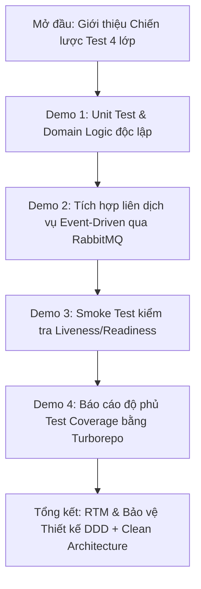

# Kịch Bản Demo & Thuyết Trình Kiểm Thử (Testing Demo Script)

Tài liệu này cung cấp kịch bản thuyết trình từng bước (Step-by-step) dành cho buổi bảo vệ đồ án/báo cáo tiến độ với thầy hướng dẫn, tập trung hoàn toàn vào việc **trình diễn hệ thống kiểm thử (Testing Infrastructure)** của dự án **DriveMate**.

---

## 🗺️ Tóm Tắt Kịch Bản Demo Kiểm Thử



---

## 🎙️ Chi Tiết Các Bước Trình Diễn & Lời Thoại

### Phần 0: Mở đầu - Giới thiệu Kiến trúc Kiểm thử (1 phút)
* **Thao tác:** Mở slide hoặc mở trực tiếp tài liệu [requirements-traceability-matrix.md](./requirements-traceability-matrix.md) trên màn hình.
* **Lời thoại đề xuất:**
  > *"Em xin phép trình bày về hệ thống kiểm thử của DriveMate. Đối với một dự án Microservices kết hợp Domain-Driven Design (DDD) và Clean Architecture, việc kiểm thử không thể chỉ dừng lại ở kiểm thử thủ công trên giao diện. Hệ thống của tụi em thiết lập chiến lược kiểm thử tự động gồm 4 lớp từ nhỏ đến lớn:
  > 1. **Unit Testing:** Kiểm thử logic nghiệp vụ lõi (Domain & Use Cases) độc lập và nhanh chóng bằng mock.
  > 2. **Service-Level E2E Testing:** Kiểm thử tích hợp nội bộ của từng service từ API Controller tới Database thật.
  > 3. **System-Level Integration Testing:** Kiểm thử sự đồng bộ và tương tác liên dịch vụ qua API Gateway (Kong) và Message Broker (RabbitMQ).
  > 4. **Smoke Testing:** Kiểm tra nhanh sức khỏe (Liveness/Readiness probes) của toàn bộ các API sau khi deploy."*

---

### Demo Scenario 1: Kiểm thử Unit & Ràng buộc Nghiệp vụ Lõi (2 phút)
* **Mục tiêu:** Chứng minh việc viết test case cho logic nghiệp vụ phức tạp (ví dụ: Chấm điểm thi lý thuyết lái xe dựa trên câu hỏi điểm liệt) một cách biệt lập, tốc độ chạy nhanh nhờ Mocking.
* **Mã Test Case minh họa:** `TC-DI-02-01` (Yêu cầu nghiệp vụ: Học viên làm sai câu hỏi điểm liệt sẽ bị đánh trượt ngay lập tức dù điểm tổng đạt yêu cầu).
* **Vị trí file code:** [submit-session.use-case.spec.ts](file:///C:/Users/Ngo%20Minh%20Tri/workspace/uit/microservices/luyen-thi-lai-xe-microservices/apps/exam-service/src/application/use-cases/submit-session/submit-session.use-case.spec.ts)
* **Thao tác thực hiện:**
  1. Mở file test [submit-session.use-case.spec.ts](file:///C:/Users/Ngo%20Minh%20Tri/workspace/uit/microservices/luyen-thi-lai-xe-microservices/apps/exam-service/src/application/use-cases/submit-session/submit-session.use-case.spec.ts) trên IDE.
  2. Chỉ cho thầy thấy đoạn code test mô phỏng một bài thi có 34/35 câu đúng, nhưng câu sai duy nhất là câu điểm liệt (`isCritical = true`).
  3. Mở terminal và chạy lệnh kiểm thử riêng biệt cho `exam-service`:
     ```bash
     npx turbo run test --filter=exam-service
     ```
* **Lời thoại đề xuất:**
  > *"Trước hết, em xin trình bày về kiểm thử đơn vị (Unit Test) cho logic nghiệp vụ. Ở đây tụi em áp dụng DDD, các thực thể nghiệp vụ hoàn toàn độc lập với database. File test `submit-session.use-case.spec.ts` của `exam-service` kiểm thử Use Case nộp bài thi.
  > Theo nghiệp vụ thi sát hạch lái xe của Bộ GTVT, chỉ cần làm sai 1 câu điểm liệt là trượt ngay lập tức. Trong test case `TC-DI-02-01`, tụi em dựng dữ liệu giả lập (Mock) với 34 câu đúng và 1 câu sai là câu điểm liệt. Khi chạy test bằng Turborepo cho `exam-service`, kết quả báo **PASS** chứng minh Use Case đã xử lý chính xác nghiệp vụ điểm liệt và trả về kết quả trượt (FAILED) mà không cần phải kết nối tới Database hay khởi động server NestJS."*

---

### Demo Scenario 2: Kiểm thử Tích hợp Liên Dịch Vụ - Event Propagation (3 phút)
* **Mục tiêu:** Trình diễn cách kiểm thử tích hợp (System Integration Test) kiểm chứng cơ chế đồng bộ dữ liệu bất đồng bộ (Eventual Consistency) qua RabbitMQ và API Gateway Kong.
* **Mã Test Case minh họa:** `TC-INTEG-01` (Đồng bộ tài khoản từ `identity-service` sang `user-service` qua RabbitMQ).
* **Vị trí file code:** [identity-user-sync.integration-spec.ts](file:///C:/Users/Ngo%20Minh%20Tri/workspace/uit/microservices/luyen-thi-lai-xe-microservices/tests/event-propagation/identity-user-sync.integration-spec.ts)
* **Chuẩn bị môi trường:** Đảm bảo các microservices đã được chạy (`npm run dev`) và Docker hạ tầng đang hoạt động.
* **Thao tác thực hiện:**
  1. Mở file test [identity-user-sync.integration-spec.ts](file:///C:/Users/Ngo%20Minh%20Tri/workspace/uit/microservices/luyen-thi-lai-xe-microservices/tests/event-propagation/identity-user-sync.integration-spec.ts) để giải thích luồng test:
     - Lấy Access Token của admin qua Kong Gateway (`POST /auth/login`).
     - Tạo tài khoản học viên mới qua Kong Gateway tới `identity-service` (`POST /admin/identity-users`).
     - Polling liên tục API của `user-service` (`GET /admin/users/:id`) với tần suất 500ms để kiểm tra xem hồ sơ học viên đã được tạo tự động chưa nhờ tin nhắn sự kiện truyền qua RabbitMQ.
     - Xóa dữ liệu học viên vừa tạo để trả lại trạng thái sạch cho DB (`DELETE /admin/identity-users/:id`).
  2. Mở terminal và chạy lệnh test tích hợp:
     ```bash
     npm run test:integration
     ```
* **Lời thoại đề xuất:**
  > *"Tiếp theo là phần kiểm thử tích hợp liên dịch vụ (System Integration Testing). Trong hệ thống microservices, các dịch vụ giao tiếp bất đồng bộ qua RabbitMQ. Để đảm bảo dữ liệu đồng bộ chính xác (Eventual Consistency), tụi em viết một test tích hợp hệ thống ở thư mục gốc `tests/`.
  > Trong bài test `identity-user-sync.integration-spec.ts`, kịch bản tự động hóa là: đăng nhập admin, tạo tài khoản người dùng tại `identity-service`. Khi tài khoản được tạo, hệ thống phát đi sự kiện `identity.user.created` qua RabbitMQ. Dịch vụ `user-service` nhận được sự kiện này và tự động khởi tạo hồ sơ người dùng (UserProfile) trong database riêng của nó.
  > Bài test sẽ thực hiện gọi API thăm dò (polling) qua API Gateway Kong tới `user-service` để kiểm chứng khi nào hồ sơ xuất hiện và thông tin có bị sai lệch không. Sau đó, nó tự động dọn dẹp bằng cách xóa tài khoản để không làm rác database. Khi em chạy lệnh `npm run test:integration`, tiến trình chạy mất khoảng 20 giây và đã vượt qua (PASS) chỉ trong vòng 1.6 giây chờ đồng bộ, chứng minh RabbitMQ truyền và nhận gói tin thành công."*

---

### Demo Scenario 3: Smoke Testing & Kiểm tra Sức khỏe Dịch vụ (2 phút)
* **Mục tiêu:** Trình diễn cách kiểm tra nhanh sức khỏe (Readiness & Liveness) của tất cả microservices và hạ tầng cơ sở dữ liệu kết nối.
* **Vị trí file code:** [smoke.ts](file:///C:/Users/Ngo%20Minh%20Tri/workspace/uit/microservices/luyen-thi-lai-xe-microservices/scripts/smoke.ts)
* **Thao tác thực hiện:**
  1. Giải thích nhanh: Mỗi dịch vụ đều có endpoint `/health/ready` thực hiện kiểm tra kết nối nội bộ tới DB, Redis, RabbitMQ, Keycloak.
  2. Chạy lệnh Smoke Test tại thư mục gốc:
     ```bash
     npm run smoke
     ```
* **Lời thoại đề xuất:**
  > *"Để đảm bảo toàn bộ hệ thống sẵn sàng hoạt động sau khi deploy, tụi em viết một script Smoke Test tại `scripts/smoke.ts`. Lệnh này sẽ tự động gọi song song tới các endpoint `/health/ready` của toàn bộ 11 microservices thông qua cổng của từng dịch vụ.
  > Điểm đặc biệt là mỗi endpoint `/health/ready` của từng dịch vụ không chỉ báo 'OK' chung chung, mà nó thực hiện kiểm tra xem kết nối tới PostgreSQL, Redis, RabbitMQ và Keycloak có thông suốt không. Khi em chạy `npm run smoke`, kết quả in ra mã màu xanh báo toàn bộ các dịch vụ đều khỏe mạnh và sẵn sàng hoạt động. Điều này giúp đội ngũ vận hành phát hiện ngay lập tức nếu một database bị sập hoặc mất kết nối mạng."*

---

### Demo Scenario 4: Chạy toàn bộ Test Suites và báo cáo Coverage (2 phút)
* **Mục tiêu:** Trình diễn năng lực quản lý và chạy song song toàn bộ mã kiểm thử trên toàn bộ Monorepo nhờ công nghệ Turborepo, cùng việc xuất báo cáo độ phủ (Coverage).
* **Thao tác thực hiện:**
  1. Chạy lệnh kiểm thử toàn bộ dự án:
     ```bash
     npm run test
     ```
  2. Tiếp tục giải thích về kiểm thử độ phủ và chạy:
     ```bash
     npm run test:cov
     ```
* **Lời thoại đề xuất:**
  > *"Để đảm bảo không có bất kỳ thay đổi nào làm hỏng code cũ (Regression Testing), tụi em cấu hình Turborepo để chạy song song tất cả các bài kiểm thử trên tất cả các dịch vụ chỉ bằng 1 lệnh duy nhất ở thư mục gốc là `npm run test`. Turborepo sẽ tự phân tích quan hệ phụ thuộc, chạy các dịch vụ song song và tự động cache lại các phần mã nguồn không thay đổi để tăng tốc độ.
  > Đồng thời, khi chạy `npm run test:cov`, hệ thống sẽ xuất ra bảng báo cáo độ phủ mã nguồn (Code Coverage) chi tiết từ số dòng code, số nhánh logic được kiểm thử của từng dịch vụ. Điều này giúp giảng viên và nhóm phát triển biết rõ phần mã nguồn nào chưa được phủ test để bổ sung kịp thời."*

---

## 💡 Các Câu Hỏi Thầy Hướng Dẫn Có Thể Hỏi & Cách Trả Lời

**Q1: Tại sao em lại cấu hình test tích hợp cấp hệ thống ở thư mục gốc `tests/` chứ không viết chung trong thư mục `test/` của từng dịch vụ?**
* **Trả lời:**
  > *"Dạ thưa thầy, theo kiến trúc Clean Architecture kết hợp DDD, mỗi dịch vụ (apps/*) phải hoàn toàn độc lập và không nên biết về sự tồn tại của dịch vụ khác. Nếu viết test tích hợp liên dịch vụ bên trong `identity-service`, chúng em sẽ vô tình vi phạm nguyên tắc lỏng lẻo (loose coupling) vì phải import hoặc gọi API của `user-service`.
  > Do đó, việc đặt thư mục `tests/` ở root monorepo đóng vai trò như một bên thứ ba (System Integration Orchestrator), giả lập đúng hành vi của người dùng bên ngoài hoặc hệ thống bên ngoài gọi vào API Gateway Kong và kiểm tra luồng đi của dữ liệu qua toàn bộ các dịch vụ."*

**Q2: Việc kiểm thử liên dịch vụ qua RabbitMQ bị phụ thuộc vào độ trễ mạng (latency). Làm sao em xử lý được sự bất định này trong mã test để tránh test bị fail oan (flaky tests)?**
* **Trả lời:**
  > *"Dạ thưa thầy, kiểm thử tích hợp bất đồng bộ luôn đối mặt với vấn đề độ trễ truyền tin (Eventual Consistency). Nếu gọi API kiểm tra ngay lập tức, dữ liệu chắc chắn chưa kịp đồng bộ và test sẽ fail.
  > Để giải quyết vấn đề này, trong file test tụi em áp dụng cơ chế **Polling với Retry limit**. Tụi em không dùng `setTimeout` cứng (vì như thế rất tốn thời gian vô ích), mà dùng một vòng lặp thử lại tối đa 10 lần, mỗi lần cách nhau 500ms. Ngay khi API trả về dữ liệu thành công (HTTP 200), vòng lặp sẽ break ngay lập tức để tiết kiệm thời gian chạy test. Đồng thời, cấu hình timeout của Jest hook được nâng lên 30 giây để bao quát trường hợp khởi tạo kết nối Keycloak ban đầu bị chậm."*
