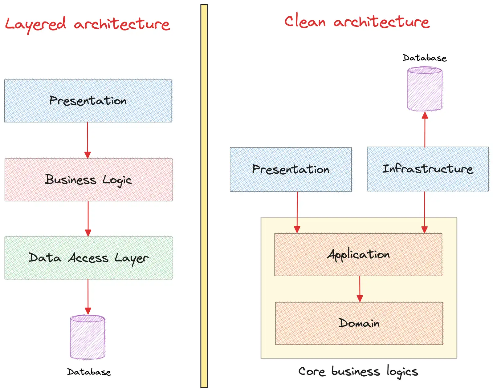

# Clean Architecture




## 1. Entities

- Có thể gọi là **domain layer**, thuộc về **core business logic**
- Là các object (model) chứa các business logic
- Trong Clean Architecture, 1 entity có thể là 1 object hoặc 1 cụm object.
- Mapping qua DDD, entities có thể bao gồm aggregate, entity, value object

## 2. Use case

- Có thể gọi là **application layer**, chứa application business logic, thuộc về core business logic
- Logic bao gồm: flow chương trình, tương tác với entities (layer trong) như load entities, save entities, … ⇒ như 1 `orchestrator` điều phối request
- Entities (domain layer) và use case (application layer) là 2 thành phần quan trọng và được cô lập ở **core business logic ⇒** không phụ thuộc các thành phần ngoài: framework, UI, database, …

## 3. Interface Adapters

- Có thể gọi là Presentation
- Chứa các adapter để convert data từ bên ngoài (web, database) vào bên trong (application, domain) và ngược lại.

## 4. Frameworks and Drivers

- Có thể gọi là **infrastructure layer**
- Chứa các detail implement của database, external service hay các driver, framework

Ví dụ: Ở use case chỉ thao tác với các interface của database thông qua repository pattern thôi, hoặc muốn giao tiếp với external service cũng phải thông qua interface. Ở layer đó hoàn toàn không thấy được implement chi tiết của chúng. Và những implement chi tiết đó sẽ nằm ở infrastructure layer này.

## 5. Dependency rule

- Chiều của dependency từ ngoài vào trong, hướng dẫn các thành phần tương tác, phụ thuộc lẫn nhau.
- Các thành phần bên trong không được phép **phụ thuộc trực tiếp** vào các thành phần ở lớp bên ngoài.
- Sự tương tác diễn ra thông qua các abstraction và dependency inversion

Ví dụ: Trong các use case, không được import các dependency ở ngoài như database (thuộc layer ngoài cùng).

```java

// Ví dụ ở đây là một file Use case.
// Các implementation của các repositories trong này thuộc về infra layer.
// Nhưng ở đây nếu import trực tiếp implementation chi tiết của các repo
// thì sẽ vi phạm dependency rule.
// Cho nên ở đây UserRepository phải là một interface
// (abstraction với layer bên ngoài) mới thỏa mãn dependency rule
public class CreateUserUseCaseImpl implements CreateUserUseCase {
    private UserRepository userRepository;
    private RoleRepository roleRepository;
    private UserDomainService userDomainService;
    private UserEventPublisher publisher;
  // ...

```

Lưu ý:

- Dependency rule không cấm hoàn toàn sự phụ thuộc giữa các thành phần.
- Mục tiêu là giảm thiểu phụ thuộc trực tiếp và khuyến khích sử dụng abstraction.

## 6. Usecase thực tế

- **Use case**: use case sẽ là tạo một author user. author user chính là người có thể tạo và quản lý bài post của họ. Sau khi tạo user xong, sẽ có một event UserCreatedEvent bắn và sync user qua một Redis server khác. Event này sẽ được bắn lên Kafka cluster
- Folder structure
  - `domain folder`: là domain layer, application chính là application layer. Hai ông này chính là core của software
  - `controller folder`: thuộc về presentation layer
  - `infra layer`: thuộc về infrastructure layer
  - `dto folder` ⇒ có 2 cách đặt
    - gom hết vào folder dto
    - `dto` phục vụ cho layer nào thì đặt tại layer đó.

```
application/
├── eventpublisher/
├── exception/
├── service/
├── repository/
│   ├── UserRepository.java
│   └── ...
└── usecase/
domain/
├── exception/
│   ├── UserNotFoundExeption.java
│   └── ...
├── valueobject/
│   ├── UserName.java
│   └── ...
├── entity/
│   ├── User.java
│   └── ...
└── service/
dto/
infra/
├── persistence/
│   ├── UserRepositoryImpl.java
│   └── ...
└── messaging/
controller/
├── UserController.java
└── ...
```

Flow của request

- Request đi tới controller `UserController` - interface adapters layer hay presentation layer ⇒ data sẽ được transform sang dạng thích hợp nhất với các layer ở trong - domain layer và application layer ⇒ dùng `UserDto` để chứa dữ liệu từ request nha.
- Request đi tiếp vào application layer thông qua use case `CreateUserUseCase` interface, chịu trách nhiệm
  - Điều phối flow của chương trình - business flow như thao tác với `UserRepository` để kiểm tra xem email có tồn tại chưa. Thao tác với `RoleRepository` để kiểm tra role có tồn tại hay không.
  - Sau đó sẽ tương tác với domain layer để tạo `User` entity (hay `User` aggregate).
  - Sau đó sẽ dùng Repository để save `User` xuống database và bắn event lên Kafka.
- Khi use case thao tác với domain layer thì các business logics của use case này sẽ được đảm bảo trong domain layer (trong các model và service).
- Và khi thao tác với các thành phần như repository, event publisher (những thành phần bên ngoài) thì use case chỉ thao tác với interface (không bao giờ use case nhìn thấy được implement chi tiết của infra).
- Và cuối cùng các implement chi tiết của database hay event publisher sẽ nằm ở infrastructure layer.

### 6.1. Layer Domain

```java

// User.java
@Getter
@Builder
public class User extends AggregateRoot<Id> {
    private UserName name;
    private Email email;
    private MobilePhone mobilePhone;
    private String password;
    UserActivated isActive;
    UserDeleted isDeleted;

    // Relationship with Role aggregate via id
    private List<Id> roleIds;

    public void updateName(UserName name) {
        this.name = name;
    }

    public void updateEmail(Email email) {
        this.email = email;
    }

    public void updateMobilePhone(MobilePhone mobilePhone) {
        this.mobilePhone = mobilePhone;
    }

    public void addRole(Id roleId) {
        if (roleIds.contains(roleId)) {
            return;
        }

        roleIds.add(roleId);
    }

    public void removeRole(Id roleId) {
        roleIds.remove(roleId);
    }

    public void activate() {
        if (isActive == UserActivated.TRUE) {
            throw new UserAlreadyActivatedException();
        }

        isActive = UserActivated.TRUE;
    }

    public void deactivate() {
        if (isActive == UserActivated.FALSE) {
            throw new UserAlreadyDeactivatedException();
        }

        isActive = UserActivated.FALSE;
    }

    public void markAsDeleted() {
        if (isDeleted == UserDeleted.TRUE) {
            throw new UserAlreadyDeletedException();
        }

        isDeleted = UserDeleted.TRUE;
    }
}
```

`User` entity ⇒ entity chính, trong DDD được xem là `aggregate root` của `User aggregate`

```java

// User.java
@Getter
@Builder
public class User extends AggregateRoot<Id> {
    private UserName name;
    private Email email;
    private MobilePhone mobilePhone;
    private String password;
    UserActivated isActive;
    UserDeleted isDeleted;

    // Relationship with Role aggregate via id
    private List<Id> roleIds;

    public void updateName(UserName name) {
        this.name = name;
    }

    public void updateEmail(Email email) {
        this.email = email;
    }

    public void updateMobilePhone(MobilePhone mobilePhone) {
        this.mobilePhone = mobilePhone;
    }

    public void addRole(Id roleId) {
        if (roleIds.contains(roleId)) {
            return;
        }

        roleIds.add(roleId);
    }

    public void removeRole(Id roleId) {
        roleIds.remove(roleId);
    }

    public void activate() {
        if (isActive == UserActivated.TRUE) {
            throw new UserAlreadyActivatedException();
        }

        isActive = UserActivated.TRUE;
    }

    public void deactivate() {
        if (isActive == UserActivated.FALSE) {
            throw new UserAlreadyDeactivatedException();
        }

        isActive = UserActivated.FALSE;
    }

    public void markAsDeleted() {
        if (isDeleted == UserDeleted.TRUE) {
            throw new UserAlreadyDeletedException();
        }

        isDeleted = UserDeleted.TRUE;
    }
}

```

- `User` entity chứa các public method để thao tác + các business logic
- Các business logic có thể kể đến:
  - Xóa user (markAsDeleted)
  - Active hay deactive user
  - Grant một role nào đó vào user
  - …

`UserName` là value object

```java

// UserName.java
@Getter
public class UserName {
    private static final int MIN_LENGTH = 3;
    private static final int MAX_LENGTH = 50;

    private String value;

    public UserName(String value) {
        setValue(value);
    }

    private void setValue(String value) {
        if (value.length() < MIN_LENGTH || value.length() > MAX_LENGTH) {
            throw new InvalidUserNameException();
        }

        this.value = value;
    }
}

```

Để đăng ký UserCreatedEvent trong domain layer ⇒ tạo một domain service để tạo User entity, handle business logic và register domain event

```java

// UserDomainServiceImpl.java implements UserDomainService.java
@Service
public class UserDomainServiceImpl implements UserDomainService {
    @Override
    public User createNewUser(UserDto userDto) {
        User user = User.builder()
                .name(new UserName(userDto.getName()))
                .email(new Email(userDto.getEmail()))
                .mobilePhone(new MobilePhone(userDto.getMobilePhone()))
                .password(userDto.getPassword())
                .isActive(UserActivated.TRUE)
                .isDeleted(UserDeleted.FALSE)
                .roleIds(userDto.getRoleIds().stream().map(Id::new).toList())
                .build();
        user.setId(new Id(UniqueIdGenerator.create()));
        user.setAggregateVersion(CONCURRENCY_CHECKING_INITIAL_VERSION);

        user.registerEvent(new UserCreatedEvent(user));
        return user;
    }
}
```

Ngoài ra, có thể dùng factory method bên trong domain object

```java

// User.java
@Getter
@Builder
public class User extends AggregateRoot<Id> {
    // ...

    // Có thể dùng Factory method ở đây để tạo User instance
    public static User createUser() {
         User user = User.builder()
                .name(new UserName(userDto.getName()))
                // ...

         user.registerEvent(new UserCreatedEvent(user));
         return user;
    }
}
```

**Lưu ý:**

- Đảm bảo business logics: nghiệp vụ cần design cẩn thận, tập trung tại layer domain (và layer application)
- Nghiệp vụ liên quan đến model nào thì nên nằm trên model ấy. Nghiệp vụ kết hợp nhiều model (entity) thì nên tạo domain service, không thì chuyển về các service ở layer application

### 6.2. Application

Usecase `CreateUserUseCase`

```java

// CreateUserUseCaseImpl.java
@Service
@AllArgsConstructor
public class CreateUserUseCaseImpl implements CreateUserUseCase {
    private UserRepository userRepository;
    private RoleRepository roleRepository;
    private UserDomainService userDomainService;
    private PasswordEncoder passwordEncoder;
    private UserEventPublisher publisher;

    // Đây là flow chính của request.
    public void execute(UserDto userDto) {
        rolesExistOrError(userDto.getRoleIds());
        userDoesNotExistOrError(userDto);
        userDto.setPassword(passwordEncoder.encode(userDto.getPassword()));
        User user = userDomainService.createNewUser(userDto);
        userRepository.save(user);
        publishDomainEvents(user);
    }

    private void userDoesNotExistOrError(UserDto userDto) {
        Optional<User> user
          = userRepository.findByEmail(userDto.getEmail());
        if (user.isPresent()) {
            throw new UserAlreadyExistsException();
        }
    }

    private void rolesExistOrError(List<String> roleIds) {
        List<Role> roles = roleRepository.findByIds(roleIds);
        if (roles.size() != roleIds.size()) {
            throw new RoleNotFoundException();
        }
    }

    private void publishDomainEvents(User user) {
        user.getDomainEvents().forEach(event -> publisher.publish(event));
    }
}
```

- Use case điều khiển flow của chương trình
- Use case dùng các libs bên ngoài để tương tác domain objects như: database, 3rd services, message brokers, … ⇒ tuân thủ dependency rule
- Để thao tác database, nếu gọi thẳng MySqlUserRepository ⇒ vi phạm

⇒ Sử dụng **Dependency inversion principle,** thay vì layer application phụ thuộc layer ngoài thì các layer ngoài phải **phụ thuộc qui định** ở layer application

```java

// Tầng application sẽ quy định những interface trong UserRepositry
// Những layer ở ngoài phải implement interface này
public interface UserRepository {
    void save(User user);
    Optional<User> findById(String id);
    Optional<User> findByEmail(String email);
    void delete(User user);
}

```

### 6.3. Controller

```java

// UserController.java
@AllArgsConstructor
@RestController
@RequestMapping("/api/v1/users")
public class UserController {
    private CreateUserUseCase createUserUseCase;

    @PostMapping
    @ResponseStatus(HttpStatus.CREATED)
    public void createUser(@RequestBody UserDto user) {
        createUserUseCase.execute(user);
    }
}
```

### 6.4. Infrastructure

Tầng này chính là tầng bên ngoài, sẽ là các implement chi tiết mà các tầng bên trong quy định bằng interface.

```java
@Component
@AllArgsConstructor
public class UserRepositoryImpl implements UserRepository {
    private UserJpaRepository userJpaRepository;

    @Override
    public void save(User user) {
        UserEntity userEntity = UserEntity.fromDomainModel(user);
        userJpaRepository.save(userEntity);
    }

    @Override
    public Optional<User> findById(String id) {
        Optional<UserEntity> userEntity = userJpaRepository.findById(id);

        return userEntity.map(UserEntity::toDomainModel);
    }

    @Override
    public Optional<User> findByEmail(String email) {
        Optional<UserEntity> userEntity
          = userJpaRepository.findByEmail(email);

        return userEntity.map(UserEntity::toDomainModel);
    }

    @Override
    public void delete(User user) {
        userJpaRepository.deleteById(user.getId().toString());
    }
}

```

```java

@Repository
public interface UserJpaRepository extends JpaRepository<UserEntity, String> {
    Optional<UserEntity> findByEmail(String email);
}
```
