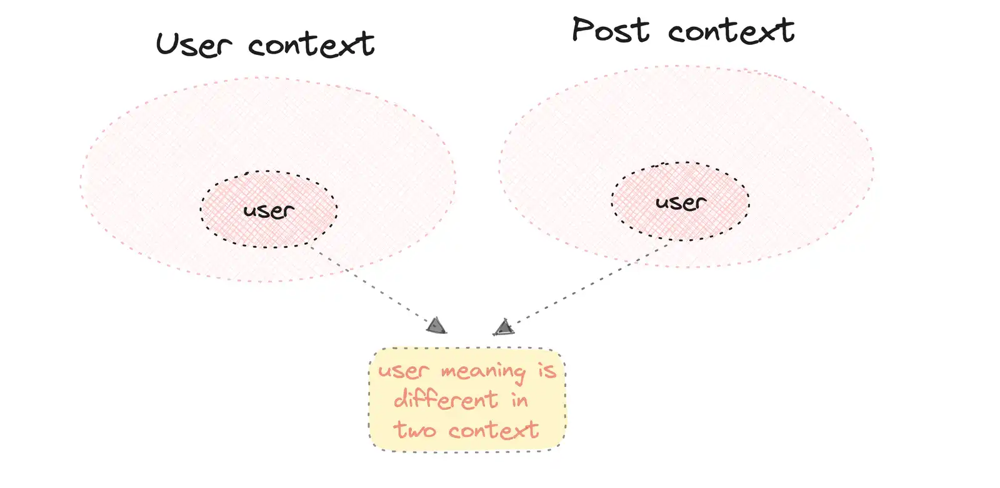

# Domain Driven Design

## 1. Khái niệm

**- Domain-Driven Design (DDD)** là phương pháp thiết kế phần mềm tập trung vào:

> Hiểu nghiệp vụ thật sâu → rồi mới thiết kế code theo nghiệp vụ đó.

- DDD giúp tránh tình trạng: Code **chạy được** nhưng không phản ánh **nghiệp vụ**
- DDD hướng tới: **Code** == **nghiệp vụ**

- DDD có 2 thành phần chính:

- **Strategic Design**
  - Tìm hiểu, phân tích, design `high level - view` của domain doanh nghiệp
  - Không có dòng code nào
  - Dựa trên các công cụ, thuật ngữ: `subdomain`, `bounded context`, `event storming`, `context map`
- **Tactical Design**
  - Dựa trên kết quả của Strategic Design ⇒ design các thứ `low-level`
  - Design ra các `business logics`, `building blocks` như: `Value object`, `Entity`, `Aggregate`, `Service`, …

## 2. Domain

- Domain = lĩnh vực nghiệp vụ hệ thống giải quyết

| System          | Domain             |
| --------------- | ------------------ |
| Shopee          | thương mại điện tử |
| Galaxy Cinema   | đặt vé             |
| Restaurant app  | đặt món            |
| Hospital system | y tế               |

- Một domain lớn ⇒ có thể thành các subdomain
- Subdomain có thể chia làm 3 loại:
  - Core subdomains
  - Generic subdomains
  - Supporting subdomains

## 3. Business logic

Ví dụ!

Team bạn nhận một dự án từ khách hàng (một công ty truyền thông ở Đông Lào).

Và yêu cầu của họ là tạo `một trang báo điện tử` (giống 24h hay vnexpress ấy các bạn). Và khi khách hàng truyền tải `requirement` về cho các bạn. Họ sẽ có một số lời nói khá quen thuộc như sau (mình nói về context User):

- Mỗi user chỉ có 1 email duy nhất và không trùng với user khác
- Khi tạo user thì mặc định sẽ có role là Subscriber.
- Có 3 system roles: Admin, Author, Subscriber.
- User admin có thể tạo được Role.
- User admin có quyền tạo thêm roles.
- Role thì không được trùng tên (unique) với nhau.
- Không được chỉnh sửa system role.
- Role name chỉ được chứa ký tự a-z, A-Z, 0-9 và \_.
- Role name chỉ có độ dài tối thiểu là 3 ký tự, tối đa 100 ký tự.
- …

Hoặc trong một ứng dụng `Food Ordering`:

- Khi mới tạo một đơn hàng (order) thì trạng thái (status) của nó sẽ là `pending`.
- Total price của một đơn hàng không được nhỏ hơn 0.
- Khi payment (thanh toán) thất bại, trạng thái cuối cùng của đơn hàng sẽ là `canceled`.
- Khi payment thành công và hàng trong kho còn đủ số lượng cho đơn hàng thì trạng thái đơn hàng sẽ là `approved`.

Đấy, tất cả các gạch đầu dòng trên, là `business logics`! Dễ hiểu phải không các bạn.

Và có một điều các bạn phải lưu ý:

- Business logics là cái thử rất `dễ thay đổi và mở rộng`. Vì sản phẩm của các bạn phải đáp ứng được nhu cầu của khách hàng (khách hàng là thượng đế lại còn khó tính). Càng phát triển thì nhu cầu của khách hàng càng thay đổi và mở rộng nhiều hơn.

⇒ **Trong DDD, các business logic sẽ được đặt trong `core domain layer`. Cụ thể là trong các value object, entity, aggregate, domain service**.

- Tất cả business logic đều tập trung vào core domain của nó. Hiểu đơn giản là có một layer là domain, tất cả logic nghiệp vụ sẽ được viết trong layer này. Khi kết hợp với hexagonal, onion hay clean architecture, nó thường nằm ở layer `domain`. Tách biệt hoàn toàn so với các layer khác và không phụ thuộc vào bất cứ layer hay công nghệ nào ví dụ database, message queue, UI, API, ... Mà các layer khác phải `implement` layer `domain` này. Đây là đảo ngược sự phụ thuộc.

## 4. Ubiquitous Language

- Ngôn ngữ chung giữa **domain expert team**, **devs team** và các team liên quan

Ví dụ:

Không dùng:

`createOrder()`

Dùng:

`placeOrder()`

## 5. Bounded Context

Phân chia các domain logics, ubiquitous language thành các `context` nhỏ hơn

Ví dụ: Trang báo điện tử

- `User bounded context`: Nơi chứa logic nghiệp vụ liên quan tới users, các từ ngữ liên quan tới users, roles.
- `Post bounded context`: Chứa logic nghiệp vụ liên quan tới các bài post, …
- Số lượng `user` xem bài post abc này trong một tháng 100 users. Thì ý nghĩa của `user trong post context` sẽ khác với `user trong user context`. Rõ ràng user trong user context thì nó đang đề cập tới, user admin, author, subscriber, hay có role là gì, ... Còn user trong post context đơn giản là user đã xem bài post ở ngoài thôi.

⇒ Đó chính là **`bounded context`**



## 6. Layer architecture

- Sơ khai: 1 đống code vào 1 hoặc 1 vài file (1 file làm tất cả từ controller, business logic, persist data, view, …) ⇒ Ông cha phát minh ra layer architecture bằng cách chia nhỏ nhiều layer nhỏ hơn. Mỗi layer làm một việc duy nhất như: UI layer, application layer, domain layer, infrastructure layer, …

⇒ Sự ra đời của các architecture: hexagonal, onion hay clean architecture

- DDD tập trung hết core business logic vào 1 “nơi” duy nhất ⇒ DDD sẽ kết hợp với các layer architecture để triển khai

## 7. Event sourcing

## 8. Modeling skill

**Modeling skill = khả năng biến nghiệp vụ ngoài đời thành object trong code đúng cách.**

Ví dụ:

❌ Primitive style

```
String email
String phone
int money
```

✅ DDD style

```
Email
PhoneNumber
Money
```

Model đúng giúp:

- code dễ đọc
- logic rõ ràng
- validation nằm đúng chỗ
- domain express rõ business meaning

## 9. Data transfer object (DTO)

- Object dùng để chuyển data đi qua các layer trong vòng đời của 1 business flow

```java

// UserDto.java
// Object đơn giản thôi chứ thực tế nhiều fields hơn nha.
@AllArgsConstructor
@NoArgsConstructor
@Getter
@Setter
public class UserDto {
    private String name;
    private String email;
    private String password;
}
```

## 10. Value Object

- **`Value object`** là 1 object, dùng để chứa dữ liệu
- **`Immutable` -** bất biến ⇒ khởi tạo value obj thì không thể thay đổi data bên trong ⇒ dữ liệu toàn vẹn - không thay đổi trong vòng đời 1 business flow
- Không có các public **setter**, các **properties** là read-only
- 2 value obj có dữ liệu giống nhau ⇒ bằng nhau
- Các business logic liên quan ⇒ đặt bên trong các value obj

```java

// UserName.java
@Getter
public class UserName {
    private static final int MIN_LENGTH = 3;
    private static final int MAX_LENGTH = 50;

    private String value;

    public UserName(String value) {
        setValue(value);
    }

    private void setValue(String value) {
        if (value.length() < MIN_LENGTH || value.length() > MAX_LENGTH) {
            throw new InvalidUserNameException();
        }

        // Ngoài ra còn các business logic khác như:
        // username không được chứa các ký tự đặc biệt
        // ...

        this.value = value;
    }
}
```

Khi muốn dùng value obj UserName

```java

// Khởi tạo một value object
UserName userName = new UserName("lenhatthanh20");

// Bạn không thể thay đổi data bên trong nó nữa
userName.setValue("admin"); // Điều này không cho phép
```

⇒ Khi 1 value obj được tạo thành công ⇒ tất cả business logic liên quan tới obj đó đã được thỏa mãn ⇒ dữ liệu trong value obj không được thay đổi được nữa ⇒ **`data consistency`**

## 11. Entity

- Cũng là object y như value object
- Có **định danh** (ID)
- Có setter
- Thường dùng để chứa dữ liệu và lưu xuống DB
- Business logic liên quan ⇒ đặt bên trong entity

```java

// Mình có một file Entity.java để dùng chung cho tất cả các entity
// Base class Entity.java
@Getter
@AllArgsConstructor
public class Entity<Type> {
    private Type id;
}

// Và đây là một entity trong DDD
// Role.java
@Getter
public class Role extends Entity<Id> {
    private RoleName name;
    private RoleDescription description;

    public Role(
            Id id,
            RoleName name,
            RoleDescription description
    ) {
        super(id);
        this.name = name;
        this.description = description;
    }

    public void updateRoleName(RoleName name) {
        // Một số business logic có thể nằm ở đây
        this.name = name;
    }

    public void updateRoleDescription(RoleDescription name) {
        // Một số business logic có thể nằm ở đây
        this.description = description;
    }

    public static Role create(
            Id id,
            RoleName name,
            RoleDescription description
    ) {
        // Một số business logic có thể nằm ở đây
        Role role = new Role(id, name, description);

        return role;
    }
}
```

- Khi tạo thành công 1 entity ⇒ tất cả **business logic** liên quan được thỏa mạn ⇒ **`data consistency`**

## 12. Domain service

- Các business logic tập trung vào `domain layer` , cụ thể: `value object`, `entity`, `aggregate`, `domain service`
- Trong layer architecture, mỗi layer sẽ có các service của layer đó ⇒ `domain service` chứa các logic phục vụ `layer domain` ⇒ **Logic ở đây là business logic**
- Khi các business logic không biết đặt ở đâu (value object, entity, aggregate) ⇒ đặt ở domain service

Ví dụ: Use case tạo một role có 1 business logic sau: Khi tạo mới một role, tên của role mới này bắt buộc không được trùng tên với bất kì role nào trong hệ thống.

```java

// CreateRoleService.java
@Service
@AllArgsConstructor
public class CreateRoleService implements CreateRoleServiceInterface{
    RoleRepositoryInterface roleRepository;

    public void create(RoleDto roleDto) {
        this.roleNameDoesNotExistOrError(roleDto.getName());

        Role role = Role.create(
                new Id(UniqueIdGenerator.create()),
                new RoleName(roleDto.getName()),
                new RoleDescription(roleDto.getDescription())
        );

        roleRepository.save(role);
    }

    // Đây là business logic mình vừa đề cập
    // Và mình đặt logic này trong domain service.
    private void roleNameDoesNotExistOrError(String name) {
        Optional<Role> role = roleRepository.findByName(name);
        if (role.isPresent()) {
            throw new RoleAlreadyExistException();
        }
    }
}
```

## 13. Aggregate

Xét usecase: **Tạo comment của 1 bài báo (post)**

Một số business logic:

- Khi tạo comment, nếu user không tồn tại thì sẽ báo lỗi cho người dùng.
- Khi xóa bài báo thì tất cả comment sẽ bị xóa theo.
- Tổng số lượng comment trong 1 bài báo là 100 (lưu ý đây chỉ là logic ví dụ - không phải logic trong production application). Nếu quá 100 thì sẽ báo lỗi cho người dùng

```java

// CHƯA ÁP DỤNG DDD
// Ở TRONG MỘT FILE SERVICE NÀO ĐÓ CỦA BẠN
// commentDto: userId, postId, content

// Dưới đây sẽ là các step các bạn hay làm:

// STEP 1. Kiểm tra xem user có tại hay không.
this.checkingUserExistOrError(userId);

// Còn nhiều business logic khác ở đây: quyền, ...

// STEP 2. Kiểm tra POST có tồn tại hay không.
Post post = getPostOrError(postId);

// STEP 3. Kiểm tra số lượng comments của POST
// Hoặc ở đây bạn hay đếm số lượng comments từ database
if (post.getComments().size() >= 100) {
    throw new PostCommentLimitException();
}
// Check một số business logic khác nữa.

// STEP 4. Save comment xuống:
Comment comment = new CommentEntity(...);
commentRepository.save(comment); // Lưu xuống DB
```

Khi có 1 usecase khác `add comment` khác usecase ở trên ⇒ dev thao tác với `Post model` và quên logic ở step 3 (làm sai), `add comment` trực tiếp, lưu lại ở step 5 ⇒ vi phạm business logic 101 comment ⇒ **`data inconsistency`**

- Aggregate giúp cho data nhất quán. Khi 1 aggregate tạo thành công ⇒ thỏa mãn tất cả business logic liên quan tới nó ⇒ consistency
- Aggregate ra đời ⇒ handle inconsistency data trong business flow của app

```java
// Post.java
// `Post` chính là aggregate root.
// Để thao tác với các thành phần bên trong như entity `Comment`
// thì tất cả phải thông qua aggregate root.
// Ví dụ thao tác `add comment`
public class Post extends AggregateRoot<Id> {

    // Đây là property `comments` để chứa comment trong aggregate.
    // Nó thể hiện mối quan hệ - object relationship.
    // Mỗi post sẽ có nhiều comments ở bên trong nó.
    // Và `Comment` chính là một entity
    private List<Comment> comments = new ArrayList<>();

    // Method này nằm bên trong aggregate root
    public void addComment(String content, String userId) {
        // True invariants here (đây là logic buộc phải thõa mãn)
        // Tất cả comment phải nhỏ hơn hoặc bằng 100.
        if (this.comments.size() > MAX_COMMENT) {
            throw new CommentLimitExceededException();
        }

        // Ví dụ còn một số business logic khác phải thỏa như:
        // Khi bài post ở trạng thái DRAFT, không thể add comment
        // Ví dụ:
        if (this.status != 'DRAFT') {
            throw new CommentPermissionException();
        }

        // ... và nhiều logic ở đây nữa

        Comment comment = new Comment(
            newId(UniqueIdGenerator.create()),
            content,
            new Id(userId)
        );
        this.comments.add(comment);
}

// Domain service AddCommentService.java (hoặc application service)
// Và ở ngoài domain service chúng ta sẽ làm như sau:
// 1. Kiểm tra xem user có tại hay không.
this.checkingUserExistOrError(userId);

// 2. Kiểm tra post có tồn tại hay không.
Post post = getPostOrError(postId); // Load aggregate

// 3. Thêm comment vào post:
post.addComment(
    commentDto.getContent(),
    user.get().getId().toString()
);

// Sau khi trãi qua step 3, toàn bộ business logic sẽ được thỏa mãn.

// 4. Lưu post:
postRepository.save(post); // Lưu xuống DB
```

Các **tính chất** và **rule** của Aggregate:

- Aggregate là tập hợp nhiều entity, value object có liên quan tới nhau.
- Trong aggregate sẽ có một `aggregate root`. (Aggregate root cũng là một entity).
- Aggregate sẽ có một ID (gọi là `global ID`).
- Các aggregate giao tiếp với bên ngoài chỉ thông qua global ID.
- Các object bên trong aggregate tuyệt được không được giao tiếp với bên ngoài. Tất cả phải thông qua aggregate root.
- **Dữ liệu bên trong aggregate sẽ được toàn vẹn và nhất quán (consistency)**.
- Khi save Aggregate phải theo cơ chế Atomic: Tất cả thông tin trong aggregate phải được save xuống thành công tất cả hoặc tất cả thất bại. Và khi có các request đồng thời, phải xử lý cho chuẩn - `concurrency requests`. Chổ này liên quan tới xử lý `concurrency requests` theo các cơ chế như `optimistic locks` hay `pessimist lock` và `transaction`
- Khi làm việc với aggregate, đừng nghĩ tới database relationship. Mà hãy nghĩ tới object relationship.


```java

// Post.java
// Đây là Aggregate root
@Getter
@Setter
public class Post extends AggregateRoot<Id> {
    private Title title;
    private PostContent content;
    private Id userId;
    private Summary summary;
    private Slug slug;
    private List<Comment> comments = new ArrayList<>();
    // Thật ra còn nhiều properties khác ở đây nữa

    public Post(
            Id id,
            Title title,
            PostContent content,
            Id userId,
            Summary summary,
            Slug slug
    ) {
        super(id);
        this.setTitle(title);
        this.setContent(content);
        this.userId = userId;
        this.summary = summary;
        this.setSlug(slug);
    }

    public void updateTitle(Title title) {
        this.title = title;
    }

    public void updateContent(PostContent content) {
        this.content = content;
    }

    private void updateSlug(Slug slug) {
        this.slug = slug;
    }

    public static Post create(
            Id id,
            Title title,
            PostContent content,
            Id userId,
            Summary summary,
            Slug slug
        ) {
        return new Post(
            id, title, content, userId, summary, thumbnail, slug
        );
    }

    public void addComment(String content, String userId) {
        // True invariants here, example
        // Total of comments must be less than 100
        // When the status of the post is DRAFT, can not add comment
        if (this.comments.size() > MAX_COMMENT) {
            throw new CommentsLimitExceededException();
        }

        // ...

        Comment comment = new Comment(
            new Id(UniqueIdGenerator.create()),
            content,
            new Id(userId)
        );
        this.comments.add(comment);
    }
}
```

**Rule design aggregate:**

- Rule 1: Dựa trên các business logic luôn đúng - `True Invariants`
- Rule 2: Aggregate nên nhỏ nhất có thể
- Rule 3: Giao tiếp với Aggregate khác bằng global ID


- Rule 4: Nên dùng `Eventual consistency`

## 14. Domain event

- Là sự thể hiện của một việc **đã xảy ra** trong Domain Layer (Ví dụ: tạo User thành công sinh ra event `UserCreatedEvent`)
- **Cơ chế hoạt động:** Bắn event ra và không cần quan tâm ai xử lý. Một Aggregate hoặc Bounded Context khác sẽ đóng vai trò "hứng" (Subscribe/Listen) event đó để xử lý nghiệp vụ tiếp theo.
- Eventual Consistency: sự đánh đổi khi dùng xử lý bất đồng bộ (async), thường thông qua **Message Queue** (như Kafka). Dữ liệu không nhất quán ngay lập tức mà sẽ "nhất quán sau một lúc nữa”
  - **Ví dụ 1 (Xóa Bài):** Nhấn xóa `Post` -> Trả response thành công ngay lập tức -> Bắn `PostDeletedEvent` -> `Comment` aggregate hứng event và tiến hành xóa comment ngầm ở background.
  - **Ví dụ 2 (Microservices):** `Order Service` tạo đơn thành công -> Bắn `OrderCreatedEvent` -> `Payment Service` (và các service khác) hứng event để tiếp tục quy trình.
- Domain Event thường được đăng ký (register) ngay bên trong **Aggregate Root**.
- Tùy thuộc vào thiết kế cụ thể, cũng có thể đăng ký bên trong **Domain Service** miễn sao hợp lý với luồng nghiệp vụ.

```java

// Hàm này bên trong Post.java (aggregate root)
public static Post create(
        Id id,
        Title title,
        PostContent content,
        Id userId,
        Summary summary,
        String thumbnail,
        Slug slug
) {
    // True invariants here
    Post post = new Post(
        id,
        title,
        content,
        userId,
        summary,
        thumbnail,
        slug
    );

    // Khi tạo post thì sẽ đăng ký một event
    post.registerEvent(new PostCreatedEvent(post));

    return post;
}

// Và ở đâu đó trong layer repository
// Khi persist DB xong event sẽ được tự động bắn đi
// Hoặc bạn có thể bắn event trong Domain service (tùy bạn)
// Nâng cao hơn thì việc commit DB
//     + publish event nó còn dính tới transaction.
// Bạn tự tìm hiểu thêm nha
// Mình ví dụ nếu save DB không thành công thì không được bắn event đi nha.
// Khi bắn event đi thất bại thì phải xử lý như thế nào?
// vân vân mây mây
public class PostRepository implements PostRepositoryInterface {
    private PostJpaRepository postJpaRepository;
    ...

    @Override
    public void save(Post post) {
        // Build PostEntity here

        this.postJpaRepository.save(postEntity);
        // Publish domain events
        user.publishEvents(domainEventPublisher);
    }
}

// Và đây là nơi nhận được event.
// Mình bắn event vào Kafka để sync data qua redis
// Ở đây sẽ là ngoài phạm vi của domain layer nha.
// Domain layer chỉ có nhiệm vụ bắn domain event đi thôi.
@Service
@AllArgsConstructor
public class PostEventHandler {
    @EventListener(PostCreatedEvent.class)
    public void handlePostCreatedEvent(PostCreatedEvent event) {
        sendMessageToKafkaBroker(event);
    }

    private void sendMessageToKafkaBroker(DomainEventInterface event) {
        Post post = (Post) event.getEventData();
        ProducerRecord<String, PostEventDto> record
            = new ProducerRecord...

        // send data to kafka
        this.kafkaTemplate.send(record);
    }
}
```

- Khi làm việc với DDD thông thường sẽ kết hợp với các layer architected.
- Business logic sẽ tập trung ở duy nhất một nơi gọi là `core domain layer`.
- Unit test riêng biệt cho domain layer luôn để verify các business logic vì domain layer không phụ thuộc vào các layer khác.
- Và các layer khác phải dựa trên domain layer để mà implement. Ví dụ trong hexagonal architecture, bạn sẽ thiết kế các input ports và output ports. Cụ thể nó có thể là các interface của domain layer. Và các layer khác muốn giao tiếp với domain layers sẽ phải implement các interfaces này. Đây là đảo ngược sự phụ thuộc (Inversion of control).
