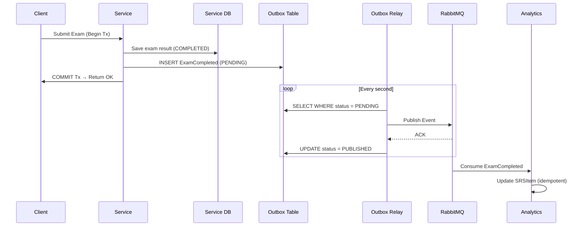
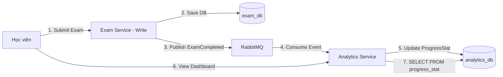

# DriveMate — Hướng Dẫn Đối Chiếu Kiến Trúc: SRS ➔ ASR ➔ ADD ➔ Design Patterns

Tài liệu này là bản đồ đối chiếu (**Mapping**) chi tiết và đầy đủ giữa **Use Cases (SRS)**, **ASR**, **ADD**, **Design Patterns** và **vị trí source code cụ thể** trong dự án **DriveMate**. Mỗi mục đều link thẳng đến file và đoạn code tương ứng, kèm giải thích cách pattern thỏa mãn yêu cầu kiến trúc.

---

## 📐 0. Kiến Trúc Tổng Thể (Từ ADD Section 3)

### 4+1 View Model

| View | Mô tả ADD | Triển khai |
|------|-----------|------------|
| **Logical** | 12 services + Kong + Keycloak + Consul + ELK | `apps/*/` mỗi thư mục = một service |
| **Implementation** | Turborepo monorepo, NestJS 11, Prisma v7 per-service, `@repo/common` | `packages/common/`, `packages/prisma-*/` |
| **Deployment** | Dev: Docker Compose; Prod target: Kubernetes + HPA | `docker-compose.yaml`, `k8s/` |
| **Data** | Database-per-service PostgreSQL 15, RabbitMQ, Redis (identity-only) | Mỗi `apps/*/prisma/schema.prisma` |
| **Process** | Login via Keycloak, Async Notification, Offline Sync, Server FSM | `identity-service/`, `notification-service/`, `exam-service/`, `simulation-service/` |

---

## 🧩 1. Danh Mục Đầy Đủ Design Patterns (GoF + Architectural)

### 📋 Bảng Tổng Hợp Tất Cả Patterns

| # | Pattern | Loại | Vị Trí Code | ASR / ADD |
|---|---------|------|-------------|-----------|
| 1 | **Decorator** | GoF Structural | `@IsEmail()`, `@ApiProperty()`, `@Injectable()` trên DTOs và Controllers | ASR-SEC-04 validation |
| 2 | **Template Method** | GoF Behavioral | `AggregateRoot`, `Entity`, `ValueObject`, `ExamSessionRepository` (abstract class) | ADD Section 3.2 |
| 3 | **Factory Method** | GoF Creational | `ExamSession.create()`, `Email.create()`, `Practice2dSession.create()` | ASR-DI-09, ASR-DI-08 |
| 4 | **Factory (Static Factory)** | GoF Creational | `ConsulConfigFactory.create()` | ASR-MOD-01, ADD 3.2 |
| 5 | **Strategy** | GoF Behavioral | `CourseCachePort` abstract class + `RedisCourseCacheService` implementation | ASR-PERF-05, ASR-AV-06 |
| 6 | **Adapter** | GoF Structural | `HttpQuestionPoolClient extends QuestionPoolClient`, `HttpUserProfileClient extends UserProfileClient` | ASR-AV-04, ADD 3.2 |
| 7 | **Interceptor (Decorator variant)** | GoF Structural / NestJS | `ApiResponseInterceptor`, `AccessLogInterceptor`, `CorrelationIdInterceptor`, `MetricsInterceptor`, `RabbitMqRetryInterceptor` | ASR-AV-03, ADD 3.2 |
| 8 | **Chain of Responsibility** | GoF Behavioral | NestJS Guards pipeline: `AuthGuard` → `TokenBlacklistGuard` → `RolesGuard` | ASR-SEC-01, ASR-SEC-03, ASR-SEC-04 |
| 9 | **Observer (Event-Driven)** | GoF Behavioral | `AggregateRoot.addDomainEvent()` → domain events → `ExamSessionCompletedEvent` | ASR-DI-07, ASR-REL-04 |
| 10 | **Repository** | DDD Pattern | `ExamSessionRepository` (abstract) + `PrismaExamSessionRepository` (impl) | ADD 3.2, ASR-REL-04 |
| 11 | **Mapper** | DDD/Structural | `ExamSessionMapper.toDomain()` (DB row → Domain aggregate) | ADD Section 3.2 |
| 12 | **Value Object** | DDD Pattern | `Email` (immutable, self-validating) | ASR-SEC-04 |
| 13 | **Aggregate Root** | DDD Pattern | `ExamSession`, `Practice2dSession` (encapsulate invariants, emit events) | ASR-REL-04, ASR-DI-01 |
| 14 | **Finite State Machine (FSM)** | Behavioral | `Practice2dSession.ingestTelemetry()` + `detectFeedback()` state transitions | ASR-UX-02, ADD 3.5 Flow 4 |
| 15 | **Transactional Outbox** | Messaging Pattern | Outbox tables in `exam-service`, `user-service`, `course-service` | ASR-DI-07, ASR-AV-05 |
| 16 | **CQRS** | Architectural | Write: `exam-service` → Read: `analytics-service` pre-aggregated table | ASR-PERF-04, ASR-PERF-07 |
| 17 | **Circuit Breaker** | Resilience Pattern | `resilientFetch()` + `configureAxiosResilience()` in `@repo/common` | ASR-AV-04 |
| 18 | **Token Blacklist** | Security Pattern | Redis `blacklist:{jti}` + `TokenBlacklistGuard` | ASR-SEC-03 |
| 19 | **Exam Config Snapshot** | Immutability Pattern | `ExamSession.topicDistributionSnapshot`, `optionsSnapshot` JSONB | ASR-DI-08 |
| 20 | **Idempotent Write** | Data Consistency | SQL Upsert trên `(examSessionId, questionId)` + `RabbitMqRetryInterceptor` dedup | ASR-REL-03 |
| 21 | **Soft Delete** | Data Integrity | `isDeleted=true` trong `course-service`, `question-service` | ASR-DI-03, ASR-DI-10 |
| 22 | **Pub-Sub (Message Broker)** | Messaging | RabbitMQ exchanges + queues + `RabbitMqRetryInterceptor` | ADD 3.4, ASR-PERF-08 |
| 23 | **Retry with Exponential Backoff** | Resilience | `backoffMs()` trong `resilient-http-client.ts` và `rabbitmq-resilience.ts` | ASR-AV-04, ASR-AV-05 |
| 24 | **Cache-Aside** | Performance | `RedisCourseCacheService` + `CourseCachePort` | ASR-PERF-05 |
| 25 | **Config Priority Chain** | Configuration | `ConsulConfigFactory`: env vars > Consul KV > .env > defaults | ASR-MOD-01, ADD 3.1 |
| 26 | **Correlation ID Propagation** | Observability | `CorrelationIdInterceptor` + `x-correlation-id` header qua HTTP và RabbitMQ | ADD 3.1 ELK |

---

## 🔬 2. Chi Tiết Từng Pattern — Code + Giải Thích + ASR Liên Quan

### 🎨 Pattern 1: Decorator Pattern

**Loại:** GoF Structural — thêm behavior vào object mà không sửa class gốc.

**Trong DriveMate:** TypeScript/NestJS dùng Decorator (`@`) đặt trên properties của DTO và Methods của Controller để tự động thêm validation, documentation, và DI metadata.

**Code cụ thể — [create-user.request.dto.ts](../../apps/identity-service/src/presentation/dtos/create-user.request.dto.ts#L11-L33):**
```typescript
export class CreateUserRequestDto {
  @ApiProperty({ example: 'nguyenvana@gm.uit.edu.vn' })  // Decorator: thêm Swagger doc
  @IsEmail()                                               // Decorator: thêm validation rule
  email!: string;

  @ApiProperty({ enum: UserRole, example: UserRole.STUDENT })
  @IsEnum(UserRole)                                        // Decorator: enforce enum constraint
  role!: UserRole;

  @ApiProperty({ minLength: 8 })
  @IsString()
  @MinLength(8)                                            // Decorator: min length guard
  temporaryPassword!: string;
}
```

**Cách pattern thỏa mãn ASR/ADD:**
- `@IsEmail()`, `@IsEnum()`, `@MinLength()` → **ASR-SEC-04** (Input validation trước khi tạo user, email uniqueness enforcement tại API layer)
- `@ApiProperty()` → **ADD Section 3.2** (OpenAPI/Swagger auto-generation cho docs-service)
- `@Injectable()` trên Services → **ADD Section 3.2** (NestJS DI Container quản lý lifecycle)

---

### 🎨 Pattern 2: Template Method Pattern

**Loại:** GoF Behavioral — abstract class định nghĩa skeleton của algorithm; subclass override các bước cụ thể.

**Trong DriveMate:** Các abstract class DDD base và Repository interface định nghĩa "hợp đồng" mà concrete implementations phải thực hiện.

**Code cụ thể — [entity.base.ts](../../packages/common/src/ddd/entity.base.ts#L1-L17):**
```typescript
// TEMPLATE: định nghĩa skeleton behavior cho mọi Entity
export abstract class Entity<TId> {
  protected readonly _id: TId;

  constructor(id: TId) { this._id = id; }

  get id(): TId { return this._id; }

  // Template Method: equality so sánh bằng identity (ID), không phải reference
  equals(other: Entity<TId>): boolean {
    if (other === null || other === undefined) return false;
    if (other.constructor !== this.constructor) return false;
    return this._id === other._id;  // Concrete step: compare by ID
  }
}
```

**Code cụ thể — [aggregate-root.base.ts](../../packages/common/src/ddd/aggregate-root.base.ts#L1-L18):**
```typescript
// TEMPLATE: AggregateRoot extends Entity, thêm domain event management
export abstract class AggregateRoot<TId> extends Entity<TId> {
  private _domainEvents: DomainEvent[] = [];

  protected addDomainEvent(event: DomainEvent): void {
    this._domainEvents.push(event);
  }
  // Subclass ExamSession, Practice2dSession sẽ gọi addDomainEvent()
  // trong các business methods của mình
}
```

**Code cụ thể — [exam-session.repository.ts](../../apps/exam-service/src/domain/repositories/exam-session.repository.ts#L36-L45):**
```typescript
// TEMPLATE: Abstract Repository — domain layer chỉ biết interface
export abstract class ExamSessionRepository {
  abstract findById(id: string): Promise<ExamSession | null>;
  abstract findAll(filter: ListExamSessionsFilter): Promise<ListExamSessionsPage>;
  abstract findMissedQuestions(filter: MissedQuestionReviewFilter): Promise<MissedQuestionItem[]>;
  abstract save(session: ExamSession): Promise<void>;
  // Concrete impl (PrismaExamSessionRepository) ở infrastructure layer
}
```

**Cách pattern thỏa mãn ASR/ADD:**
- **ADD Section 3.2 `@repo/common`:** DDD base classes là shared library; mọi service extend cùng một AggregateRoot → nhất quán pattern toàn hệ thống.
- **ASR-REL-04 Atomic Submit:** `ExamSession` extends `AggregateRoot` → business invariants (assertInProgress, assertNotExpired) được enforce trong domain, không rò rỉ ra ngoài.

---

### 🎨 Pattern 3: Factory Method Pattern

**Loại:** GoF Creational — static factory method kiểm soát quá trình khởi tạo object, thực thi business invariants.

**Code cụ thể — [email.vo.ts](../../apps/identity-service/src/domain/value-objects/email.vo.ts#L11-L17):**
```typescript
export class Email extends ValueObject<{ value: string }> {
  private constructor(props: { value: string }) {  // private: không thể new Email()
    super(props);
  }

  // FACTORY METHOD: validate rồi mới tạo object
  static create(value: string): Email {
    const normalized = value.trim().toLowerCase();
    if (!Email.EMAIL_REGEX.test(normalized)) {
      throw new InvalidEmailException(value);  // Guard: invalid input = exception
    }
    return new Email({ value: normalized });   // Normalize tại điểm tạo
  }
}
```

**Code cụ thể — [exam-session.aggregate.ts](../../apps/exam-service/src/domain/aggregates/exam-session/exam-session.aggregate.ts#L77-L113):**
```typescript
export class ExamSession extends AggregateRoot<string> {
  // FACTORY METHOD: create() cho NEW session
  static create(props: CreateExamSessionProps): ExamSession {
    if (!props.studentId?.trim()) throw new InvalidExamSessionException('studentId is required');
    if (!props.templateId?.trim()) throw new InvalidExamSessionException('templateId is required');
    if (props.questions.length < 1) throw new InvalidExamSessionException('questions are required');
    const now = new Date();
    const expiresAt = new Date(now.getTime() + props.durationMinutes * 60_000); // Server-authoritative timer
    return new ExamSession(crypto.randomUUID(), props.studentId, ...);
  }

  // FACTORY METHOD: reconstitute() cho session đã có trong DB
  static reconstitute(props: ReconstituteExamSessionProps): ExamSession {
    return new ExamSession(props.id, props.studentId, ...);  // No validation: trusted from DB
  }
}
```

**Cách pattern thỏa mãn ASR/ADD:**
- **ASR-DI-09:** `ExamSession.create()` validate `questions.length >= 1` trước khi tạo session → structural correctness enforced tại domain.
- **ASR-REL-02:** `expiresAt = now + durationMinutes * 60_000` được tính server-side ngay khi `create()`, không phụ thuộc client clock.
- **ASR-SEC-04:** `Email.create()` normalize + validate → invalid email không thể tồn tại trong domain.

---

### 🎨 Pattern 4: Factory (Static Factory — ConsulConfigFactory)

**Loại:** GoF Creational — tạo complex object (config) với fallback chain.

**Code cụ thể — [consul.factory.ts](../../packages/common/src/consul/consul.factory.ts#L9-L73):**
```typescript
// biome-ignore lint/complexity/noStaticOnlyClass: factory pattern kept as class for NestJS compatibility
export class ConsulConfigFactory {
  /**
   * Priority: Environment Variables > Consul KV > .env File > Defaults
   */
  static create(joiSchema?: Joi.ObjectSchema, serviceName?: string): ConfigFactory {
    return async () => {
      try {
        const consulConfig = await ConsulConfigFactory.loadFromConsul(consulUrl, nodeEnv, serviceName);
        const envConfig = ConsulConfigFactory.loadFromEnv(env, serviceName);
        // mergeConfig: env vars OVERRIDE Consul values (priority chain)
        config = ConsulConfigFactory.mergeConfig(consulConfig, envConfig);
      } catch (error) {
        // FALLBACK: Nếu Consul không available, dùng .env file
        config = ConsulConfigFactory.loadFromEnv(env, serviceName);
      }
      if (joiSchema) {
        const { error, value } = joiSchema.validate(config, { abortEarly: false });
        if (error) throw new Error(`Configuration validation error: ${error.message}`);
        return value;
      }
      return config;
    };
  }
}
```

**Cách pattern thỏa mãn ASR/ADD:**
- **ASR-MOD-01 (No Redeployment):** Exam rules lấy từ Consul KV; thay đổi tại Consul → có hiệu lực ngay không cần restart service.
- **ADD Section 3.1:** "Consul KV — per-service configuration with priority: env vars > Consul > defaults" — Config priority chain được implement chính xác tại [L44](../../packages/common/src/consul/consul.factory.ts#L44).

---

### 🎨 Pattern 5: Strategy Pattern

**Loại:** GoF Behavioral — định nghĩa family of algorithms, encapsulate từng cái, cho phép hoán đổi.

**Code cụ thể — [course-cache.port.ts](../../apps/course-service/src/application/ports/course-cache.port.ts#L18-L30):**
```typescript
// STRATEGY INTERFACE: định nghĩa cache contract
export abstract class CourseCachePort {
  abstract getCourse(courseId: string): Promise<CourseResult | null>;
  abstract setCourse(course: CourseResult): Promise<void>;
  abstract getCourseList(key: CourseListCacheKey): Promise<ListCoursesResult | null>;
  abstract setCourseList(key: CourseListCacheKey, result: ListCoursesResult): Promise<void>;
  abstract invalidateCourse(courseId: string): Promise<void>;
  abstract invalidateLists(): Promise<void>;
}
```

**Code cụ thể — [redis-course-cache.service.ts](../../apps/course-service/src/infrastructure/cache/redis-course-cache.service.ts#L14-L21):**
```typescript
// CONCRETE STRATEGY: Redis implementation
@Injectable()
export class RedisCourseCacheService extends CourseCachePort {
  private readonly ttlSeconds = 600;  // 10 minutes TTL

  constructor(@Inject(REDIS_CLIENT) private readonly redis: Redis) {
    super();
  }

  // invalidateCourse → delete + invalidateLists (xóa tất cả list cache liên quan)
  async invalidateCourse(courseId: string): Promise<void> {
    await this.safeExec(() => this.redis.del(this.courseKey(courseId)));
    await this.invalidateLists();
  }

  // safeExec: nếu Redis down → fallback = null (partial degradation)
  private async safeExec<T>(operation: () => Promise<T>, fallback?: T): Promise<T> {
    try {
      return await operation();
    } catch (error) {
      this.logger.warn(`Course cache skipped: ${error}`);
      return fallback as T;  // Graceful degradation: cache miss, query DB instead
    }
  }
}
```

**Cách pattern thỏa mãn ASR/ADD:**
- **ASR-PERF-05:** Cache hit < 50ms; cache miss DB fallback < 300ms — `safeExec` đảm bảo nếu Redis fail thì vẫn serve từ DB.
- **ASR-AV-06 (Partial Degradation):** `safeExec` với fallback = null → khi Redis fail, system tiếp tục hoạt động với DB fallback thay vì crash.
- **ADD Table 47:** "Selected flows can use cache-backed or projected read models to reduce direct dependency pressure."
- Strategy pattern cho phép swap `RedisCourseCacheService` với `InMemoryCacheService` hoặc `NoCacheService` mà không sửa business logic.

---

### 🎨 Pattern 6: Adapter Pattern

**Loại:** GoF Structural — chuyển đổi interface của class thành interface khác mà client mong đợi.

**Code cụ thể — [http-question-pool.client.ts](../../apps/exam-service/src/infrastructure/http/http-question-pool.client.ts#L16-L57):**
```typescript
// ADAPTEE: `resilientFetch` (raw HTTP API)
// ADAPTER: HttpQuestionPoolClient adapts HTTP → domain QuestionPoolClient interface

@Injectable()
export class HttpQuestionPoolClient extends QuestionPoolClient {
  // QuestionPoolClient là abstract class trong application/ports layer
  // HttpQuestionPoolClient "adapts" HTTP response sang QuestionPoolItem[]

  async getPool(request: QuestionPoolRequest): Promise<QuestionPoolItem[]> {
    const token = await this.tokenService.getServiceToken();
    const response = await resilientFetch(            // Gọi HTTP (raw)
      `${baseUrl}/admin/questions/pool`,
      { method: 'POST', headers: { authorization: `Bearer ${token}` }, body: JSON.stringify(request) },
      { serviceName: 'exam-service', dependencyName: 'question-service', timeoutMs }
    );
    const envelope = await response.json() as ApiEnvelope<{ items: QuestionPoolItem[] }>;
    return envelope.data?.items ?? [];  // Adapt API envelope → domain type
  }
}
```

**Cách pattern thỏa mãn ASR/ADD:**
- **ASR-AV-04:** Adapter bọc `resilientFetch` (có Circuit Breaker, Retry, Timeout) → `exam-service` được bảo vệ khỏi `question-service` failure.
- **ADD Section 3.2 Implementation View:** "Authentication and authorization are handled by Keycloak guards injected at the module level — no individual service implements its own auth logic" — Adapter pattern giúp exam-service giao tiếp với question-service qua clean interface mà không phụ thuộc HTTP details.
- **Dependency Inversion Principle:** `StartSessionUseCase` phụ thuộc vào abstract `QuestionPoolClient`, không phụ thuộc vào HTTP — có thể test dễ dàng bằng mock.

---

### 🎨 Pattern 7: Interceptor Pattern (Decorator variant — Cross-Cutting Concerns)

**Loại:** GoF Structural + NestJS AOP — thêm behavior trước/sau khi request được xử lý mà không sửa handler logic.

**7a. ApiResponseInterceptor — [http-api.ts](../../packages/common/src/http-api.ts#L51-L143):**
```typescript
@Injectable()
export class ApiResponseInterceptor<T> implements NestInterceptor {
  intercept(context: ExecutionContext, next: CallHandler<T>): Observable<...> {
    return next.handle().pipe(
      map((data) => ({         // Wrap mọi response thành uniform envelope
        success: true,
        code: 'SUCCESS',
        message: statusCode === HttpStatus.CREATED ? 'Created' : 'OK',
        timestamp: new Date().toISOString(),
        path: request.originalUrl,
        data,                  // Original data từ controller/use-case
      })),
    );
  }
}
```

**7b. AccessLogInterceptor — [access-log.interceptor.ts](../../packages/common/src/http/access-log.interceptor.ts#L28-L80):**
```typescript
@Injectable()
export class AccessLogInterceptor implements NestInterceptor {
  intercept(context: ExecutionContext, next: CallHandler): Observable<unknown> {
    const startedAt = Date.now();
    return next.handle().pipe(
      tap({
        next: () => this.logAccess(request, response, startedAt),  // Log on success
        error: () => this.logAccess(request, response, startedAt), // Log on error
      }),
    );
    // logAccess ghi: method, path, statusCode, latencyMs, actorId, actorRole, ipAddress, userAgent
  }
}
```

**7c. CorrelationIdInterceptor — [correlation-id.interceptor.ts](../../packages/common/src/http/correlation-id.interceptor.ts#L28-L61):**
```typescript
@Injectable()
export class CorrelationIdInterceptor implements NestInterceptor {
  intercept(context: ExecutionContext, next: CallHandler): Observable<unknown> {
    const correlationId = this.resolveCorrelationId(context)  // Lấy từ HTTP header hoặc RabbitMQ headers
      ?? getCurrentCorrelationId()
      ?? createCorrelationId();  // Tạo mới nếu chưa có

    return new Observable((subscriber) =>
      runWithCorrelationId(correlationId, () => {  // Propagate qua AsyncLocalStorage
        const subscription = next.handle().subscribe(subscriber);
        return () => subscription.unsubscribe();
      }),
    );
  }
  // resolveCorrelationId: hỗ trợ cả HTTP (x-correlation-id header) và RabbitMQ (message properties.headers)
}
```

**7d. MetricsInterceptor — [metrics.interceptor.ts](../../packages/common/src/metrics/metrics.interceptor.ts#L13-L53):**
```typescript
@Injectable()
export class MetricsInterceptor implements NestInterceptor {
  intercept(context: ExecutionContext, next: CallHandler): Observable<unknown> {
    const startedAt = process.hrtime.bigint();
    return next.handle().pipe(
      finalize(() => {
        const durationSeconds = Number(process.hrtime.bigint() - startedAt) / 1_000_000_000;
        this.metricsService.recordHttpRequest({ method, route, statusCode, durationSeconds });
        // Prometheus RED signals: Rate (count), Errors (status >= 400), Duration (durationSeconds)
      }),
    );
  }
}
```

**7e. RabbitMqRetryInterceptor — [rabbitmq-resilience.ts](../../packages/common/src/messaging/rabbitmq-resilience.ts#L234-L339):**
```typescript
@Injectable()
export class RabbitMqRetryInterceptor implements NestInterceptor {
  intercept(context: ExecutionContext, next: CallHandler): Observable<unknown> {
    // 1. Idempotency check: skip duplicate messages
    const messageKey = resolveMessageKey(context, this.options.queue);
    if (messageKey && isProcessedMessage(messageKey)) {
      this.logger.warn(`RabbitMQ duplicate message skipped: ${messageKey}`);
      this.ack(context);
      return EMPTY;  // Idempotent: không xử lý lại
    }

    return next.handle().pipe(
      tap(() => { markProcessedMessage(messageKey); this.ack(context); }),
      catchError((error) => from(this.retryOrDeadLetter(context, error)).pipe(mergeMap(() => EMPTY))),
    );
  }

  private async retryOrDeadLetter(context, error): Promise<void> {
    const currentRetryCount = readRetryCount(headers);
    const targetQueue = nextRetryCount <= this.retryDelaysMs.length
      ? getRabbitMqRetryQueueName(this.options.queue, nextRetryCount)  // Retry queue
      : getRabbitMqDlqName(this.options.queue);                        // Dead Letter Queue
    channel.sendToQueue(targetQueue, message.content, { ...headers, 'x-retry-count': nextRetryCount });
  }
}
```

**Cách patterns thỏa mãn ASR/ADD:**
- `ApiResponseInterceptor` → **ADD Section 3.2** (ApiResponseInterceptor, DomainExceptionFilter listed as shared library components)
- `AccessLogInterceptor` → **ADD Section 3.1** (ELK stack logging; Winston HTTP transport; logs include actorId, correlationId)
- `CorrelationIdInterceptor` → **ADD Table 44** ("Requests propagate x-correlation-id to help correlate logs and troubleshoot cross-service failures")
- `MetricsInterceptor` → **ASR-AV-03** (Prometheus RED signals: Rate, Errors, Duration)
- `RabbitMqRetryInterceptor` → **ASR-AV-05** (Retry + DLQ), **ASR-REL-03** (Idempotency check via `processedMessageKeys` map)

---

### 🎨 Pattern 8: Chain of Responsibility — NestJS Guards Pipeline

**Loại:** GoF Behavioral — chuỗi handler xử lý request tuần tự; mỗi handler quyết định có tiếp tục hay không.

**Code cụ thể — [jwt-auth.guard.ts](../../apps/identity-service/src/infrastructure/guards/jwt-auth.guard.ts#L19-L69):**
```typescript
@Injectable()
export class JwtAuthGuard implements CanActivate {
  private cachedPublicKey: string | null = null;  // Public key cache (lazy load)

  async canActivate(context: ExecutionContext): Promise<boolean> {
    // CHAIN STEP 1: Check nếu route là Public → bypass chain
    const isPublic = this.reflector.getAllAndOverride<boolean>(META_UNPROTECTED, [...]);
    if (isPublic) return true;

    // CHAIN STEP 2: Validate JWT signature với Keycloak public key
    const token = authHeader.slice(7);
    const publicKey = await this.getPublicKey();  // Fetch from Keycloak (with retry via resilientFetch)
    const decoded = jwt.verify(token, publicKey, { algorithms: ['RS256'], issuer });
    request.user = decoded;
    return true;
    // NestJS tự động tiếp tục sang TokenBlacklistGuard → RolesGuard
  }

  private async getPublicKey(): Promise<string> {
    if (this.cachedPublicKey) return this.cachedPublicKey;  // Cache Keycloak public key
    const response = await resilientFetch(url, {}, { serviceName: 'identity-service', dependencyName: 'keycloak' });
    // ...format and cache
  }
}
```

**Cách pattern thỏa mãn ASR/ADD:**
- **ASR-SEC-01:** Guard pipeline enforce stateless JWT validation trên mỗi request.
- **ASR-SEC-03:** `TokenBlacklistGuard` là link kế tiếp trong chain — check Redis blacklist AFTER JWT validation.
- **ASR-SEC-04:** `RolesGuard` là link cuối — enforce RBAC dựa trên `realm_access.roles` trong JWT payload.
- **ADD Section 3.1:** "Kong validates JWT tokens via Keycloak on every request" — Guards là tầng validation trong NestJS sau Kong.

---

### 🎨 Pattern 9: Observer / Domain Event Pattern

**Loại:** GoF Behavioral — subject (Aggregate) notify observers (event handlers) khi state thay đổi.

**Code cụ thể — [exam-session.aggregate.ts](../../apps/exam-service/src/domain/aggregates/exam-session/exam-session.aggregate.ts#L192-L238):**
```typescript
private grade(status: ExamSessionStatus, finishedAt: Date): void {
  // Business logic: tính điểm, check kill-questions
  let score = 0;
  let criticalMistakes = 0;
  for (const question of this._questions) {
    const correct = question.grade();
    if (correct) score += 1;
    if (question.isCritical && !correct) criticalMistakes += 1;  // Rule Engine
  }
  const failedByCritical = criticalMistakes > this.maxCriticalMistakes;
  this._isPassed = !failedByCritical && score >= this.passingScore;
  // ...

  // OBSERVER: emit domain events → handlers sẽ xử lý async
  this.addDomainEvent(new ExamSessionCompletedEvent(         // → Outbox publisher
    this.id, this.studentId, score, this._isPassed,
    this.licenseCategory,
    this._questions.map(q => ({ questionId: q.questionId, isCorrect: q.isCorrect }))
  ));

  if (this._isPassed) {
    this.addDomainEvent(new ExamSessionPassedEvent(...));    // → Notification trigger
  } else {
    this.addDomainEvent(new ExamSessionFailedEvent(...));   // → Notification trigger
  }
}
```

**Code cụ thể — [practice2d-session.aggregate.ts](../../apps/simulation-service/src/domain/aggregates/practice2d/practice2d-session.aggregate.ts#L154-L181):**
```typescript
end(abandoned = false): void {
  this.assertActive();  // Guard clause: chỉ kết thúc nếu IN_PROGRESS
  this._status = abandoned ? Practice2dSessionStatus.ABANDONED : Practice2dSessionStatus.COMPLETED;
  this._score = Math.max(0, 100 - this._totalPenalty);

  if (!abandoned) {
    this.addDomainEvent(new Practice2dSessionCompletedEvent(  // Observer notification
      this.id, this.studentId, this.licenseCategory,
      this._score, this._errorCount, this._totalPenalty
    ));
  }
}
```

**Cách pattern thỏa mãn ASR/ADD:**
- **ASR-DI-07:** `ExamSessionCompletedEvent` được ghi vào outbox TRONG CÙNG transaction với exam result → Transactional Outbox Pattern triggered bởi Observer.
- **ASR-REL-04:** Grading logic hoàn toàn trong `grade()` method của domain — không ở controller hay service layer.
- **ADD Section 3.6.1 (Scenario 1):** "exam-service opens a single exam_db transaction that records all answers, grades the submission, writes the immutable COMPLETED result, and writes an ExamCompleted event to the outbox table."

---

### 🎨 Pattern 10: Repository Pattern

**Loại:** DDD Pattern — tách biệt domain logic khỏi data access; domain thao tác với abstract repository.

**Code cụ thể — [exam-session.repository.ts](../../apps/exam-service/src/domain/repositories/exam-session.repository.ts#L36-L45):**
```typescript
// Domain layer: chỉ biết abstract contract
export abstract class ExamSessionRepository {
  abstract findById(id: string): Promise<ExamSession | null>;
  abstract findAll(filter: ListExamSessionsFilter): Promise<ListExamSessionsPage>;
  abstract findMissedQuestions(filter: MissedQuestionReviewFilter): Promise<MissedQuestionItem[]>;
  abstract save(session: ExamSession): Promise<void>;
}
// PrismaExamSessionRepository ở infrastructure layer implement abstract này
// → Domain không biết Prisma, PostgreSQL, hay SQL syntax
```

**Cách pattern thỏa mãn ASR/ADD:**
- **ADD Section 3.2:** "Prisma v7 generates an isolated client package per service (e.g. @prisma/exam-client) to enforce the database-per-service boundary."
- **ASR-DI-01:** `save(session)` ghi toàn bộ ExamSession aggregate (bao gồm grading result) trong 1 Prisma transaction.
- **ASR-PERF-10, ASR-PERF-03:** `findAll()` có `ListExamSessionsFilter` với `page/size` → pagination enforced tại repository interface level — không thể gọi findAll() mà không có pagination params.

---

### 🎨 Pattern 11: Mapper Pattern

**Loại:** DDD/Structural — chuyển đổi data giữa các layers (DB row ↔ Domain object, Domain ↔ DTO).

**Code cụ thể — [exam-session.mapper.ts](../../apps/exam-service/src/infrastructure/persistence/mappers/exam-session.mapper.ts#L63-L114):**
```typescript
export class ExamSessionMapper {
  static toDomain(raw: RawExamSession): ExamSession {
    return ExamSession.reconstitute({
      // Map DB fields → Domain aggregate props
      // Ưu tiên snapshot values (immutable) over live template values
      passingScore: raw.passingScoreSnapshot ?? raw.template.passingScore,   // Snapshot first!
      durationMinutes: raw.durationMinutesSnapshot ?? raw.template.durationMinutes,
      // ...
      questions: raw.questions.map((q) => ({
        optionsSnapshot: q.optionsSnapshot as ExamQuestionOptionSnapshot[],  // JSONB → typed
        correctOptionId: q.correctOptionId,   // correctOptionId ONLY exists in domain aggregate
        isCritical: q.isCritical,            // isCritical ONLY exists in domain — stripped from API response
        // ...
      })),
    });
  }
}
```

**Cách pattern thỏa mãn ASR/ADD:**
- **ASR-SEC-05 (Answer Confidentiality):** `correctOptionId` và `isCritical` tồn tại trong domain aggregate (sau Mapper), nhưng Controller/DTO KHÔNG bao giờ serialize chúng ra response.
- **ASR-DI-08 (Config Snapshot):** Mapper ưu tiên `*Snapshot` fields (read from DB) over live template values → đảm bảo immutability của historical exam config.

---

### 🎨 Pattern 12 & 13: Value Object + Aggregate Root (DDD Patterns)

**Loại:** DDD Tactical Patterns — fundamental building blocks của Domain-Driven Design.

**Value Object — [value-object.base.ts](../../packages/common/src/ddd/value-object.base.ts#L1-L13):**
```typescript
export abstract class ValueObject<T extends object> {
  protected readonly props: T;

  constructor(props: T) {
    this.props = Object.freeze(props);  // IMMUTABLE: không ai có thể mutate props sau constructor
  }

  equals(other: ValueObject<T>): boolean {
    // VALUE EQUALITY: so sánh bằng nội dung (không phải reference)
    return JSON.stringify(this.props) === JSON.stringify(other.props);
  }
}
// Email extends ValueObject → Email("a@b.com") === Email("a@b.com") là true
```

**Cách pattern thỏa mãn ASR/ADD:**
- **ASR-SEC-04:** `Email` ValueObject tự validate và normalize → business rule về email format được enforce tại domain level, không rò rỉ ra controller.
- **ADD Section 3.2:** `@repo/common` — DDD base classes (AggregateRoot, Entity, ValueObject).

---

### 🎨 Pattern 14: Finite State Machine (FSM) — Server-Side

**Loại:** Behavioral Pattern — quản lý state transitions theo rules được định nghĩa sẵn.

**Code cụ thể — [practice2d-session.aggregate.ts](../../apps/simulation-service/src/domain/aggregates/practice2d/practice2d-session.aggregate.ts#L183-L235):**
```typescript
// FSM: ingestTelemetry là state transition trigger
ingestTelemetry(input: PracticeTelemetryInput): Practice2dFeedback {
  this.assertActive();  // GUARD: chỉ xử lý khi state = IN_PROGRESS

  this._totalEvents += 1;
  const feedback = this.detectFeedback(input);  // State evaluation
  this._feedbackEvents.push(feedback);
  if (feedback.penalty > 0 || feedback.severity === FeedbackSeverity.FATAL) {
    this._errorCount += 1;
    this._totalPenalty += feedback.penalty;
  }
  return feedback;
}

private detectFeedback(input: PracticeTelemetryInput): Practice2dFeedback {
  // FSM TRANSITION RULES (server-side, không expose to client):
  if (input.collision) {
    return this.feedback(input, 'COLLISION', FeedbackSeverity.FATAL, 100); // Fatal → session ends
  }
  if (typeof input.speedKmh === 'number' && input.speedKmh > 60) {
    return this.feedback(input, 'OVERSPEED', FeedbackSeverity.WARNING, 10); // Warning → deduct points
  }
  if (typeof input.laneOffset === 'number' && Math.abs(input.laneOffset) > 1) {
    return this.feedback(input, 'LANE_DEPARTURE', FeedbackSeverity.WARNING, 5);
  }
  return this.feedback(input, null, FeedbackSeverity.INFO, 0);  // Normal
}
```

**Cách pattern thỏa mãn ASR/ADD:**
- **ASR-UX-02 (Alert ≤ 300ms):** Feedback được tính ngay server-side từ telemetry; client nhận `{ errorCode, severity, penalty }` → render alert ngay không cần thêm xử lý.
- **ADD Section 3.5 (Flow 4):** "simulation-service processes each incoming event server-side, validates it against the current FSM state, and either advances the FSM state or rejects the action."
- **ASR-DI-02:** FSM rules (COLLISION = FATAL, OVERSPEED = WARNING) là data-driven behavior — không expose sang client → không thể cheat.

---

### 🎨 Pattern 15: Retry with Exponential Backoff

**Loại:** Resilience Pattern — retry failed operations với increasing delays.

**Code cụ thể — [resilient-http-client.ts](../../packages/common/src/http/resilient-http-client.ts#L57-L94):**
```typescript
// Retry loop với backoff
for (let attempt = 0; attempt <= normalized.retries; attempt += 1) {
  const controller = new AbortController();
  const timeout = setTimeout(() => controller.abort(), normalized.timeoutMs);

  try {
    const response = await fetch(input, { ...init, signal: controller.signal });
    if (!shouldRetryStatus(response.status) || attempt === normalized.retries) {
      recordCircuitResult(normalized, response.ok || response.status < 500);
      return response;
    }
  } catch (error) {
    if (attempt === normalized.retries) { recordCircuitResult(normalized, false); throw error; }
  } finally {
    clearTimeout(timeout);
  }

  await sleep(backoffMs(normalized, attempt));  // Exponential backoff
  assertCircuitClosed(normalized);  // Check circuit breaker state trước retry
}

function backoffMs(options, attempt: number): number {
  return Math.round(options.retryDelayMs * options.retryBackoffFactor ** attempt);
  // Default: 200ms * 2^0 = 200ms, 200ms * 2^1 = 400ms, 200ms * 2^2 = 800ms
}
```

**Cách pattern thỏa mãn ASR/ADD:**
- **ASR-AV-04:** "Calls using the helper fail within the configured timeout, retry transient failures according to configuration." Tactics: Retry, Exception Handling.
- `shouldRetryStatus()` chỉ retry 408 (Timeout), 429 (Rate Limit), 5xx — không retry 4xx (client errors).

---

### 🎨 Pattern 16: Config Priority Chain (Composite Configuration)

**Loại:** Chain of Responsibility variant — mỗi config source có priority; override theo thứ tự.

**Code cụ thể — [consul.factory.ts](../../packages/common/src/consul/consul.factory.ts#L35-L53):**
```typescript
// PRIORITY: env vars > Consul KV > .env defaults
let config: ConfigRecord = {};
try {
  const consulConfig = await ConsulConfigFactory.loadFromConsul(consulUrl, nodeEnv, serviceName);
  const envConfig = ConsulConfigFactory.loadFromEnv(env, serviceName);
  // mergeConfig: envConfig (env vars) OVERRIDE consulConfig (Consul KV)
  config = ConsulConfigFactory.mergeConfig(consulConfig, envConfig);
} catch (error) {
  // FALLBACK: Consul unreachable → use env vars / .env only
  config = ConsulConfigFactory.loadFromEnv(env, serviceName);
}
// Key design: ConsulConfigService caches fetched keys (L13: configCache Map)
// to avoid repeated Consul calls during service lifetime
```

**Cách pattern thỏa mãn ASR/ADD:**
- **ADD Section 3.1:** "Consul KV — per-service configuration with priority: env vars > Consul > defaults"
- **ASR-MOD-01:** Exam rules stored in Consul KV → Admin thay đổi → Consul KV update → next request của service lấy config mới từ Consul → no restart needed.

---

### 🎨 Pattern 17: Correlation ID Propagation (Observability Pattern)

**Loại:** Observability Pattern — gắn unique ID cho mỗi request, propagate qua tất cả services.

**Code cụ thể — [correlation-id.interceptor.ts](../../packages/common/src/http/correlation-id.interceptor.ts#L29-L60):**
```typescript
intercept(context: ExecutionContext, next: CallHandler): Observable<unknown> {
  const correlationId =
    this.resolveCorrelationId(context) ??  // 1. Lấy từ incoming request
    getCurrentCorrelationId() ??           // 2. Dùng current context (async propagation)
    createCorrelationId();                 // 3. Tạo mới nếu chưa có (UUID)

  return new Observable((subscriber) =>
    runWithCorrelationId(correlationId, () => {  // AsyncLocalStorage: propagate qua async chain
      const subscription = next.handle().subscribe(subscriber);
      return () => subscription.unsubscribe();
    }),
  );
  // Supports both HTTP (x-correlation-id header) and RabbitMQ (message properties.headers)
}
```

**Cách pattern thỏa mãn ASR/ADD:**
- **ADD Table 44 (ASR-AV-03):** "Requests propagate x-correlation-id to help correlate logs and troubleshoot cross-service failures." — Interceptor tự động extract/create/propagate correlation ID.
- **ADD Section 3.1 (ELK Stack):** `AccessLogInterceptor` ghi `correlationId` vào mọi log entry → có thể trace một request qua nhiều services trong Kibana bằng cùng correlation ID.

---

## 🗺️ 3. Bản Đồ Đối Chiếu Chi Tiết (Use Case ➔ ASR ➔ ADD ➔ Pattern ➔ Code)

### 🔐 Nhóm 1: Quản Lý Người Dùng & Bảo Mật

| Use Case | ASR | ADD Table/Section | Pattern | File & Dòng Code Cốt Lõi |
|----------|-----|------------------|---------|--------------------------|
| UC01: Login | ASR-SEC-01, ASR-PERF-01 | Table 1, 7; Flow 1 | Chain of Responsibility (Guards), Caching (Public Key) | [jwt-auth.guard.ts#L28-L69](../../apps/identity-service/src/infrastructure/guards/jwt-auth.guard.ts#L28-L69) |
| UC02: Forgot Password | ASR-SEC-02 | Table 2 | Token Lifecycle (Delegation to Keycloak) | [forgot-password.use-case.ts#L15-L32](../../apps/identity-service/src/application/use-cases/forgot-password/forgot-password.use-case.ts#L15-L32) |
| UC03: Create User | ASR-SEC-04 | Table 4; ADD 3.4 | Decorator (DTO validation), Pub-Sub (RabbitMQ sync) | [create-user.request.dto.ts#L11-L33](../../apps/identity-service/src/presentation/dtos/create-user.request.dto.ts#L11-L33) |
| UC05: Lock User | ASR-SEC-01 | Table 1 | Delegation Pattern (Keycloak BFD) | [lock-user.use-case.ts#L21-L32](../../apps/identity-service/src/application/use-cases/lock-user/lock-user.use-case.ts#L21-L32) |
| UC06: Assign License | ASR-DI-05, ASR-MOD-02 | Table 28, 36 | Transactional Outbox, Audit Log | [assign-license-tier.use-case.ts#L18-L47](../../apps/user-service/src/application/use-cases/assign-license-tier/assign-license-tier.use-case.ts#L18-L47) |
| UC33: Logout | ASR-SEC-03 | Table 3; ADD 3.4 | Token Blacklist (Redis), Chain of Responsibility | [token-blacklist.guard.ts#L13-L29](../../apps/identity-service/src/infrastructure/guards/token-blacklist.guard.ts#L13-L29) |

#### 🔍 Chi Tiết Logic & Đoạn Code Nhóm 1

*   **UC01: Login (jwt-auth.guard.ts)**
    *   *Mô tả*: Trích xuất token JWT stateless từ HTTP Authorization header, kiểm tra chữ ký token sử dụng khóa công khai Keycloak và gán thông tin người dùng vào request context.
    *   *Code*:
        ```typescript
        // apps/identity-service/src/infrastructure/guards/jwt-auth.guard.ts (Lines 28-69)
        const isPublic = this.reflector.getAllAndOverride<boolean>(META_UNPROTECTED, [
          context.getHandler(),
          context.getClass(),
        ]);
        if (isPublic) return true;

        const request = context.switchToHttp().getRequest();
        const authHeader = request.headers.authorization;
        if (!authHeader || !authHeader.startsWith('Bearer ')) {
          throw new UnauthorizedException('Missing or invalid credentials. (MSG01)');
        }

        const token = authHeader.slice(7);
        try {
          const publicKey = await this.getPublicKey();
          const decoded = jwt.verify(token, publicKey, {
            algorithms: ['RS256'],
            issuer: this.configService.get<string>('keycloak.issuer'),
          }) as jwt.JwtPayload;

          request.user = decoded;
          return true;
        }
        ```
*   **UC02: Forgot Password (forgot-password.use-case.ts)**
    *   *Mô tả*: Chuẩn hóa email đầu vào, kiểm tra tài khoản có tồn tại và đang hoạt động hay không. Nếu có, thực hiện ủy quyền việc gửi email reset mật khẩu tới Keycloak Identity Provider nhằm bảo vệ an toàn vòng đời token.
    *   *Code*:
        ```typescript
        // apps/identity-service/src/application/use-cases/forgot-password/forgot-password.use-case.ts (Lines 15-32)
        async execute(command: ForgotPasswordCommand): Promise<ForgotPasswordResult> {
          const normalizedEmail = command.email.trim().toLowerCase();
          const response = new ForgotPasswordResult(
            true,
            'Neu email nay ton tai, huong dan dat lai mat khau da duoc gui.',
          );

          const user = await this.identityProvider.findUserByEmail(normalizedEmail);
          if (!user?.id || user.enabled === false) {
            this.logger.log(
              `Forgot password requested for non-existing or disabled email: ${normalizedEmail}`,
            );
            return response;
          }

          await this.identityProvider.sendPasswordResetEmail(user.id);
          return response;
        }
        ```
*   **UC03: Create User (create-user.request.dto.ts)**
    *   *Mô tả*: Sử dụng Decorator Pattern (qua thư viện `class-validator`) để tự động kiểm tra định dạng và độ phức tạp dữ liệu đầu vào tại tầng Controller trước khi truyền đi tiếp.
    *   *Code*:
        ```typescript
        // apps/identity-service/src/presentation/dtos/create-user.request.dto.ts (Lines 11-33)
        export class CreateUserRequestDto {
          @ApiProperty({ example: 'nguyenvana@gm.uit.edu.vn' })
          @IsEmail({}, { message: 'Please enter a valid email address. (MSG04)' })
          email!: string;

          @ApiProperty({ enum: UserRole, example: UserRole.STUDENT })
          @IsEnum(UserRole, { message: 'Invalid user account data. (MSG13)' })
          role!: UserRole;

          @ApiProperty({ minLength: 8 })
          @IsString()
          @MinLength(8, {
            message: 'Password does not meet complexity requirements. (MSG07)',
          })
          temporaryPassword!: string;
        }
        ```
*   **UC05: Lock User (lock-user.use-case.ts)**
    *   *Mô tả*: Tìm thông tin user aggregate, thực thi lệnh khóa/mở khóa trên Keycloak provider, đồng thời cập nhật cờ khóa trạng thái dưới DB local và phát sinh sự kiện thay đổi qua outbox.
    *   *Code*:
        ```typescript
        // apps/identity-service/src/application/use-cases/lock-user/lock-user.use-case.ts (Lines 21-32)
        async execute(command: LockUserCommand): Promise<LockUserResult> {
          const user = await this.identityUserRepository.findById(command.userId);
          if (!user) {
            throw new IdentityUserNotFoundException(command.userId);
          }

          await this.identityProvider.setUserEnabled(command.userId, !command.locked);
          user.lock(command.locked);
          await this.identityUserRepository.save(user);
          await this.publishEvents(user);
          return new LockUserResult(user.id, command.locked);
        }
        ```
*   **UC06: Assign License (assign-license-tier.use-case.ts)**
    *   *Mô tả*: Gán phân hạng bằng lái (như B1, B2) cho học viên. Quá trình này được ghi nhận cùng một bản ghi Audit Event trong cùng transaction DB và emit event đồng bộ bất đồng bộ qua outbox.
    *   *Code*:
        ```typescript
        // apps/user-service/src/application/use-cases/assign-license-tier/assign-license-tier.use-case.ts (Lines 18-47)
        async execute(
          command: AssignLicenseTierCommand,
        ): Promise<GetUserProfileResult> {
          const profile = await this.userProfileRepository.findById(
            command.studentId,
          );
          if (!profile) {
            throw new UserProfileNotFoundException(command.studentId);
          }

          profile.assignLicenseTier(command.newLicenseTier, command.changedById);

          const auditEvent = createAuditEvent({
            serviceName: 'user-service',
            actorId: command.changedById,
            action: 'USER_LICENSE_ASSIGNED',
            resourceType: 'USER_PROFILE',
            resourceId: profile.id,
            requestContext: command.auditContext,
            metadata: {
              newLicenseTier: command.newLicenseTier,
            },
          });

          await this.userProfileRepository.save(profile, auditEvent);
        ```
*   **UC33: Logout (token-blacklist.guard.ts)**
    *   *Mô tả*: Trích xuất token từ request và tra cứu trong Redis Distributed Blacklist để từ chối các phiên truy cập đã thực hiện logout/đăng xuất trước đó.
    *   *Code*:
        ```typescript
        // apps/identity-service/src/infrastructure/guards/token-blacklist.guard.ts (Lines 13-29)
        async canActivate(context: ExecutionContext): Promise<boolean> {
          const request = context
            .switchToHttp()
            .getRequest<{ headers: { authorization?: string } }>();

          const authHeader = request.headers.authorization;
          if (!authHeader) return true;

          const token = authHeader.replace(/^Bearer\s+/i, '');
          if (token && (await this.tokenBlacklistService.isBlacklisted(token))) {
            throw new UnauthorizedException(
              'Authentication token is missing or invalid. (MSG121)',
            );
          }

          return true;
        }
        ```

---

### 📚 Nhóm 2: Quản Lý Khóa Học

| Use Case | ASR | ADD Table | Pattern | File & Dòng Code Cốt Lõi |
|----------|-----|-----------|---------|--------------------------|
| UC07: View Course | ASR-PERF-05 | Table 12 | Strategy (CourseCachePort), Cache-Aside | [course-cache.port.ts#L18-L30](../../apps/course-service/src/application/ports/course-cache.port.ts#L18-L30), [redis-course-cache.service.ts#L23-L25](../../apps/course-service/src/infrastructure/cache/redis-course-cache.service.ts#L23-L25) |
| UC08/09: Create/Update Course | ASR-DI-06, ASR-PERF-05 | Table 29, 12 | Partial Update, Cache Invalidation | [redis-course-cache.service.ts#L44-L51](../../apps/course-service/src/infrastructure/cache/redis-course-cache.service.ts#L44-L51) |
| UC10: Delete Course | ASR-DI-10 | Table 32 | Soft-Delete, Guard Clause | [delete-course.use-case.ts#L19-L50](../../apps/course-service/src/application/use-cases/delete-course/delete-course.use-case.ts#L19-L50) |

#### 🔍 Chi Tiết Logic & Đoạn Code Nhóm 2

*   **UC07: View Course (redis-course-cache.service.ts)**
    *   *Mô tả*: Cung cấp caching cho các tác vụ đọc chi tiết khóa học thông qua Redis cache. Nếu xảy ra lỗi cache, hệ thống tự động suy giảm chức năng (graceful degradation) bằng cách query trực tiếp DB.
    *   *Code*:
        ```typescript
        // apps/course-service/src/infrastructure/cache/redis-course-cache.service.ts (Lines 23-25)
        async getCourse(courseId: string): Promise<CourseResult | null> {
          return this.getJson<CourseResult>(this.courseKey(courseId));
        }
        ```
*   **UC08/09: Create/Update Course (redis-course-cache.service.ts)**
    *   *Mô tả*: Khi khóa học được cập nhật hoặc tạo mới, hệ thống tự động xóa cache khóa học chi tiết và tất cả các cache danh sách khóa học liên quan để đảm bảo tính nhất quán dữ liệu.
    *   *Code*:
        ```typescript
        // apps/course-service/src/infrastructure/cache/redis-course-cache.service.ts (Lines 44-51)
        async invalidateCourse(courseId: string): Promise<void> {
          await this.safeExec(() => this.redis.del(this.courseKey(courseId)));
          await this.invalidateLists();
        }

        async invalidateLists(): Promise<void> {
          await this.deleteByPattern('course:list:*');
        }
        ```
*   **UC10: Delete Course (delete-course.use-case.ts)**
    *   *Mô tả*: Hỗ trợ cơ chế xóa mềm (Soft-Delete) bằng cách thay đổi trạng thái `isDeleted=true` và lưu lại thông tin người xóa. Đồng thời ném biệt lệ ngăn chặn nếu khóa học đang có học viên đăng ký hoạt động.
    *   *Code*:
        ```typescript
        // apps/course-service/src/application/use-cases/delete-course/delete-course.use-case.ts (Lines 19-50)
        async execute(command: DeleteCourseCommand): Promise<CourseResult> {
          const course = await this.courseRepository.findById(command.courseId);
          if (!course) throw new CourseNotFoundException(command.courseId);
          const activeEnrollments = await this.courseRepository.countEnrollments(
            course.id,
          );
          if (activeEnrollments > 0) {
            throw new CourseHasActiveEnrollmentsException(course.id);
          }

          course.archive(command.actorId);
          await this.courseRepository.save(
            course,
            createAuditEvent({
              serviceName: 'course-service',
              actorId: command.actorId ?? course.createdById,
              action: 'COURSE_ARCHIVED',
              resourceType: 'COURSE',
              resourceId: course.id,
              requestContext: command.auditContext,
              metadata: {
                status: course.status,
                isDeleted: course.isDeleted,
                deletedAt: course.deletedAt?.toISOString(),
              },
            }),
          );
          await this.courseCache.invalidateCourse(course.id);
          await this.courseCache.invalidateLists();

          return CourseResult.fromAggregate(course);
        }
        ```

---

### 📝 Nhóm 3: Thi Lý Thuyết

| Use Case | ASR | ADD Table | Pattern | File & Dòng Code Cốt Lõi |
|----------|-----|-----------|---------|--------------------------|
| UC11: Start Exam | ASR-PERF-12, ASR-DI-08, ASR-DI-09, ASR-REL-02 | Table 10, 31, 34, Scenario 4 | Factory Method, Exam Config Snapshot, Adapter | [exam-session.aggregate.ts#L77-L113](../../apps/exam-service/src/domain/aggregates/exam-session/exam-session.aggregate.ts#L77-L113), [http-question-pool.client.ts#L16-L57](../../apps/exam-service/src/infrastructure/http/http-question-pool.client.ts#L16-L57) |
| UC12: Auto-Save | ASR-REL-03, ASR-UX-05 | Table 21, 40, Flow 3 | Idempotent Write, Interceptor (RabbitMqRetry dedup) | [save-answer.use-case.ts#L19-L37](../../apps/exam-service/src/application/use-cases/save-answer/save-answer.use-case.ts#L19-L37) |
| UC13/14: Submit & Grade | ASR-REL-04, ASR-DI-01, ASR-DI-02, ASR-DI-07 | Table 23, 25, 30, 33, Scenario 1 | Observer (Domain Events), Aggregate Root, Rule Engine, Transactional Outbox | [exam-session.aggregate.ts#L192-L238](../../apps/exam-service/src/domain/aggregates/exam-session/exam-session.aggregate.ts#L192-L238) |
| UC15: View Result | ASR-REL-07, ASR-SEC-05 | Table 24, 5, Scenario 4 | Mapper (strip correctOptionId), Repository (indexed lookup) | [exam-session.mapper.ts#L63-L114](../../apps/exam-service/src/infrastructure/persistence/mappers/exam-session.mapper.ts#L63-L114) |

#### 🔍 Chi Tiết Logic & Đoạn Code Nhóm 3

*   **UC11: Start Exam (exam-session.aggregate.ts)**
    *   *Mô tả*: Khởi tạo một phiên thi mới, tự động tính toán thời gian hết hạn ở phía máy chủ (Server-authoritative timer) và lưu bản chụp cấu hình phân bổ câu hỏi lúc tạo (Config Snapshot) để đảm bảo lịch sử thi không bị ảnh hưởng khi cấu hình mẫu thi chung thay đổi.
    *   *Code*:
        ```typescript
        // apps/exam-service/src/domain/aggregates/exam-session/exam-session.aggregate.ts (Lines 77-113)
        static create(props: CreateExamSessionProps): ExamSession {
          if (!props.studentId?.trim()) {
            throw new InvalidExamSessionException('studentId is required');
          }
          if (!props.templateId?.trim()) {
            throw new InvalidExamSessionException('templateId is required');
          }
          if (props.questions.length < 1) {
            throw new InvalidExamSessionException('questions are required');
          }

          const now = new Date();
          const expiresAt = new Date(
            now.getTime() + props.durationMinutes * 60_000,
          );

          const questions = props.questions.map((q, index) =>
            ExamQuestion.create({
              questionId: q.questionId,
              sequence: index + 1,
              optionsSnapshot: q.optionsSnapshot,
              correctOptionId: q.correctOptionId,
              isCritical: q.isCritical,
            }),
          );
        ```
*   **UC12: Auto-Save (save-answer.use-case.ts)**
    *   *Mô tả*: Tự động lưu trữ câu trả lời của học viên trong suốt phiên thi. Hệ thống tự động kiểm tra tính sở hữu và thực hiện kết thúc (finalize) bài thi nếu đã quá thời gian quy định.
    *   *Code*:
        ```typescript
        // apps/exam-service/src/application/use-cases/save-answer/save-answer.use-case.ts (Lines 19-37)
        async execute(command: SaveAnswerCommand): Promise<ExamSessionResult> {
          const session = await this.sessionRepository.findById(command.sessionId);
          if (!session) throw new ExamSessionNotFoundException();
          session.assertOwner(command.studentId);
          const finalized = await finalizeExpiredSessionIfNeeded(
            session,
            this.sessionRepository,
            this.eventPublisher,
          );
          if (finalized) return ExamSessionResult.fromAggregate(session, true);

          session.saveAnswer(
            command.questionId,
            command.selectedOptionId,
            command.isBookmarked,
          );
          await this.sessionRepository.save(session);
          return ExamSessionResult.fromAggregate(session);
        }
        ```
*   **UC13/14: Submit & Grade (exam-session.aggregate.ts)**
    *   *Mô tả*: Chấm điểm bài thi tự động tại Domain layer theo quy định số câu đúng tối thiểu và số lỗi câu điểm liệt tối đa. Khi hoàn tất, phát sinh sự kiện domain event `ExamSessionCompletedEvent` để tiến hành lưu trữ bất đồng bộ.
    *   *Code*:
        ```typescript
        // apps/exam-service/src/domain/aggregates/exam-session/exam-session.aggregate.ts (Lines 192-238)
        private grade(status: ExamSessionStatus, finishedAt: Date): void {
          let score = 0;
          let criticalMistakes = 0;

          for (const question of this._questions) {
            const correct = question.grade();
            if (correct) {
              score += 1;
            }
            if (question.isCritical && !correct) {
              criticalMistakes += 1;
            }
          }

          const failedByCritical = criticalMistakes > this.maxCriticalMistakes;
          this._isPassed = !failedByCritical && score >= this.passingScore;
          this._score = score;
          this._status = status;
          this._finishedAt = finishedAt;

          this.addDomainEvent(
            new ExamSessionCompletedEvent(
              this.id,
              this.studentId,
              score,
              this._isPassed,
              this.licenseCategory,
              this._questions.map((q) => ({
                questionId: q.questionId,
                isCorrect: q.isCorrect ?? false,
              })),
            ),
          );
        ```
*   **UC15: View Result (exam-session.mapper.ts)**
    *   *Mô tả*: Trích xuất và chuyển đổi dữ liệu từ database sang Domain Aggregate. Quy trình ánh xạ này giúp giấu trường đáp án đúng `correctOptionId` hoặc cờ `isCritical` khỏi các API phản hồi để tránh học viên cheat dữ liệu đáp án.
    *   *Code*:
        ```typescript
        // apps/exam-service/src/infrastructure/persistence/mappers/exam-session.mapper.ts (Lines 63-114)
        static toDomain(raw: RawExamSession): ExamSession {
          return ExamSession.reconstitute({
            id: raw.id,
            studentId: raw.studentId,
            templateId: raw.templateId,
            status: raw.status as ExamSessionStatus,
            score: raw.score,
            isPassed: raw.isPassed,
            startedAt: raw.startedAt,
            finishedAt: raw.finishedAt,
            expiresAt: raw.expiresAt,
            durationMinutes: raw.durationMinutesSnapshot ?? raw.template.durationMinutes,
            passingScore: raw.passingScoreSnapshot ?? raw.template.passingScore,
            maxCriticalMistakes: raw.maxCriticalMistakesSnapshot ?? raw.template.maxCriticalMistakes,
            licenseCategory: raw.licenseCategorySnapshot as LicenseCategory,
            questions: raw.questions.map((q) =>
              ExamQuestion.reconstitute({
                id: q.id,
                questionId: q.questionId,
                sequence: q.sequence,
                selectedOptionId: q.selectedOptionId ?? undefined,
                isBookmarked: q.isBookmarked,
                isCorrect: q.isCorrect ?? undefined,
                isCritical: q.isCritical,
                correctOptionId: q.correctOptionId,
                optionsSnapshot: q.optionsSnapshot as ExamQuestionOptionSnapshot[],
              }),
            ),
          });
        }
        ```

---

### 📊 Nhóm 4: Analytics

| Use Case | ASR | ADD Table | Pattern | File & Dòng Code Cốt Lõi |
|----------|-----|-----------|---------|--------------------------|
| UC26/34: Progress Dashboard | ASR-PERF-04, ASR-PERF-07 | Table 11, 13 | CQRS, Pub-Sub (ExamCompleted event) | [messaging.controller.ts#L33-L43](../../apps/analytics-service/src/presentation/messaging/messaging.controller.ts#L33-L43), [get-progress.use-case.ts#L19-L25](../../apps/analytics-service/src/application/use-cases/get-progress/get-progress.use-case.ts#L19-L25) |
| UC19: Reset Progress | ASR-REL-05 | Table 22 | Soft Reset, Pub-Sub (student.progress.reset) | [reset-enrollment-progress.use-case.ts#L19-L49](../../apps/course-service/src/application/use-cases/reset-enrollment-progress/reset-enrollment-progress.use-case.ts#L19-L49), [messaging.controller.ts#L84-L96](../../apps/analytics-service/src/presentation/messaging/messaging.controller.ts#L84-L96) |
| UC32: Missed Questions | ASR-PERF-09, ASR-DI-07 | Table 15, 30 | Spaced Repetition, Transactional Outbox | [list-missed-questions.use-case.ts#L15-L22](../../apps/exam-service/src/application/use-cases/list-missed-questions/list-missed-questions.use-case.ts#L15-L22) |

#### 🔍 Chi Tiết Logic & Đoạn Code Nhóm 4

*   **UC26/34: Progress Dashboard (messaging.controller.ts / get-progress.use-case.ts)**
    *   *Mô tả*: Phân tách ghi và đọc (CQRS). Analytics-service lắng nghe event `exam.session.completed` qua RabbitMQ để tự cập nhật bảng tổng hợp thống kê học tập (Read-side projection). Khi người dùng query dashboard, API sẽ lấy trực tiếp từ Redis Cache hoặc từ DB Projection của analytics để đảm bảo tốc độ phản hồi nhanh nhất.
    *   *Code*:
        ```typescript
        // apps/analytics-service/src/presentation/messaging/messaging.controller.ts (Lines 33-43)
        @EventPattern('exam.session.completed')
        async handleExamCompleted(
          @Payload() payload: ExamCompletedPayload,
        ): Promise<void> {
          await this.handleSafely('exam.session.completed', async () => {
            await this.recordLearningEventUseCase.execute({
              type: 'exam-completed',
              payload,
            });
          });
        }

        // apps/analytics-service/src/application/use-cases/get-progress/get-progress.use-case.ts (Lines 19-25)
        async execute(query: GetProgressQuery): Promise<ProgressDashboard> {
          const cached = await this.cache.get(query.studentId, query.licenseTier);
          if (cached) return cached;
          const dashboard = await this.repository.getDashboard(query.studentId);
          await this.cache.set(query.studentId, dashboard, query.licenseTier);
          return dashboard;
        }
        ```
*   **UC19: Reset Progress (reset-enrollment-progress.use-case.ts / messaging.controller.ts)**
    *   *Mô tả*: Cho phép reset lại tiến trình học tập của học viên. `course-service` thực hiện reset trạng thái của enrollment aggregate và publish event `course.enrollment.progress-reset`. `analytics-service` lắng nghe event để xóa toàn bộ dữ liệu thống kê cũ của học viên đó.
    *   *Code*:
        ```typescript
        // apps/course-service/src/application/use-cases/reset-enrollment-progress/reset-enrollment-progress.use-case.ts (Lines 19-49)
        async execute(
          command: ResetEnrollmentProgressCommand,
        ): Promise<EnrollmentResult> {
          const enrollment = await this.enrollmentRepository.findById(
            command.enrollmentId,
          );
          if (!enrollment)
            throw new EnrollmentNotFoundException(command.enrollmentId);
          if (enrollment.studentId !== command.studentId) {
            throw new EnrollmentUnauthorizedException(command.enrollmentId);
          }

          enrollment.resetProgress();
          await this.enrollmentRepository.save(
            enrollment,
            createAuditEvent({
              serviceName: 'course-service',
              actorId: command.studentId,
              action: 'ENROLLMENT_PROGRESS_RESET',
              resourceType: 'COURSE_ENROLLMENT',
              resourceId: enrollment.id,
              requestContext: command.auditContext,
              metadata: { courseId: enrollment.courseId },
            }),
          );

          const events = enrollment.getDomainEvents();
          await this.eventPublisher.publishAll(events);
          enrollment.clearDomainEvents();

          return EnrollmentResult.fromAggregate(enrollment);
        }

        // apps/analytics-service/src/presentation/messaging/messaging.controller.ts (Lines 84-96)
        @EventPattern('course.enrollment.progress-reset')
        async handleProgressReset(@Payload() payload: StudentPayload): Promise<void> {
          await this.handleSafely('course.enrollment.progress-reset', async () => {
            if (!payload.studentId) return;
            this.logger.log(
              `Resetting analytics projection for student ${payload.studentId}`,
            );
            await this.recordLearningEventUseCase.execute({
              type: 'progress-reset',
              studentId: payload.studentId,
            });
          });
        }
        ```
*   **UC32: Missed Questions (list-missed-questions.use-case.ts)**
    *   *Mô tả*: Trích xuất danh sách các câu hỏi mà học viên đã trả lời sai trong khoảng thời gian nhất định từ DB để phục vụ việc ôn tập tập trung các phần kiến thức yếu.
    *   *Code*:
        ```typescript
        // apps/exam-service/src/application/use-cases/list-missed-questions/list-missed-questions.use-case.ts (Lines 15-22)
        execute(query: ListMissedQuestionsQuery): Promise<MissedQuestionItem[]> {
          return this.sessionRepository.findMissedQuestions({
            studentId: query.studentId,
            limit: Math.min(Math.max(query.limit, 1), 50),
            periodDays: query.periodDays,
            mode: query.mode,
          });
        }
        ```

---

### 🚗 Nhóm 5: Thực Hành Lái Xe

| Use Case | ASR | ADD Table | Pattern | File & Dòng Code Cốt Lõi |
|----------|-----|-----------|---------|--------------------------|
| Practice 2D Simulation | ASR-UX-02, ASR-MOD-03 | Table 39, 37, Scenario 2, Flow 4 | FSM (Server-Side), Observer (Domain Events), Factory Method | [practice2d-session.aggregate.ts#L183-L235](../../apps/simulation-service/src/domain/aggregates/practice2d/practice2d-session.aggregate.ts#L183-L235) |

#### 🔍 Chi Tiết Logic & Đoạn Code Nhóm 5

*   **Practice 2D Simulation (practice2d-session.aggregate.ts)**
    *   *Mô tả*: Triển khai máy trạng thái hữu hạn (FSM) ở server để kiểm tra gói tin telemetry gửi lên từ client. Server tự động đánh giá các vi phạm như đâm đụng (collision - phạt 100 điểm, kết thúc lập tức), chạy quá tốc độ (overspeed - phạt 10 điểm), hay đè vạch (lane offset - phạt 5 điểm), trả kết quả phản hồi về cho client nhanh chóng (<300ms).
    *   *Code*:
        ```typescript
        // apps/simulation-service/src/domain/aggregates/practice2d/practice2d-session.aggregate.ts (Lines 183-235)
        ingestTelemetry(input: PracticeTelemetryInput): Practice2dFeedback {
          this.assertActive();

          this._totalEvents += 1;
          const feedback = this.detectFeedback(input);
          this._feedbackEvents.push(feedback);
          if (feedback.penalty > 0 || feedback.severity === FeedbackSeverity.FATAL) {
            this._errorCount += 1;
            this._totalPenalty += feedback.penalty;
          }
          return feedback;
        }

        private detectFeedback(input: PracticeTelemetryInput): Practice2dFeedback {
          if (input.collision) {
            return this.feedback(input, 'COLLISION', FeedbackSeverity.FATAL, 100);
          }
          if (typeof input.speedKmh === 'number' && input.speedKmh > 60) {
            return this.feedback(input, 'OVERSPEED', FeedbackSeverity.WARNING, 10);
          }
          if (typeof input.laneOffset === 'number' && Math.abs(input.laneOffset) > 1) {
            return this.feedback(input, 'LANE_DEPARTURE', FeedbackSeverity.WARNING, 5);
          }
          return this.feedback(input, null, FeedbackSeverity.INFO, 0);
        }
        ```

---

### 🏥 Nhóm 6: System-Level Patterns

| Concern | ASR | ADD Table | Pattern | File & Dòng Code Cốt Lõi |
|---------|-----|-----------|---------|--------------------------|
| HTTP Resilience | ASR-AV-04 | Table 45 | Circuit Breaker, Retry + Exponential Backoff, Timeout | [resilient-http-client.ts#L49-L221](../../packages/common/src/http/resilient-http-client.ts#L49-L221) |
| MQ Resilience | ASR-AV-05, ASR-REL-03 | Table 46 | Interceptor, Idempotent Consumer, DLQ, Retry | [rabbitmq-resilience.ts#L234-L339](../../packages/common/src/messaging/rabbitmq-resilience.ts#L234-L339) |
| Observability | ASR-AV-03 | Table 44 | Interceptor (Metrics + AccessLog + CorrelationId), Observer | [metrics.interceptor.ts#L13-L53](../../packages/common/src/metrics/metrics.interceptor.ts#L13-L53), [access-log.interceptor.ts#L28-L80](../../packages/common/src/http/access-log.interceptor.ts#L28-L80) |
| Config Management | ASR-MOD-01 | ADD 3.1 | Factory Method, Config Priority Chain | [consul.factory.ts#L20-L73](../../packages/common/src/consul/consul.factory.ts#L20-L73) |
| Data Mapping | ASR-SEC-05, ASR-DI-08 | Table 5, 34 | Mapper Pattern | [exam-session.mapper.ts#L64-L113](../../apps/exam-service/src/infrastructure/persistence/mappers/exam-session.mapper.ts#L64-L113) |
| Audit Logging | ASR-DI-05, ASR-SEC-03 | ADD 3.4 | Factory (createAuditEvent), Sanitizer | [audit-event.factory.ts#L8-L38](../../packages/common/src/audit/audit-event.factory.ts#L8-L38) |

---

## 🏗️ 4. Mô Tả Chi Tiết Các Architectural Patterns Cốt Lõi

### 1. Transactional Outbox Pattern

**Vị trí:** `exam-service`, `user-service`, `course-service` — `infrastructure/outbox/`

**Vấn đề giải quyết:** Trong microservices, ghi DB và publish message broker không thể bọc trong 1 distributed transaction. Nếu broker down sau khi DB commit → event bị mất.

**Giải pháp (từ ADD Table 46):**


**ASR:** ASR-DI-07, ASR-AV-05, ASR-REL-04

---

### 2. CQRS (Command Query Responsibility Segregation)

**Vị trí:** Write side — `exam-service`; Read side — `analytics-service`

**Vấn đề giải quyết:** Nếu dashboard query trực tiếp từ `exam_db` (có hàng triệu records) → DB overload, response chậm.

**Giải pháp:**


**ADD Table 11:** "No real-time aggregation queries on large log tables are permitted... Response time < 200ms via indexed lookup on aggregation table."

**ASR:** ASR-PERF-04, ASR-PERF-07

---

### 3. Circuit Breaker Pattern

**Vị trí:** [resilient-http-client.ts](../../packages/common/src/http/resilient-http-client.ts)

**3 states:** `Closed` (normal) → `Open` (fail-fast sau `failureThreshold` lỗi liên tiếp) → `Half-Open` (test sau `openMs` ms).

**Code:**
```typescript
const circuits = new Map<string, CircuitState>();  // Global state map
// Key: "service-name:dependency-name" (e.g. "exam-service:question-service")

function assertCircuitClosed(options): void {
  const state = circuits.get(circuitKey(options));
  if (!state || state.openedUntil <= Date.now()) return;  // Closed or Half-Open: allow
  throw new CircuitBreakerOpenError(options.dependencyName);  // Open: fail-fast
}

function recordCircuitResult(options, success: boolean): void {
  if (success) { circuits.delete(key); return; }  // Reset on success
  const failures = current.failures + 1;
  circuits.set(key, {
    failures,
    openedUntil: failures >= failureThreshold ? Date.now() + openMs : 0,  // Open circuit
  });
}
```

**ADD Table 45 (ASR-AV-04):** Tactics: Retry, Exception Handling, Degradation, Ignore Faulty Behavior.

---

### 4. Strategy Pattern (CourseCachePort)

**Vấn đề giải quyết:** Use case (`GetCourseUseCase`) phụ thuộc vào caching, nhưng nếu hardcode Redis → khó test, khó swap implementation.

**Giải pháp:**
```
CourseCachePort (abstract Strategy interface)
  ├── RedisCourseCacheService (Concrete Strategy: Redis TTL 10min)
  └── (Future: InMemoryCacheService for local dev)
```

**ADD Table 12:** Cache key = `course:detail:{courseId}` với TTL 600s. `safeExec` đảm bảo Redis failure → fallback to null → DB query (không crash).

---

---

> **Nguồn tham chiếu:**
> - `context/SRS.docx` — Use Case descriptions
> - `context/ASR.xlsx` — 48 Architecturally Significant Requirements
> - `context/ADD.docx` — Architecture Design Document (Design Constraints, 5 Architectural Views, 47 ASR Scenario Tables)
> - Source Code: `apps/*/`, `packages/common/src/`
